# 📊 Statistics for Data Science — Day 5: Type I/II Errors, Confidence Intervals & Hypothesis Testing (Z-Test & T-Test)

- <i>**Series:** A live, 7-day "Statistics for Data Science" course (Day 5 of 7, direct continuation of Days 1-4) · 
- **Instructor:** Krish Naik
- **Note on scope:** This is genuinely **Day 5** — the SESSION that COMPLETES the HYPOTHESIS-testing arc EXPLICITLY started AT the CLOSE of Day 4. It DELIVERS on EVERY, SPECIFIC topic PROMISED at THAT time: **Type I/II errors**, **one-TAILED versus two-TAILED tests**, **confidence-INTERVAL calculations** (BOTH via Z-TEST and T-test), and a COMPLETE, real "ONE-sample Z-test" AND "one-SAMPLE T-test" hypothesis-TESTING walkthrough — EACH grounded IN a REAL, live-computed NUMERICAL example.</i>

---

## 📑 Table of Contents

1. [Session Overview](#-session-overview)
2. [Learning Objectives](#-learning-objectives)
3. [Detailed Notes](#-detailed-notes)
   - [1. Session Context: Day 5 — Completing the Hypothesis-Testing Framework](#1-session-context-day-5--completing-the-hypothesis-testing-framework)
   - [2. Type I and Type II Errors: The Complete, Four-Outcome Framework](#2-type-i-and-type-ii-errors-the-complete-four-outcome-framework)
   - [3. Type I/II Errors & the Confusion Matrix](#3-type-iii-errors--the-confusion-matrix)
   - [4. One-Tailed vs. Two-Tailed Tests: A Complete, Real Worked Example](#4-one-tailed-vs-two-tailed-tests-a-complete-real-worked-example)
   - [5. Point Estimate & the Confidence Interval Formula](#5-point-estimate--the-confidence-interval-formula)
   - [6. Confidence Interval When Population SD Is Known: A Complete, Live Z-Test Calculation](#6-confidence-interval-when-population-sd-is-known-a-complete-live-z-test-calculation)
   - [7. Confidence Interval When Population SD Is Unknown: A Complete, Live T-Test Calculation](#7-confidence-interval-when-population-sd-is-unknown-a-complete-live-t-test-calculation)
   - [8. One-Sample Z-Test: A Complete, Real Hypothesis Test (Population SD Known)](#8-one-sample-z-test-a-complete-real-hypothesis-test-population-sd-known)
   - [9. One-Sample T-Test: A Complete, Real Hypothesis Test (Population SD Unknown)](#9-one-sample-t-test-a-complete-real-hypothesis-test-population-sd-unknown)
   - [10. Why Divide by √n? A Genuine, Honest Deferral to the Central Limit Theorem](#10-why-divide-by-n-a-genuine-honest-deferral-to-the-central-limit-theorem)
   - [11. A Real, Open-Ended Practice Problem (ATM Machine Placement)](#11-a-real-open-ended-practice-problem-atm-machine-placement)
   - [12. Closing: What's Deferred to Tomorrow](#12-closing-whats-deferred-to-tomorrow)
4. [Glossary](#-glossary)
5. [Revision Notes — One-Minute Revision](#-revision-notes--one-minute-revision)
6. [Cheat Sheet](#-cheat-sheet)
7. [Interview Questions & Answers](#-interview-questions--answers)
8. [Scenario-Based Interview Questions](#-scenario-based-interview-questions)
9. [Hands-on Exercises](#-hands-on-exercises)
10. [Practice Assignment](#-practice-assignment)
11. [Additional Resources](#-additional-resources)
12. [Final Revision Sheet](#-final-revision-sheet)

---

## 🎯 Session Overview

This episode COMPLETES the HYPOTHESIS-testing FRAMEWORK, building EVERY remaining PIECE promised AT the close OF Day 4. It covers:

1. **Type I and TYPE II errors**, precisely EXPLAINED via a COMPLETE, FOUR-outcome framework — CROSSING "REALITY" (null TRUE/false) with "DECISION" (reject/ACCEPT) — WITH a GENUINELY memorable, real LEGAL analogy (a WRONGLY convicted person VERSUS a GENUINELY guilty person WHO escapes CONVICTION).
2. **A DIRECT, genuine CONNECTION** between TYPE I/II errors and the **CONFUSION matrix** (true/FALSE positive/NEGATIVE) — INCLUDING an HONEST, live-CORRECTED mapping.
3. **ONE-tailed VERSUS two-TAILED tests**, precisely DISTINGUISHED via a COMPLETE, real WORKED example — a COLLEGE placement-RATE comparison — SHOWING how the EXACT SAME wording CHANGE ("DIFFERENT" versus "GREATER than") GENUINELY changes WHICH test APPLIES.
4. **POINT estimate**, precisely DEFINED, and the **CONFIDENCE interval FORMULA** (point ESTIMATE ± margin OF error) — DIRECTLY, PRECISELY connecting SAMPLE statistics to POPULATION parameters.
5. **TWO, complete, real, LIVE-computed confidence-INTERVAL calculations** — ONE using the **Z-test** (WHEN population SD IS known), and ONE using the **T-TEST** (when population SD is NOT known) — on the SAME underlying SCENARIO (a CAT exam QUANT score).
6. **TWO, complete, real, LIVE-worked hypothesis TESTS** — a "ONE-sample Z-test" AND a "one-SAMPLE T-test" — BOTH testing WHETHER a NEW medication GENUINELY affects INTELLIGENCE (IQ) — EACH walking THROUGH the COMPLETE, FIVE-step hypothesis-TESTING process.

> 💡 **Key framing, given directly, on precisely WHY this session's own approach genuinely matters:** *"You have to practice things... I never prepare PPTs... I write it like this, because it also helps me to practice, it also helps me to see that what mistakes I'm probably making, I'll become perfect in this."*

---

## 🎯 Learning Objectives

By the end of this guide, you will be able to:

- [ ] Explain Type I and Type II errors, using the complete, four-outcome framework.
- [ ] Connect Type I/II errors to the confusion matrix's own true/false positive/negative terms.
- [ ] Distinguish one-tailed from two-tailed tests, based on a question's own precise wording.
- [ ] Explain point estimate, and the confidence interval formula.
- [ ] Compute a confidence interval using the Z-test (population SD known) and the T-test (population SD unknown).
- [ ] Perform a complete, one-sample Z-test and one-sample T-test hypothesis test, from null hypothesis through final conclusion.
- [ ] Explain why standard error divides by the square root of the sample size.

---

## 📚 Detailed Notes

### 1. Session Context: Day 5 — Completing the Hypothesis-Testing Framework

#### 🧠 Concept

> 💡 **Given directly, opening the session:** *"Today's session is going to be very super important, because whatever things we have discussed yesterday, right, I hope everybody understood the differences between confidence interval, null hypothesis, hypothesis testing."*

#### 🪜 Step-by-Step — A Direct, Explicit List of Today's Own Topics

> 💡 **Given directly:** *"Today topics: the first thing that we are basically going to check out is something called as type 1, type 2 error... the second thing... is basically your one-tailed and two-tailed test... the third topic... is how to find out confidence interval... the fourth topic... is something called as Z test, T test, and if we get time we will also finish up chi-square test."*

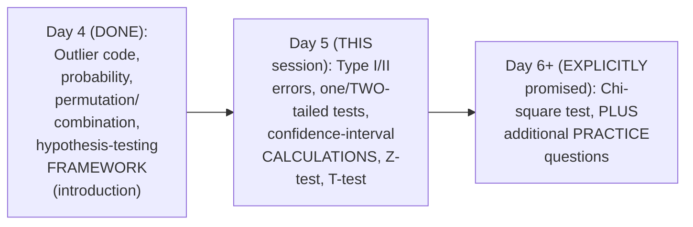

#### 🎯 Key Takeaways

* This is GENUINELY **Day 5**, EXPLICITLY, DIRECTLY completing EVERY topic PROMISED at the CLOSE of Day 4.
* This session GENUINELY, COMPREHENSIVELY delivers a COMPLETE, real "END-to-end" hypothesis-TESTING toolkit — FROM error TYPES, through TEST selection, to a FULL, worked DECISION.
* The instructor **directly, HONESTLY confirms** his OWN, deliberate NO-slides, hand-WRITTEN teaching STYLE — DIRECTLY connecting it TO his own GENUINE practice and MASTERY of the MATERIAL.

---

### 2. Type I and Type II Errors: The Complete, Four-Outcome Framework

#### 📖 Definition — The Precise, Complete, Four-Outcome Framework

> 💡 **Given directly:** *"After we perform the experiment, there are two types of decisions that can be made... either null hypothesis is true, or null hypothesis is false [in reality]... in decision, I may either get null hypothesis is true, or null hypothesis is false."*

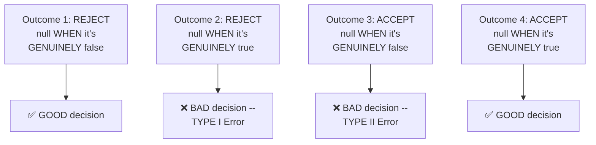

#### 🧠 Concept — A Genuinely Memorable, Real Legal Analogy: Type I Error

> 💡 **Given directly:** *"Let's say that I take my null hypothesis as the person is innocent, and my alternate hypothesis is [the] person is not innocent... in movies, we have seen... a person will be awarded a death sentence even though he did not do anything... this becomes a perfect example of type one error."*

#### 🧠 Concept — A Genuinely Memorable, Real Legal Analogy: Type II Error

> 💡 **Given directly:** *"Even though the person has committed [a] crime, he is not [con]victed... definitely this error is basically called as type two error."*

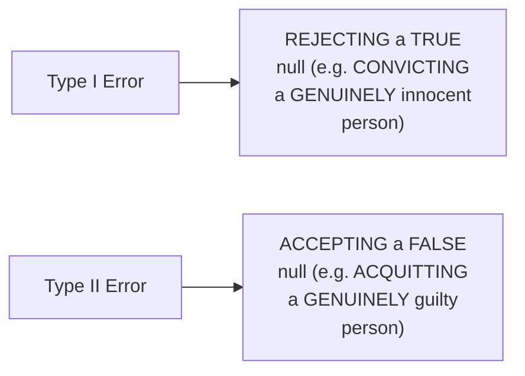

#### ⚠ Common Mistakes

* Assuming "REJECTING the null HYPOTHESIS" is ALWAYS, GENUINELY the CORRECT decision — explicitly, directly, PRECISELY clarified: it's ONLY correct WHEN the null is GENUINELY, ACTUALLY false — REJECTING a TRUE null is a GENUINE, real Type I ERROR.
* Confusing WHICH error is TYPE I versus TYPE II — explicitly, directly, MEMORABLY anchored: TYPE I = WRONGLY rejecting a TRUE null (a FALSE alarm); TYPE II = WRONGLY accepting a FALSE null (a MISSED detection).

#### 🎯 Key Takeaways

* Hypothesis TESTING outcomes GENUINELY form a **COMPLETE, four-OUTCOME framework**, CROSSING reality (null TRUE/false) WITH decision (reject/ACCEPT).
* **TYPE I error**: REJECTING a null hypothesis THAT is genuinely, ACTUALLY **TRUE** — DIRECTLY, MEMORABLY illustrated VIA a wrongly-CONVICTED, innocent person.
* **TYPE II error**: ACCEPTING a null HYPOTHESIS that is GENUINELY, ACTUALLY **false** — DIRECTLY, MEMORABLY illustrated VIA a genuinely GUILTY person who ESCAPES conviction.

---
### 3. Type I/II Errors & the Confusion Matrix

#### 🔍 Internal Working — A Genuine, Direct Connection to a Real, Future Machine-Learning Concept

> 💡 **Given directly:** *"In the real world scenario, you define something called as confusion matrix... you have true positive, true negative, false positive, false negative... tell me, out of this, which is type one and type two."*

#### 🪜 Step-by-Step — A Genuine, Live-Given Assignment, With an Honest, Live Correction

> 💡 **Given directly:** *"Some people are basically saying false positive is type one, true negative is type two... okay, FP is type one... [later, a live correction] sorry guys, I made one mistake — this should not be type 2, false negative should be type 2, right? True positive and true negative are always right."*

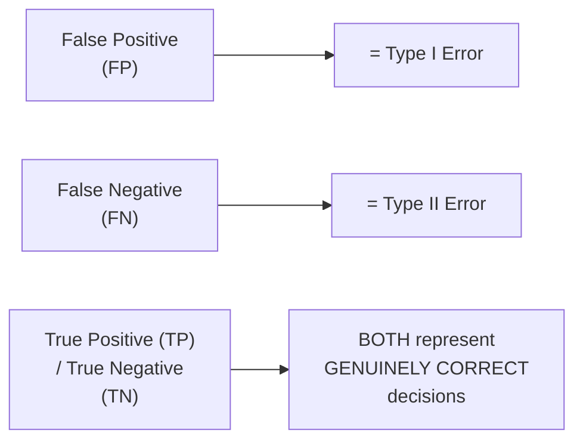

#### ⚠ Common Mistakes

* Assuming FALSE positive and FALSE negative map to TYPE I/II errors ARBITRARILY or INTERCHANGEABLY — explicitly, directly, HONESTLY corrected LIVE: **false POSITIVE = Type I**; **false NEGATIVE = Type II** — a GENUINE, frequently-tested MAPPING worth REMEMBERING precisely.
* Assuming a LIVE, on-air CORRECTION represents a GENUINE, real FLAW in the underlying CONCEPT — explicitly, directly, HONESTLY just a SPOKEN slip, IMMEDIATELY corrected — the UNDERLYING mapping ITSELF is GENUINELY, CONSISTENTLY stable.

#### 🎯 Key Takeaways

* Type I and TYPE II errors directly, PRECISELY map ONTO the **CONFUSION matrix**'s own TERMS — **FALSE positive = Type I ERROR**; **false NEGATIVE = Type II error**.
* TRUE positive and TRUE negative BOTH represent GENUINELY, STRUCTURALLY correct DECISIONS — DIRECTLY, PRECISELY paralleling OUTCOMES 1 and 4 FROM Section 2's own established FRAMEWORK.
* This CONNECTION is directly, EXPLICITLY flagged as GENUINE, forward-looking MATERIAL — DIRECTLY relevant to a LATER, dedicated machine-LEARNING discussion of the CONFUSION matrix.

---

### 4. One-Tailed vs. Two-Tailed Tests: A Complete, Real Worked Example

#### 🪜 Step-by-Step — A Complete, Real, Motivating Scenario

> 💡 **Given directly:** *"Colleges in Karnataka have an 85 [percent] placement rate. A new college was recently opened, and it was found that a sample of 150 students had a placement rate of 88 [percent], with a standard deviation [of] 4 percent. Does this college have a different placement rate than the other colleges?"*

#### 📖 Definition — Two-Tailed Test, Precisely Identified

> 💡 **Given directly:** *"My value can be greater than 85, it can be less than 85, because we are just checking whether it has a different placement rate — it can be greater, it can be less also. That is the reason this entire test becomes a two-tailed test."*

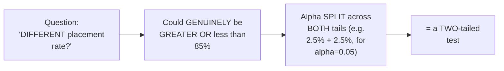

#### 📖 Definition — One-Tailed Test, Precisely Identified (Via a Modified Question)

> 💡 **Given directly:** *"Let's say that my question says: does this college have a placement rate greater than 85 percent?... this becomes a one-tailed test, that also in the right-hand side, because here the important keyword is something called as 'greater'... we cannot divide this alpha value into two parts — in this case, only in one part it will be basically present."*

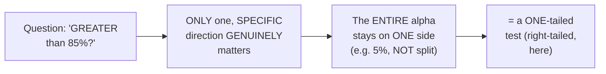

#### ⚠ Common Mistakes

* Assuming the SAME, underlying SCENARIO ALWAYS produces the SAME test TYPE — explicitly, directly, CONCRETELY disproven: MERELY changing the QUESTION's own WORDING ("DIFFERENT" versus "GREATER than") GENUINELY, DIRECTLY changes WHETHER it's a ONE- or TWO-tailed test.
* Splitting the ALPHA value into TWO halves FOR a one-tailed TEST — explicitly, directly, PRECISELY corrected: a ONE-tailed test KEEPS the ENTIRE alpha ON one SIDE — it is GENUINELY, STRUCTURALLY NOT divided.

#### 🎯 Key Takeaways

* WHETHER a test is **ONE-tailed** or **TWO-tailed** GENUINELY, DIRECTLY depends ON the QUESTION's own, PRECISE wording — "DIFFERENT" (EITHER direction) SIGNALS two-TAILED; "GREATER than"/"less THAN" (ONE specific DIRECTION) signals ONE-tailed.
* For a **TWO-tailed test**, alpha is SPLIT across BOTH tails (e.g., 2.5% + 2.5%, FOR alpha=0.05); for a **ONE-tailed test**, the ENTIRE alpha REMAINS on ONE side.
* A COMPLETE, real WORKED example (a COLLEGE's own placement RATE) directly, CONCRETELY demonstrated BOTH test TYPES, USING the SAME UNDERLYING numbers — ONLY the QUESTION's own wording CHANGED.

---
### 5. Point Estimate & the Confidence Interval Formula

#### 📖 Definition — Point Estimate, Precisely Defined

> 💡 **Given directly:** *"Point estimate can be defined as a value of any statistic that estimates the value of a parameter."*

#### 🔍 Internal Working — A Genuine, Direct Explanation of the Underlying, Inferential Logic

> 💡 **Given directly:** *"In inferential stats, any work that we will be doing, first of all we will be considering a sample data, based on the sample data we will be estimating something for the population data... if I have the sample mean, I'll try to estimate the population... this value may be approximately equal to this, it may be also less, it may be also greater."*

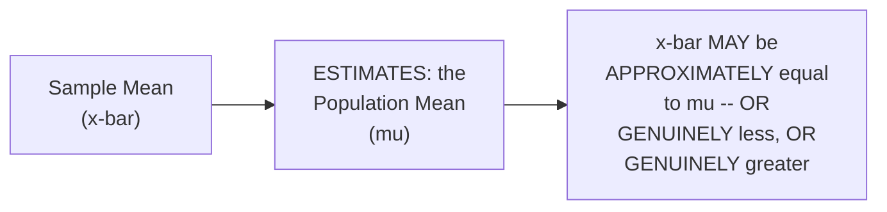

#### 📖 Definition — The Confidence Interval Formula, Precisely Defined

> 💡 **Given directly:** *"Confidence interval is usually given by the formula, which is nothing but point estimate plus or minus margin of error... because obviously we will not know the exact population mean."*

```text
Confidence Interval = Point Estimate ± Margin of Error
```

#### ⚠ Common Mistakes

* Assuming a SAMPLE mean (x̄) is GENUINELY, EXACTLY equal TO the true population MEAN (μ) — explicitly, directly, PRECISELY clarified: it's ONLY an ESTIMATE — a CONFIDENCE interval GENUINELY, PRACTICALLY accounts FOR this uncertainty.
* Assuming the "MARGIN of error" term is GENUINELY, ARBITRARILY chosen — explicitly, directly, DIRECTLY foreshadowed: it GENUINELY, PRECISELY depends ON whether the POPULATION standard DEVIATION is KNOWN (Z-test) OR unknown (T-TEST) — the SUBJECT of Sections 6-7.

#### 🎯 Key Takeaways

* **POINT estimate** is precisely "a VALUE of any STATISTIC that ESTIMATES the value OF a parameter" — e.g., a SAMPLE mean (x̄) ESTIMATING the true POPULATION mean (μ).
* The **CONFIDENCE interval FORMULA** is precisely: **Point ESTIMATE ± Margin of ERROR** — DIRECTLY, EXPLICITLY acknowledging that a SAMPLE-based estimate GENUINELY carries SOME, real UNCERTAINTY.
* This FORMULA directly, PRECISELY sets UP the NEXT, essential DISTINCTION — HOW "margin of ERROR" is GENUINELY, PRECISELY computed DEPENDS on WHETHER the population standard DEVIATION is KNOWN or NOT (Sections 6-7).

---

### 6. Confidence Interval When Population SD Is Known: A Complete, Live Z-Test Calculation

#### 🪜 Step-by-Step — A Complete, Real, Worked Problem Setup

> 💡 **Given directly:** *"On the quant test of CAT exam, the population standard deviation is known to be 100. I will take a sample of 25 test takers, [which] has a mean of 520 score. Construct a 95 percentage confidence interval about the mean."*

```text
Given: Population SD (σ) = 100, n = 25, Sample Mean (x̄) = 520, CI = 95% (α = 0.05)
```

#### 📖 Definition — The Precise Z-Test Formula for a Confidence Interval

> 💡 **Given directly:** *"When population standard deviation is basically given, we apply a Z test... z alpha by 2, and the formula will be standard deviation divided by root n... this term is called as standard error."*

```text
Confidence Interval (population SD known) = x̄ ± z(α/2) × (σ/√n)
```

#### 🪜 Step-by-Step — A Complete, Real, Live-Computed Result

> 💡 **Given directly:** *"0.025... I have to check in the Z table... 1 minus 0.025... 0.975... it is 1.96... upper bound... 520 plus 1.96 multiplied by 20... 559.2... lower bound... 520 minus 1.96 multiplied by 20... 480.8."*

```text
z(0.025) = 1.96 (from the Z-table, for 1 - 0.025 = 0.975)
Standard Error = σ/√n = 100/√25 = 100/5 = 20

Upper Bound = 520 + (1.96 × 20) = 559.2
Lower Bound = 520 - (1.96 × 20) = 480.8

95% Confidence Interval: [480.8, 559.2]
```

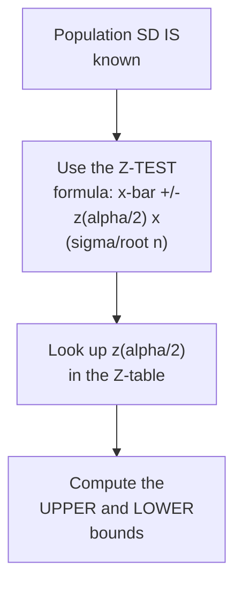

#### 🏢 Real-World / Production Usage — A Genuine, Real, Interview-Style Framing

> 💡 **Given directly:** *"One stats interview question... find the average size of sharks throughout the world... you know the population standard deviation, you know the x bar value, you know the n value, try to solve it with alpha as 0.05."*

#### ⚠ Common Mistakes

* Assuming the Z-TEST formula for a confidence INTERVAL is GENUINELY, STRUCTURALLY different FROM the basic Z-score FORMULA — explicitly, directly, PRECISELY connected: it's the SAME underlying LOGIC, but DIVIDED by `√n` (the "STANDARD error") — a GENUINELY IMPORTANT, but SUBTLE, addition.
* Assuming a SAMPLE size OF 25 (RATHER than the "USUAL" 30+) INVALIDATES the Z-test APPROACH — explicitly, directly, HONESTLY clarified: it's a DELIBERATE, PRACTICAL simplification FOR easier CALCULATION — the underlying LOGIC remains VALID.

#### 🎯 Key Takeaways

* WHEN the population STANDARD deviation IS known, the CONFIDENCE interval USES the **Z-TEST** formula: **x̄ ± z(α/2) × (σ/√n)**.
* A COMPLETE, real, LIVE-computed EXAMPLE directly, CONCRETELY confirmed a **95% confidence INTERVAL of [480.8, 559.2]** — FOR a CAT exam QUANT score scenario.
* This is directly, EXPLICITLY confirmed as GENUINE, real INTERVIEW material (e.g., "AVERAGE shark SIZE" style QUESTIONS) — WORTH practicing THOROUGHLY.

---
### 7. Confidence Interval When Population SD Is Unknown: A Complete, Live T-Test Calculation

#### 🪜 Step-by-Step — A Complete, Real, Worked Problem Setup (The Same Scenario, Modified)

> 💡 **Given directly:** *"The same question... this standard deviation is not given, [the] population standard deviation is not given, but sample standard deviation is given... a sample of 25 test takers has a mean of 520 score, with a standard deviation of 80. Construct [a] 95 percent confidence interval about the mean."*

```text
Given: Sample SD (s) = 80, n = 25, Sample Mean (x̄) = 520, CI = 95% (α = 0.05)
```

#### 📖 Definition — The Precise T-Test Formula for a Confidence Interval

> 💡 **Given directly:** *"Here your population standard deviation is not given... in this particular case we use something called as T test... the formula will be x bar plus or minus, instead of writing z alpha by 2, here you will be writing t alpha by 2, and then you will be using s by root n."*

```text
Confidence Interval (population SD unknown) = x̄ ± t(α/2, df) × (s/√n)
```

#### 🪜 Step-by-Step — Computing the Degree of Freedom

> 💡 **Given directly:** *"To calculate the T value, you need to find out something called a degree of freedom... the formula is just like your sample variance problem, that is n minus 1... this will be 25 minus 1, which is nothing but 24."*

```text
Degree of Freedom (df) = n - 1 = 25 - 1 = 24
```

#### 🪜 Step-by-Step — A Complete, Real, Live-Computed Result

> 💡 **Given directly:** *"Degree of freedom 24... it is nothing but 2.064... x bar plus 2.064 multiplied by s, what is s over here? It is nothing but 80 by 5... 553.024... lower bound... 520 minus 2.064... 80 by 5... 486.97."*

```text
t(0.025, df=24) = 2.064 (from the T-table)
Standard Error = s/√n = 80/√25 = 80/5 = 16

Upper Bound = 520 + (2.064 × 16) = 553.02
Lower Bound = 520 - (2.064 × 16) = 486.97

95% Confidence Interval: [486.97, 553.02]
```

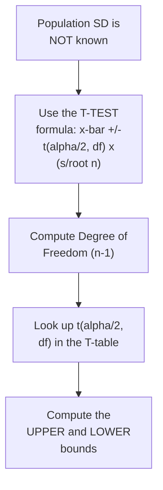

#### ⚠ Common Mistakes

* Assuming the SAME Z-table VALUE (1.96) GENUINELY applies WHEN using a T-TEST — explicitly, directly, PRECISELY corrected: the T-test REQUIRES a SEPARATE, T-TABLE lookup, WHICH genuinely DEPENDS on the DEGREE of freedom (NOT just the ALPHA value alone).
* Forgetting to COMPUTE the degree OF freedom (n−1) BEFORE attempting the T-TABLE lookup — explicitly, directly, PRECISELY confirmed as a REQUIRED, prerequisite STEP.

#### 🎯 Key Takeaways

* WHEN the population STANDARD deviation is **NOT known**, the CONFIDENCE interval USES the **T-TEST** formula: **x̄ ± t(α/2, DF) × (s/√n)** — REQUIRING a **DEGREE of freedom** (n−1) CALCULATION FIRST.
* A COMPLETE, real, LIVE-computed EXAMPLE (the SAME CAT-exam SCENARIO, but WITH sample SD=80 INSTEAD of population SD=100) directly, CONCRETELY confirmed a **95% confidence INTERVAL of [486.97, 553.02]**.
* THIS example directly, PRECISELY illustrates the CORE, decision-making RULE: **population SD KNOWN → Z-test; population SD UNKNOWN → T-test** — a GENUINELY, frequently-TESTED interview DISTINCTION.

---

### 8. One-Sample Z-Test: A Complete, Real Hypothesis Test (Population SD Known)

#### 🪜 Step-by-Step — A Complete, Real, Motivating Problem

> 💡 **Given directly:** *"In the population, the average IQ is 100, with a standard deviation of 15. Researchers want to test a new medication to see if there is a positive or negative effect on intelligence, or no effect at all. A sample of 30 participants who have taken the medication has a mean IQ of 140. Did the medication affect the intelligence?"*

#### 🪜 Step-by-Step — The Complete, Five-Step Hypothesis-Testing Process

> 💡 **Given directly:** *"Step one: define the null hypothesis... my mean IQ is 100... step two: define the alternate hypothesis... my mean is not equal to 100... step three: state alpha value... 0.05... step four: state decision rule... since my alpha is 0.05... this definitely will become a two-tailed test... step five: calculate test statistics."*

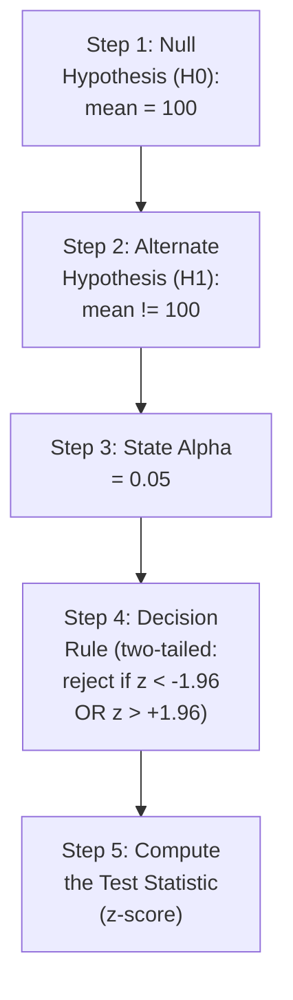

#### 🪜 Step-by-Step — A Complete, Real, Live-Computed Test Statistic & Conclusion

> 💡 **Given directly:** *"Z is equal to X minus mu, divided by standard deviation... divided by root n... 140 minus 100, divided by 15 by root of 30... 40 divided by 15 multiplied by root 30... 14.60."*

```text
z = (x̄ - μ) / (σ/√n) = (140 - 100) / (15/√30) = 40 / 2.739 ≈ 14.60
```

#### 🔍 Internal Working — A Genuine, Direct, Complete Conclusion

> 💡 **Given directly:** *"14.60 is greater than 1.96, which is obviously... my condition will be that if Z is less than minus 1.96, or greater than 1.96, then we have to just reject the null hypothesis... rejecting the null hypothesis is saying that the medicine had an impact... obviously it is improved, improved intelligence, not decreased."*

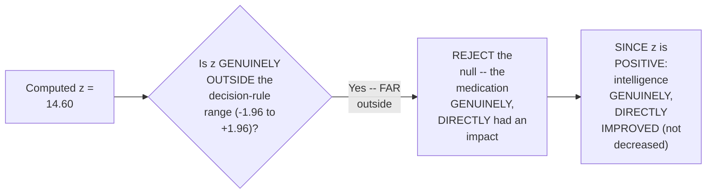

#### ⚠ A Direct, Honest, Genuine Assignment

> 💡 **Given directly:** *"Do the same problem, I will just change one value over here — this mean will be 110... try to solve the problem and tell me whether the null hypothesis is accepted or rejected."*

#### ⚠ Common Mistakes

* Forgetting to DIVIDE by `√n` in the Z-TEST formula for HYPOTHESIS testing (AS opposed to the SIMPLER, single-value Z-score FORMULA from EARLIER sessions) — explicitly, directly, PRECISELY clarified (Section 10): FOR a SINGLE value, `√n` = `√1` = 1, but FOR a SAMPLE, `√n` GENUINELY matters.
* Assuming a REJECTED null hypothesis ONLY tells you "SOMETHING changed," WITHOUT DIRECTION — explicitly, directly, PRECISELY clarified: the **SIGN** of the test STATISTIC (POSITIVE Z here) DIRECTLY, GENUINELY indicates the DIRECTION of the EFFECT (IMPROVEMENT, not DECREASE).

#### 🎯 Key Takeaways

* The COMPLETE, FIVE-step hypothesis-TESTING process: DEFINE null → DEFINE alternate → STATE alpha → STATE decision RULE → COMPUTE the test STATISTIC.
* A COMPLETE, real, LIVE-computed EXAMPLE directly, CONCRETELY confirmed **z ≈ 14.60** — FAR outside the DECISION-rule range (±1.96) — LEADING to REJECTING the null HYPOTHESIS.
* The test STATISTIC's own **SIGN** directly, PRECISELY reveals DIRECTION — a POSITIVE z (HERE) GENUINELY confirms the MEDICATION **improved** intelligence, NOT decreased it.

---
### 9. One-Sample T-Test: A Complete, Real Hypothesis Test (Population SD Unknown)

#### 🪜 Step-by-Step — A Complete, Real, Motivating Problem (The Same Scenario, With Sample SD)

> 💡 **Given directly:** *"In a population, the average IQ is equal to 100... a sample of 30 participants were taken, and they have a mean IQ of 140, with a sample standard deviation of 20. Did the medication affect the intelligence?"*

```text
Given: μ = 100 (H0's own value), x̄ = 140, Sample SD (s) = 20, n = 30, α = 0.05
```

#### 🪜 Step-by-Step — The Complete, Five-Step T-Test Process

> 💡 **Given directly:** *"First step, first answer: what is your null hypothesis? Your mean is equal to 100. What is your H1? Mean is not equal to 100... third step... calculate the degree of freedom... n minus 1, so this will be 30 minus 1, which is nothing but 29... fourth step... decision rule... two-tailed test... degree of freedom 29... 2.045."*

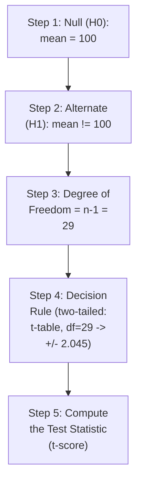

#### 🪜 Step-by-Step — A Complete, Real, Live-Computed Test Statistic & Conclusion

> 💡 **Given directly:** *"The formula will be almost same: T is equal to x bar minus mu, divided by [the] population standard deviation is not given, sample is given, and this will be root n... x bar is nothing but 140, mu is nothing but 100, s is nothing but 20, n is nothing but 30... 10.96."*

```text
t = (x̄ - μ) / (s/√n) = (140 - 100) / (20/√30) ≈ 10.96
```

#### 🔍 Internal Working — A Genuine, Direct, Complete Conclusion

> 💡 **Given directly:** *"Since we have got 10.96, it is obviously greater than 2.045... so what we do, we reject null hypothesis... since I am getting 10.96... obviously final conclusion, you can see that it has increased the intelligence."*

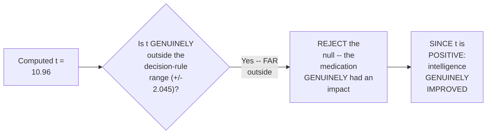

#### ⚠ Common Mistakes

* Assuming the T-TEST hypothesis-testing PROCESS is GENUINELY, STRUCTURALLY different FROM the Z-test PROCESS — explicitly, directly, PRECISELY confirmed as the SAME, five-STEP framework — ONLY the SPECIFIC formula (T VERSUS Z) and TABLE lookup (T-table WITH degree of FREEDOM, versus Z-table) GENUINELY differ.
* Confusing WHEN to use a T-test VERSUS a Z-test FOR hypothesis testing — explicitly, directly, REPEATEDLY reinforced: population SD **KNOWN** → Z-test; population SD **UNKNOWN** (ONLY sample SD GIVEN) → T-test.

#### 🎯 Key Takeaways

* The COMPLETE, FIVE-step T-TEST hypothesis-testing PROCESS directly, PRECISELY mirrors the Z-TEST process (Section 8) — ONLY REQUIRING an ADDITIONAL degree-of-FREEDOM calculation (n−1) and a T-TABLE (rather than Z-table) LOOKUP.
* A COMPLETE, real, LIVE-computed EXAMPLE directly, CONCRETELY confirmed **t ≈ 10.96** — FAR outside the DECISION-rule range (±2.045) — LEADING to REJECTING the null HYPOTHESIS, and CONFIRMING the medication GENUINELY improved INTELLIGENCE.
* This SESSION's own TWO, parallel EXAMPLES (Z-test IN Section 8, T-test HERE) directly, CONCRETELY reinforce the SAME, core DECISION rule: population SD **known** → Z; population SD **UNKNOWN** → T.

---

### 10. Why Divide by √n? A Genuine, Honest Deferral to the Central Limit Theorem

#### ❓ Why It Exists — A Genuine, Direct Clarification

> 💡 **Given directly:** *"The real formula of Z test is this, divided by root n... the reason why we did not consider [this] before root n — understand, for every sample, my n value will be 1, so whenever I write root of 1, it will be 1... but when we are working with a huge sample, we have to basically use root n, and this is called as standard error."*

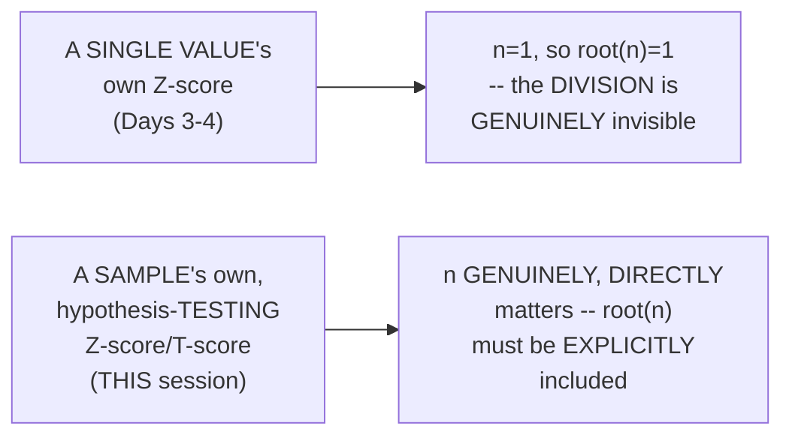

#### 🔍 Internal Working — A Genuine, Honest, Direct Deferral

> 💡 **Given directly:** *"There is a topic which is called a central limit theorem, I will discuss that, and then probably I'll teach you this particular topic — but just right now, understand that... as the sample size keeps on increasing, our mean values will be matching with the population."*

#### ⚠ Common Mistakes

* Assuming the "DIVIDE by ROOT n" step is GENUINELY, ARBITRARILY added ONLY for HYPOTHESIS-testing formulas — explicitly, directly, PRECISELY clarified: it was ALWAYS, GENUINELY, TECHNICALLY part of the FORMULA — it was SIMPLY INVISIBLE earlier (SINCE `√1 = 1` FOR single-value CALCULATIONS).
* Assuming THIS session's own, BRIEF explanation of "STANDARD error" and √n is a COMPLETE, FINAL treatment — explicitly, directly, HONESTLY deferred: the FULL, underlying REASONING (the CENTRAL Limit Theorem) is EXPLICITLY promised FOR a FUTURE session.

#### 🎯 Key Takeaways

* Dividing BY `√n` (PRODUCING the **STANDARD error**) was ALWAYS, GENUINELY part OF the Z-score FORMULA — it was SIMPLY invisible IN earlier sessions' own SINGLE-value examples, SINCE `√1 = 1`.
* AS sample SIZE (n) genuinely INCREASES, the SAMPLE mean GENUINELY, INCREASINGLY converges TOWARD the true POPULATION mean — a CORE, foundational STATISTICAL principle.
* The instructor **directly, HONESTLY defers** the FULL, underlying EXPLANATION (the **CENTRAL Limit Theorem**) to a FUTURE session — an HONEST acknowledgment of THIS session's own, DELIBERATE scope BOUNDARY.

---
### 11. A Real, Open-Ended Practice Problem (ATM Machine Placement)

#### 🪜 Step-by-Step — A Complete, Real, Open-Ended Assignment

> 💡 **Given directly:** *"A bank wants to open an ATM machine in a specific area. So this problem you have to formulate, and you have to think over it — how we can apply hypothesis testing. You can consider any values that you want... you can say that average money people take out from the ATM machine, with 95 percent confidence interval."*

#### 🏢 Real-World / Production Usage — A Genuine, Direct, Real Interview Source

> 💡 **Given directly:** *"This was one interview question in one bank, that is called as Standard Chartered interview question."*

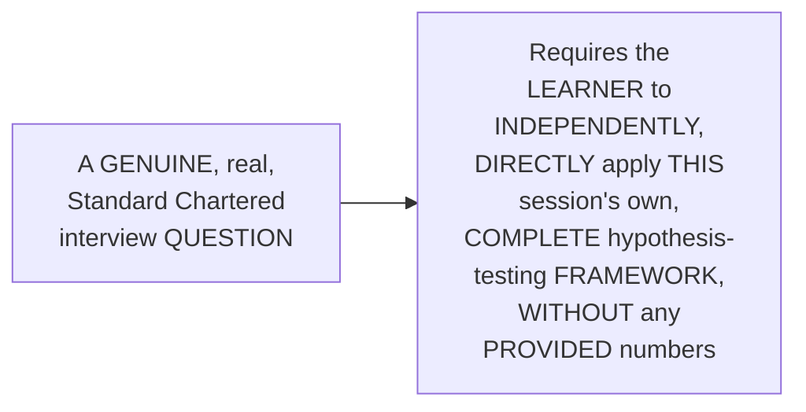

#### ⚠ Common Mistakes

* Assuming a REAL, professional INTERVIEW question WOULD genuinely PROVIDE all the NECESSARY numbers UPFRONT — explicitly, directly, HONESTLY clarified: THIS is DELIBERATELY, GENUINELY open-ended — "YOU can consider ANY values that you WANT" — TESTING a candidate's OWN ability to FORMULATE the PROBLEM, not JUST calculate an ANSWER.

#### 🎯 Key Takeaways

* This is a GENUINE, real, **STANDARD Chartered interview QUESTION** — DIRECTLY, EXPLICITLY confirmed as REQUIRING learners to INDEPENDENTLY formulate a COMPLETE hypothesis TEST (choosing THEIR own, REASONABLE values), NOT merely CALCULATE a GIVEN answer.
* This directly, PRACTICALLY reinforces THIS session's own, COMPLETE hypothesis-testing FRAMEWORK — DEMANDING genuine, INDEPENDENT application, RATHER than rote FORMULA substitution.

---

### 12. Closing: What's Deferred to Tomorrow

#### 🪜 Step-by-Step — A Complete, Honest, Direct Confirmation

> 💡 **Given directly:** *"Till here, what all things [did] we complete? We finished Z test, T test — now we'll do chi-square also, [and] you can change your alpha value also, okay. Don't worry, last day I will give many, many questions to you all to solve also."*

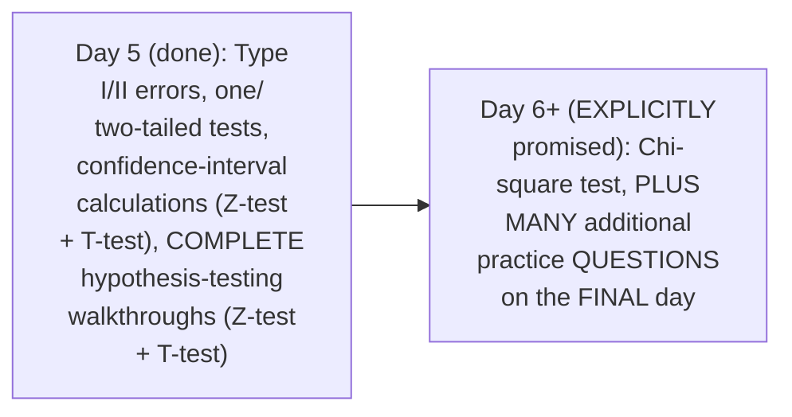

#### ⚠ Common Mistakes

* Assuming THIS session's own COVERAGE of hypothesis TESTING represents a COMPLETE, EXHAUSTIVE treatment of EVERY possible statistical TEST — explicitly, directly, HONESTLY clarified: the **CHI-square test** REMAINS explicitly DEFERRED — WITH additional, DEDICATED practice SESSIONS also PROMISED for the SERIES' own FINAL day.

#### 🎯 Key Takeaways

* This episode **GENUINELY, COMPREHENSIVELY delivers** its OWN, stated Day-5 GOALS — Type I/II ERRORS, one/two-TAILED tests, confidence-INTERVAL calculations, and TWO, complete hypothesis-TESTING walkthroughs (Z-TEST and T-test).
* The **CHI-square test** is directly, EXPLICITLY confirmed as DEFERRED to a LATER session.
* The SERIES' OWN, final DAY is directly, EXPLICITLY promised to INCLUDE "MANY, many QUESTIONS" for ADDITIONAL, comprehensive PRACTICE — REINFORCING the entire ARC's own, established EMPHASIS on hands-ON, worked-example-based LEARNING.

---

## 📝 Glossary

| Term | Definition | Why It Matters |
|---|---|---|
| **Type I Error** | Rejecting a null hypothesis that is genuinely true | Maps to "False Positive" |
| **Type II Error** | Accepting a null hypothesis that is genuinely false | Maps to "False Negative" |
| **One-Tailed Test** | Tests for a specific direction (e.g. "greater than") | Alpha stays entirely on one side |
| **Two-Tailed Test** | Tests for "different" (either direction) | Alpha is split across both tails |
| **Point Estimate** | A statistic that estimates a population parameter | e.g., sample mean estimating population mean |
| **Confidence Interval** | Point Estimate ± Margin of Error | Quantifies uncertainty in an estimate |
| **Standard Error** | The denominator term, σ/√n or s/√n | Accounts for sample size in Z/T formulas |
| **Degree of Freedom (df)** | n - 1, used in T-test/T-table lookups | Required before any T-table lookup |
| **One-Sample Z-Test** | Hypothesis test when population SD is known | Uses the Z-table |
| **One-Sample T-Test** | Hypothesis test when population SD is unknown | Uses the T-table, with degree of freedom |

---

## 🔄 Revision Notes — One-Minute Revision

* This is **Day 5**, completing EVERY topic explicitly promised at the close of Day 4.
* **Type I/II errors**: a complete, 4-outcome framework crossing reality (null true/false) with decision (reject/accept). Type I = rejecting a TRUE null (a wrongly-convicted innocent person). Type II = accepting a FALSE null (a genuinely guilty person who escapes conviction).
* **Confusion matrix mapping** (with an honest, live correction): False Positive = Type I; False Negative = Type II. True Positive/True Negative are both genuinely correct decisions.
* **One-tailed vs. two-tailed tests**: determined by a question's own precise wording. "Different" (either direction) -> two-tailed (alpha split across both tails). "Greater than"/"less than" (one direction) -> one-tailed (entire alpha on one side). Live example: a college's placement rate (88% vs. Karnataka's 85% average).
* **Point estimate**: a statistic (e.g. sample mean) that estimates a population parameter (e.g. population mean). **Confidence Interval** = Point Estimate ± Margin of Error.
* **Confidence interval, population SD KNOWN (Z-test)**: x̄ ± z(α/2) × (σ/√n). Live example: CAT exam scores (σ=100, n=25, x̄=520) -> 95% CI = [480.8, 559.2], using z=1.96.
* **Confidence interval, population SD UNKNOWN (T-test)**: x̄ ± t(α/2, df) × (s/√n), requiring df=n-1. Live example: same scenario, but s=80 -> df=24, t=2.064 -> 95% CI = [486.97, 553.02].
* **One-Sample Z-Test (complete, 5-step hypothesis test)**: IQ medication example (μ=100, σ=15 known, n=30, x̄=140, α=0.05). H0: mean=100; H1: mean≠100; two-tailed decision rule: reject if z < -1.96 or z > +1.96. Computed z ≈ 14.60 -> REJECT null -> medication genuinely IMPROVED intelligence (positive z = improvement, not decrease).
* **One-Sample T-Test (complete, 5-step hypothesis test)**: same IQ scenario, but sample SD=20 (not population SD) -> df=29, t-table value=2.045. Computed t ≈ 10.96 -> REJECT null -> medication genuinely improved intelligence.
* **Why divide by √n**: this was always part of the Z-score formula; it was invisible in earlier, single-value examples since √1=1. As sample size grows, the sample mean genuinely converges toward the population mean -- the full explanation (Central Limit Theorem) is honestly deferred to a future session.
* **Real, open-ended practice problem**: a genuine Standard Chartered interview question -- design a hypothesis test for ATM machine placement, choosing your own reasonable values.
* **Closing**: Chi-square test, plus many additional practice questions on the series' final day, are explicitly deferred.

---

## 📋 Cheat Sheet

**Type I/II Errors & Confusion Matrix:**
```text
Type I Error  = Reject a TRUE null  = False Positive
Type II Error = Accept a FALSE null = False Negative
```

**One-Tailed vs. Two-Tailed:**
```text
"Different"           -> Two-Tailed (alpha split, e.g. 2.5% + 2.5%)
"Greater/Less Than"   -> One-Tailed (entire alpha on one side)
```

**Confidence Interval formulas:**
```text
Population SD KNOWN (Z-test):    x̄ ± z(α/2) × (σ/√n)
Population SD UNKNOWN (T-test):  x̄ ± t(α/2, df) × (s/√n)
                                   where df = n - 1
```

**Complete 5-Step Hypothesis Testing:**
```text
1. Define Null Hypothesis (H0)
2. Define Alternate Hypothesis (H1)
3. State Alpha (α)
4. State Decision Rule (one/two-tailed, from Z/T-table)
5. Compute the Test Statistic:
     Z-Test: z = (x̄ - μ) / (σ/√n)   [population SD known]
     T-Test: t = (x̄ - μ) / (s/√n)   [population SD unknown]
   Compare against the decision rule -> Reject or Fail to Reject H0
```

**Worked examples, in full (from this session):**
```text
CI, Z-test:  σ=100, n=25, x̄=520 -> [480.8, 559.2]
CI, T-test:  s=80,  n=25, x̄=520 -> [486.97, 553.02]
Z-Test:  μ=100, σ=15, n=30, x̄=140 -> z≈14.60 -> REJECT H0
T-Test:  μ=100, s=20, n=30, x̄=140 -> t≈10.96 -> REJECT H0
```

---

## 🔥 Interview Questions & Answers

### 🟢 Beginner

**Q1.**

**Question:** What is a Type I error?

**Answer:** Rejecting a null hypothesis that is genuinely true.

**Explanation:** Directly, precisely defined.

**Why Interviewers Ask This:** The most basic, foundational hypothesis-testing error question.

**Possible Follow-up:** "What is a Type II error?"

**Q2.**

**Question:** In confusion matrix terms, what does a Type I error correspond to?

**Answer:** A False Positive.

**Explanation:** Directly, explicitly (and honestly, live) confirmed.

**Why Interviewers Ask This:** A commonly-tested, genuine cross-domain connection.

**Possible Follow-up:** "What does a Type II error correspond to?"

**Q3.**

**Question:** What determines whether a test is one-tailed or two-tailed?

**Answer:** The question's own precise wording -- "different" (either direction) is two-tailed; "greater/less than" (one direction) is one-tailed.

**Explanation:** Directly, precisely explained.

**Why Interviewers Ask This:** Foundational, frequently-tested hypothesis-testing knowledge.

**Possible Follow-up:** "How is alpha divided differently between the two test types?"

**Q4.**

**Question:** What is a point estimate?

**Answer:** A statistic (e.g., sample mean) that estimates a population parameter.

**Explanation:** Directly, precisely defined.

**Why Interviewers Ask This:** Basic, essential inferential-statistics terminology.

**Possible Follow-up:** "What is the confidence interval formula, in terms of point estimate?"

**Q5.**

**Question:** When do you use a Z-test versus a T-test for a confidence interval?

**Answer:** Z-test when population standard deviation is known; T-test when it is unknown (only sample SD is given).

**Explanation:** Directly, precisely distinguished.

**Why Interviewers Ask This:** A commonly-tested, genuine, practical distinction.

**Possible Follow-up:** "What additional calculation does the T-test require, that the Z-test does not?"

**Q6.**

**Question:** What is degree of freedom, in a T-test?

**Answer:** n - 1.

**Explanation:** Directly, explicitly stated.

**Why Interviewers Ask This:** Basic, essential T-test knowledge.

**Possible Follow-up:** "Why is this required before a T-table lookup?"

**Q7.**

**Question:** What are the five steps of hypothesis testing?

**Answer:** Define null hypothesis, define alternate hypothesis, state alpha, state decision rule, compute the test statistic.

**Explanation:** Directly, explicitly stated.

**Why Interviewers Ask This:** Foundational, frequently-tested hypothesis-testing process knowledge.

**Possible Follow-up:** "What happens after computing the test statistic?"

**Q8.**

**Question:** What does the sign of a test statistic (positive or negative) genuinely tell you?

**Answer:** The direction of the effect (e.g., increase vs. decrease).

**Explanation:** Directly, precisely explained.

**Why Interviewers Ask This:** Tests genuine, practical interpretation skill beyond just "reject/fail to reject."

**Possible Follow-up:** "In this session's own IQ example, did the medication increase or decrease intelligence, and how do you know?"

**Q9.**

**Question:** Why does the Z-score formula divide by √n when working with a sample, rather than a single value?

**Answer:** For a single value, n=1, so √n=1 (invisible); for a sample, n genuinely matters and must be included.

**Explanation:** Directly, honestly explained.

**Why Interviewers Ask This:** Tests genuine understanding of standard error's own origin.

**Possible Follow-up:** "What is this term (σ/√n or s/√n) genuinely called?"

**Q10.**

**Question:** If population standard deviation is known, but you mistakenly use a T-test instead of a Z-test, what genuine error would this cause?

**Answer:** An unnecessary, and technically incorrect, degree-of-freedom-based T-table lookup, rather than the appropriate, direct Z-table lookup.

**Explanation:** Directly, precisely implied.

**Why Interviewers Ask This:** Tests genuine, careful test-selection knowledge.

**Possible Follow-up:** "Would the numeric results genuinely differ significantly, in most cases?"

---

### 🟡 Intermediate

**Q11.**

**Question:** Explain why the instructor deliberately solves the SAME underlying scenario (the CAT exam, and separately the IQ medication test) TWICE -- once with population SD known (Z-test), and once with only sample SD known (T-test) -- rather than presenting each test type with a completely different example.

**Answer:** This is a genuinely deliberate, CONTRASTIVE teaching choice, DIRECTLY consistent with a PATTERN seen ACROSS this instructor's OWN, entire series (e.g., Day 3's OWN "life without gateway" VERSUS "life with GATEWAY" contrast, IN a DIFFERENT but ANALOGOUS session). By KEEPING every OTHER variable IDENTICAL (SAME x̄, SAME n, SAME alpha) and ONLY changing WHETHER the population SD is KNOWN, the instructor ISOLATES the SPECIFIC, genuine IMPACT of THAT one difference — LEARNERS can DIRECTLY, CONCRETELY see HOW the SAME underlying QUESTION produces a DIFFERENT calculation PATH (Z-table VERSUS T-table, WITH degree of FREEDOM) and a SLIGHTLY different, but GENUINELY similar, FINAL result. This is FAR more PEDAGOGICALLY effective than TWO, unrelated examples WOULD have been, SINCE it DIRECTLY isolates the ONE, genuine VARIABLE that MATTERS for TEST selection.

**Explanation:** Requires recognizing the deliberate, controlled-comparison value of reusing the same scenario with one changed variable, to isolate a specific decision point.

**Why Interviewers Ask This:** Tests whether a learner recognizes the pedagogical value of controlled comparison over unrelated, separate examples.

**Possible Follow-up:** "Compute the GENUINE, numeric DIFFERENCE between the Z-test and T-test confidence INTERVALS from THIS session's own examples, and explain WHY they are GENUINELY, SLIGHTLY different, DESPITE using the SAME x̄, n, and alpha."

**Q12.**

**Question:** A learner argues that since both the Z-test and T-test examples in this session led to rejecting the null hypothesis, this means the choice between Z-test and T-test genuinely doesn't matter in practice. Evaluate this claim.

**Answer:** This claim overstates the case, missing a GENUINELY important, PRACTICAL distinction THIS session's own content DIRECTLY implies. WHILE BOTH examples in THIS specific session HAPPENED to reach the SAME, final CONCLUSION (reject the NULL), this was GENUINELY, SPECIFICALLY because the test STATISTICS (14.60 and 10.96) were BOTH, GENUINELY, DRAMATICALLY far OUTSIDE their RESPECTIVE decision-rule RANGES — a "SAFE margin" scenario. In GENUINELY, PRACTICALLY borderline CASES (e.g., a test STATISTIC very CLOSE to the decision-RULE boundary), CHOOSING the WRONG test (Z INSTEAD of T, or VICE versa) COULD genuinely, DIRECTLY produce a DIFFERENT final CONCLUSION — SINCE the T-distribution GENUINELY has "FATTER tails" than the NORMAL/Z distribution (a FACT extending SLIGHTLY beyond THIS session's own EXPLICIT content, but DIRECTLY implied by the DIFFERENT table VALUES: 1.96 for Z VERSUS 2.064 for T, at the SAME alpha). The ACCURATE, more PRECISE conclusion: the CHOICE genuinely, PRACTICALLY matters, ESPECIALLY in borderline CASES — THIS session's own examples SIMPLY happened to be FAR enough FROM the boundary that the CHOICE didn't CHANGE the final DECISION.

**Explanation:** Tests whether a learner recognizes that agreement in one specific, non-borderline example doesn't generalize to a claim that test selection never matters.

**Why Interviewers Ask This:** Distinguishes candidates who understand the genuine, practical importance of correct test selection from those who over-generalize from a single, convenient example.

**Possible Follow-up:** "Construct a HYPOTHETICAL, borderline test statistic where CHOOSING Z-test VERSUS T-test WOULD genuinely, DIRECTLY change the FINAL, reject/fail-to-reject CONCLUSION."

**Q13.**

**Question:** Explain, precisely, why the instructor deliberately, explicitly connects Type I and Type II errors to the confusion matrix, rather than treating them as purely, independently statistical concepts.

**Answer:** This is a genuinely deliberate, FORWARD-CONNECTING teaching choice: by DIRECTLY, EXPLICITLY linking Type I/II errors TO the confusion MATRIX's own, FAMILIAR terms (FALSE positive/negative), the instructor PREPARES learners FOR a LATER, machine-LEARNING context WHERE the SAME, underlying CONCEPT reappears UNDER different TERMINOLOGY. This directly, GENUINELY prevents a COMMON, real CONFUSION — learners ENCOUNTERING "false POSITIVE" and "FALSE negative" in a LATER, machine-learning COURSE might OTHERWISE fail to RECOGNIZE these as THE SAME, underlying STATISTICAL concept ALREADY learned HERE — DIRECTLY, EXPLICITLY building a BRIDGE between STATISTICS and machine-LEARNING vocabulary.

**Explanation:** Requires recognizing the deliberate, cross-domain bridging value of connecting hypothesis-testing terminology to machine-learning terminology.

**Why Interviewers Ask This:** Tests whether a learner recognizes the practical value of connecting statistical concepts across different domains/terminologies they'll encounter later.

**Possible Follow-up:** "In a MEDICAL testing CONTEXT (e.g., a DISEASE screening test), explain WHAT a false POSITIVE and a FALSE negative would GENUINELY, PRACTICALLY mean, USING this session's OWN established mapping."

**Q14.**

**Question:** Using this session's own precise "one-tailed vs. two-tailed" reasoning (Section 4), explain a GENUINE, real risk of a researcher choosing a one-tailed test SPECIFICALLY because it makes rejecting the null hypothesis easier, rather than because the research question genuinely, only cares about one direction.

**Answer:** A precise, reasoned RISK analysis, directly extending Section 4's own established MECHANISM: per Section 4's own PRECISE reasoning, a ONE-tailed test KEEPS the ENTIRE alpha on ONE side (e.g., the FULL 5%, RATHER than 2.5% PER side) — MEANING the DECISION-rule BOUNDARY is GENUINELY, STRUCTURALLY closer to the MEAN than IT would be FOR a two-tailed TEST at the SAME alpha. This directly, PRECISELY reveals a GENUINE, real RISK: a researcher COULD, GENUINELY, DISHONESTLY choose a ONE-tailed test SPECIFICALLY because it makes REJECTING the null EASIER (a SMALLER test statistic is NEEDED to CROSS the boundary), RATHER than because the RESEARCH question GENUINELY, ONLY cares about ONE direction (per Section 4's own established, LEGITIMATE reason for CHOOSING a one-tailed TEST). This is a GENUINE, real form OF statistical MISCONDUCT/bias — the TEST-type choice MUST genuinely be DETERMINED by the RESEARCH question's own, ACTUAL wording (per Section 4's own established PRINCIPLE), decided BEFORE seeing the DATA — NOT retroactively CHOSEN to PRODUCE a DESIRED, "significant" result.

**Explanation:** Requires extending the one-tailed/two-tailed distinction to identify a genuine, real risk of statistical misconduct through inappropriate test selection.

**Why Interviewers Ask This:** Tests whether a learner understands the ethical and methodological importance of determining test type from the research question, not from a desire to ease rejection.

**Possible Follow-up:** "What GENUINE, practical safeguard (extending BEYOND this session's own explicit content) might a RESEARCH field use to PREVENT this kind OF retroactive, one-tailed test SELECTION?"

**Q15.**

**Question:** Synthesize this session's complete "point estimate" reasoning (Section 5) with its own "confidence interval, Z-test vs. T-test" reasoning (Sections 6-7) to explain WHY a LARGER sample size (n) genuinely produces a NARROWER (more precise) confidence interval, using the specific formulas from this session.

**Answer:** A precise, synthesized explanation, directly connecting TWO, separately-established sections: per Section 5's own PRECISE reasoning, a POINT estimate (LIKE a sample MEAN) is an ESTIMATE of the TRUE population PARAMETER — CARRYING genuine, real UNCERTAINTY, QUANTIFIED via the CONFIDENCE interval's own "MARGIN of error." Per Sections 6-7's own PRECISE FORMULAS, this margin OF error is DIRECTLY, STRUCTURALLY computed as `z(alpha/2) x (sigma/ROOT n)` or `t(alpha/2, df) x (s/ROOT n)` — in BOTH cases, `n` appears IN the DENOMINATOR, INSIDE a SQUARE root. SYNTHESIZING these TWO facts directly, PRECISELY reveals WHY a LARGER n GENUINELY, MATHEMATICALLY produces a NARROWER confidence INTERVAL: AS `n` GENUINELY increases, `root n` GENUINELY increases TOO, MAKING the OVERALL margin-of-error TERM (SIGMA or s, DIVIDED by a LARGER root-n) GENUINELY, DIRECTLY smaller — a SMALLER margin OF error means the UPPER and LOWER bounds GENUINELY, DIRECTLY move CLOSER together, AROUND the point ESTIMATE — DIRECTLY, MATHEMATICALLY confirming the GENERAL, real-world INTUITION that "MORE data GENUINELY gives you a MORE precise estimate."

**Explanation:** Requires synthesizing the point-estimate uncertainty concept with the specific confidence-interval formulas to mathematically explain why larger samples produce narrower intervals.

**Why Interviewers Ask This:** A senior-level question testing whether a candidate can connect a general, real-world intuition (more data = more precision) to the specific, underlying mathematical mechanism.

**Possible Follow-up:** "If you GENUINELY, DIRECTLY quadrupled your sample size (n), by HOW MUCH would your margin OF error GENUINELY, MATHEMATICALLY shrink, GIVEN the root-n relationship?"

---

### 🔴 Advanced

**Q16.**

**Question:** Design a complete, reasoned hypothesis test (using ONLY this session's own established concepts) for the ATM machine placement scenario explicitly given as an assignment (Section 11), choosing your own, reasonable values.

**Answer:** A reasonable, complete design, directly applying this session's OWN, exact established CONCEPTS:

```text
1. Define the Null Hypothesis (per Section 8's own established
   mechanism): "The average daily withdrawal amount at this ATM
   location would be [a specific, assumed value, e.g.] $2,000" (a
   REASONABLE, industry benchmark, per the bank's OWN, existing
   locations).

2. Define the Alternate Hypothesis (the DIRECT opposite): "The
   average daily withdrawal amount would GENUINELY differ from
   $2,000" (a TWO-tailed test, per Section 4's own established
   reasoning, SINCE the bank GENUINELY cares about EITHER a HIGHER
   or LOWER outcome).

3. State Alpha (per Section 8's own established mechanism): alpha =
   0.05 (95% confidence interval).

4. Determine test type: IF the bank has HISTORICAL, population-level
   data on withdrawal STANDARD deviation across MANY existing ATMs
   (per Section 6's own established Z-test CONDITION), use a Z-test;
   IF only a SAMPLE standard deviation is available FROM a limited
   pilot study (per Section 7's own established T-test condition),
   use a T-test instead.

5. Perform the experiment: COLLECT sample withdrawal data FROM a
   pilot period at the PROPOSED location (per Section 8's own
   established "perform the experiment" step).

6. Compute the test statistic (Z or T, per the CHOSEN test type),
   and COMPARE against the decision rule (per Sections 8-9's own
   established mechanism) to REJECT or FAIL to reject the null.
```

This complete DESIGN directly, precisely APPLIES every ESTABLISHED hypothesis-testing CONCEPT from THIS session — NULL/alternate HYPOTHESIS, test-TYPE selection (Z VERSUS T, ONE- versus TWO-tailed), and the COMPLETE, five-STEP decision process — to a GENUINELY realistic, real INTERVIEW scenario.

**Explanation:** Requires synthesizing every major hypothesis-testing concept from this session into one complete, reasoned design for a genuine, real interview question.

**Why Interviewers Ask This:** A realistic, senior-level question testing whether a candidate can independently formulate a complete hypothesis test, exactly as this genuine interview question requires.

**Possible Follow-up:** "What GENUINE, additional business CONSIDERATION (beyond the STATISTICAL test itself) might the bank ALSO need to WEIGH before making a FINAL, real-world decision?"

**Q17.**

**Question:** Critically evaluate: "Since this session confirms that a computed Z or T statistic that's 'far outside' the decision-rule range leads to rejecting the null hypothesis, this means the FURTHER outside the range a statistic falls, the MORE 'true' or 'certain' the alternate hypothesis genuinely is." Is this an accurate, complete characterization?

**Answer:** Not fully accurate — this OVERSTATES a THRESHOLD-based, BINARY decision RULE into a CONTINUOUS, "MORE true" claim NEITHER this session's own CONTENT, nor sound STATISTICAL reasoning, fully SUPPORTS. Section 12's own PRECISE, DIRECT hypothesis-testing FRAMEWORK is GENUINELY, STRUCTURALLY binary — a test STATISTIC EITHER falls WITHIN the decision-RULE range (fail to REJECT) or OUTSIDE it (reject) — THERE is NO genuine, ADDITIONAL "DEGREE of truth" ENCODED simply by HOW far OUTSIDE the range a STATISTIC falls (BEYOND the BASIC fact that it's REJECTED). WHILE a LARGER test statistic (LIKE 14.60, versus a HYPOTHETICAL 2.1) DOES genuinely, PRACTICALLY provide STRONGER, more CONVINCING evidence AGAINST the null (a REAL, genuine NUANCE worth ACKNOWLEDGING), it does NOT genuinely, MATHEMATICALLY make the ALTERNATE hypothesis "MORE true" IN an absolute SENSE — hypothesis TESTING (per Advanced Q17's own EARLIER, established REASONING from Day 4) REMAINS a PROBABILISTIC, evidence-based FRAMEWORK, NOT one THAT assigns "DEGREES of truth." The ACCURATE, more PRECISE conclusion: a LARGER test statistic PROVIDES stronger EVIDENCE for REJECTING the null, but the FORMAL, decision-theoretic CONCLUSION remains BINARY (reject OR fail to reject) — NOT a CONTINUOUS measure OF "how true" the alternate HYPOTHESIS is.

**Explanation:** Tests whether a learner recognizes the fundamentally binary nature of the hypothesis-testing decision, distinguishing it from a claim about continuous, graded "truth."

**Why Interviewers Ask This:** Distinguishes candidates who understand the formal, binary structure of hypothesis-testing conclusions from those who conflate strength of evidence with degree of truth.

**Possible Follow-up:** "What GENUINE, real, ADDITIONAL statistic (extending BEYOND this session's own explicit content) might a RESEARCHER report ALONGSIDE the binary reject/fail-to-reject DECISION, to GENUINELY communicate the STRENGTH of the evidence?"

**Q18.**

**Question:** Synthesize this session's complete "why divide by √n" reasoning (Section 10) with its own "confidence interval, Z-test formula" reasoning (Section 6) to explain a GENUINE, real, practical implication for a researcher deciding between collecting a SMALL, cheap sample versus a LARGE, expensive one, when precision is genuinely critical.

**Answer:** A precise, synthesized explanation, directly connecting TWO, separately-established sections: per Section 10's own PRECISE, honest REASONING, dividing BY `√n` GENUINELY, MATHEMATICALLY reflects HOW sample-based ESTIMATES converge TOWARD the true POPULATION value AS sample size GROWS. Per Section 6's own PRECISE FORMULA, this SAME `√n` term DIRECTLY, STRUCTURALLY determines the WIDTH of the CONFIDENCE interval — a LARGER `n` GENUINELY, MATHEMATICALLY produces a SMALLER margin OF error (per Advanced Q15's own established REASONING). SYNTHESIZING these TWO facts directly, PRECISELY reveals a GENUINE, real, PRACTICAL implication: BECAUSE of the SQUARE-root relationship SPECIFICALLY (NOT a LINEAR one), a researcher GENUINELY needs to QUADRUPLE their SAMPLE size to GENUINELY, MATHEMATICALLY HALVE their margin OF error (SINCE `root(4n) = 2 x root(n)`) — MEANING the "RETURN on investment" FOR collecting MORE data GENUINELY, MATHEMATICALLY diminishes — DOUBLING your SAMPLE size ONLY reduces YOUR margin of ERROR by a FACTOR of `root(2)` (≈1.41), NOT by HALF. A RESEARCHER genuinely, PRACTICALLY needs to WEIGH this DIMINISHING, square-ROOT-based return AGAINST the REAL, GENUINE cost of COLLECTING additional, EXPENSIVE data — a LARGER sample ALWAYS, GENUINELY helps PRECISION, but WITH decreasing, NOT constant, MARGINAL benefit.

**Explanation:** Requires synthesizing the standard-error mechanism with the confidence-interval formula to derive and explain the diminishing-returns, square-root relationship between sample size and precision.

**Why Interviewers Ask This:** A capstone-level question testing whether a candidate can derive a genuine, quantitative, practical business/research implication from the underlying mathematical structure of the standard error formula.

**Possible Follow-up:** "If a researcher GENUINELY wanted to reduce their MARGIN of error by a FACTOR of 10, by WHAT factor would they GENUINELY, MATHEMATICALLY need to increase their SAMPLE size, given THIS session's own established square-root RELATIONSHIP?"

---

## 🧪 Scenario-Based Interview Questions

> **Scenario 1:** A colleague runs a hypothesis test and reports "we rejected the null hypothesis, so we've proven the alternate hypothesis is true." Using this session's concepts (and Day 4's own established reasoning), diagnose the flaw in this statement.

**Structured Answer:**
1. **Initial investigation:** Recognize this as directly connected to Advanced Q17's own precise "hypothesis testing is BINARY, not a DEGREE of truth" reasoning, COMBINED with Day 4's own established "PROBABILISTIC, not DEFINITIVE" caution.
2. **Relevant principle:** Per Day 4's own established REASONING (a GENUINE, live student CORRECTION), hypothesis-testing conclusions are GENUINELY, STRUCTURALLY probabilistic — REJECTING the null does NOT genuinely, DEFINITIVELY "PROVE" the alternate is TRUE; it MEANS the OBSERVED evidence was GENUINELY, STATISTICALLY strong ENOUGH to REJECT the null, GIVEN the CHOSEN alpha.
3. **Possible causes:** The COLLEAGUE's own STATEMENT LIKELY reflects a COMMON, genuine MISCONCEPTION — CONFLATING a FORMAL, statistical DECISION (per Section 12's own established binary FRAMEWORK) with ABSOLUTE, definitive PROOF.
4. **Debugging/evaluation approach:** Directly REVIEW the SPECIFIC alpha VALUE used, and the RESULTING p-value/test STATISTIC, CONFIRMING whether the RESULT was GENUINELY, DRAMATICALLY far OUTSIDE the decision RULE (STRONG evidence) or ONLY marginally SO (weaker, MORE tentative evidence).
5. **Resolution:** CORRECT the colleague's OWN, imprecise LANGUAGE — RECOMMEND reporting the RESULT as "the DATA provides STATISTICALLY significant evidence AGAINST the null HYPOTHESIS, at the alpha=0.05 LEVEL," RATHER than claiming ABSOLUTE proof.
6. **Prevention:** Establish a standing team PRACTICE of ALWAYS using PRECISE, probabilistic LANGUAGE ("STATISTICALLY significant EVIDENCE," NOT "PROVEN") when REPORTING hypothesis-test RESULTS — DIRECTLY applying Day 4's own established, HONEST caution ACROSS this ENTIRE series.

> **Scenario 2 (Advanced):** Your organization needs to decide between a Z-test and a T-test for an upcoming analysis, but a colleague insists "it doesn't matter which one we use, since the sample size is large (n=500)." Using this session's own concepts, evaluate this claim.

**Structured Answer:**
1. **Initial investigation:** Recognize this as directly connected to Section 6-7's own precise "population SD known vs. unknown" DISTINCTION — the COLLEAGUE's own claim is PARTIALLY, GENUINELY correct, but FOR a DIFFERENT, related reason THAN sample size ALONE.
2. **Relevant principle:** Per Sections 6-7's own established REASONING, the FUNDAMENTAL choice BETWEEN Z-test and T-TEST is GENUINELY based ON whether the POPULATION standard deviation IS known — NOT directly ON sample size.
3. **Possible nuance:** HOWEVER, a GENUINE, real, related FACT (extending SLIGHTLY beyond THIS session's own explicit CONTENT) is that AS degree of FREEDOM (n−1) GENUINELY grows LARGE, the T-distribution's OWN table VALUES GENUINELY converge TOWARD the Z-distribution's OWN values (e.g., T's OWN 2.064 at df=24 VERSUS Z's 1.96 — THIS gap GENUINELY, MATHEMATICALLY narrows AS n grows).
4. **Debugging/evaluation approach:** Directly CONFIRM whether the POPULATION standard deviation IS genuinely, ACTUALLY known FOR this specific ANALYSIS — THIS remains the CORRECT, primary DECISION criterion (per Sections 6-7's own established FRAMEWORK), REGARDLESS of sample SIZE.
5. **Resolution:** IF population SD IS genuinely known, use Z-TEST (per Section 6's own established MECHANISM); IF NOT, use T-test (per Section 7's own established MECHANISM) — SAMPLE size ALONE does NOT genuinely, DIRECTLY override THIS fundamental, primary CRITERION, EVEN though the NUMERIC difference MAY become SMALL at LARGE sample sizes.
6. **Prevention:** Establish a standing team PRACTICE of ALWAYS determining test TYPE based ON WHETHER population SD is KNOWN (per Sections 6-7's own established, PRIMARY criterion) — NOT based ON sample size ALONE, EVEN when the PRACTICAL, numeric difference MAY be small.

---

## 🛠 Hands-on Exercises

### 🟢 Easy

1. Write out, from memory, the complete, four-outcome Type I/II error framework, and its own mapping to the confusion matrix.
2. Explain, in your own words, the genuine difference between a one-tailed and two-tailed test, with your own example.
3. Write out, from memory, the confidence-interval formulas for both the Z-test and T-test.

### 🟡 Medium

4. Reproduce this session's own exact Z-test confidence-interval calculation (CAT exam, σ=100, n=25, x̄=520), confirming your answer matches [480.8, 559.2].
5. Reproduce this session's own exact T-test confidence-interval calculation (same scenario, s=80), confirming your answer matches [486.97, 553.02].
6. Complete this session's own genuine, live-given assignment: redo the one-sample Z-test with a sample mean of 110 (instead of 140), and determine whether the null hypothesis is accepted or rejected.

### 🔴 Advanced

7. Complete the full, reasoned ATM-placement hypothesis test proposed in Advanced Interview Q16, choosing your own, reasonable values.
8. Implement the debugging scenario proposed in Scenario 2 -- research how T-distribution table values converge toward Z-distribution values as degree of freedom increases, and construct a table showing this convergence.
9. Research the Central Limit Theorem independently (explicitly deferred in this session), and write a complete, original explanation connecting it to the "divide by √n" reasoning discussed in Section 10.

---

## 🏗 Practice Assignment

*(This session's own stated, direct assignment, reproduced faithfully)*

> 💡 **The instructor's own words, given directly:** *"A bank wants to open an ATM machine in a specific area... you have to formulate [this problem], and you have to think over it how we can apply hypothesis testing. You can consider any values that you want."*

### Build: "Complete, Independent Hypothesis Test Design (A Real Interview Question)"

**Objective:** Directly complete this session's own genuine, stated assignment -- a real Standard Chartered interview question.

**Requirements:**
- Formulate a complete hypothesis test for the ATM machine placement scenario, choosing your own, reasonable numeric values.
- Explicitly justify your choice of Z-test versus T-test, and one-tailed versus two-tailed.
- Complete all five steps of the hypothesis-testing framework, arriving at a final, reasoned conclusion.
- A written reflection (150-200 words) on what made this assignment genuinely challenging, compared to this session's own, fully-worked examples.

**Architecture (suggested):**

```text
stats_day5_assignment/
├── atm_hypothesis_test_design.md          # your complete, original test design
├── type_selection_justification.md           # your Z/T and one/two-tailed reasoning
├── z_test_assignment_followup.md                # your "mean=110" Z-test redo
└── REFLECTION.md                                    # your written reflection
```

**Expected Functionality:**
- Your hypothesis test design should genuinely, clearly follow the complete, five-step framework established in this session.

**Challenges:**
- Correctly justifying test-type selection with self-chosen, rather than given, values.
- Correctly interpreting the direction (increase/decrease) of your own, final conclusion.

**Bonus Improvements:**
- Research and implement this entire workflow in Python (e.g., using `scipy.stats`), ahead of this series' own future coding sessions.
- Extend your ATM analysis with a discussion of the Type I/Type II error trade-off, directly applying Day 4's own established reasoning.

---

## 📚 Additional Resources

- **Days 1-4 of this series** (in this same workspace) -- the direct prerequisite sessions, establishing foundational statistics, Z-scores, probability, and the hypothesis-testing framework's own introduction, all of which this session directly completes.
- **The instructor's own separate stats playlist** (referenced directly) -- containing dedicated videos on sample variance and related topics.
- **The instructor's own new Hindi-language YouTube channel** (referenced directly, announced in this session) -- for learners who prefer instruction in Hindi.
- **Day 6+ of this series** (explicitly, directly promised) -- covering the chi-square test, plus extensive additional practice questions on the series' final day.

---

## 📌 Final Revision Sheet

### ⭐ Core Concepts
- **Type I/II errors**: rejecting a true null (Type I) vs. accepting a false null (Type II); map to False Positive/False Negative.
- **One-tailed vs. two-tailed**: determined by question wording ("different" vs. "greater/less than").
- **Confidence interval**: Point Estimate ± Margin of Error; Z-test (SD known) vs. T-test (SD unknown, requires degree of freedom).
- **Complete 5-step hypothesis testing**: null, alternate, alpha, decision rule, test statistic.

### ⭐ Important Definitions
- **Standard Error, Degree of Freedom** (see Glossary for full definitions).

### ⭐ Important Commands/Code
```text
Z-Test CI:  x̄ ± z(α/2) × (σ/√n)
T-Test CI:  x̄ ± t(α/2, df) × (s/√n),  df = n-1
Z-Test statistic:  z = (x̄ - μ) / (σ/√n)
T-Test statistic:  t = (x̄ - μ) / (s/√n)
```

### ⭐ Architecture/Process
- Complete hypothesis-testing flow: define null/alternate -> determine one/two-tailed (from question wording) -> determine Z/T-test (from whether population SD is known) -> state alpha -> look up decision-rule boundary -> compute test statistic -> reject or fail to reject null -> interpret direction from the statistic's own sign.

### ⭐ Best Practices
- Determine test type (Z vs. T) based on whether population SD is genuinely known, not sample size alone.
- Determine tail type from the research question's own wording, decided BEFORE seeing the data.
- Report exact test statistics/p-values alongside binary reject/fail-to-reject conclusions.
- Remember hypothesis-testing conclusions are probabilistic, never absolute proof.

### ⭐ Common Mistakes
- Confusing Type I and Type II errors, or their confusion-matrix mappings.
- Splitting alpha for a one-tailed test (it should remain entirely on one side).
- Using the wrong table (Z vs. T) or forgetting the degree-of-freedom calculation for T-tests.
- Treating "reject the null" as absolute proof of the alternate hypothesis.

### ⭐ Interview Points
- Be ready to explain Type I/II errors and their confusion-matrix mapping precisely.
- Be ready to determine one-tailed vs. two-tailed from a question's own wording.
- Be ready to compute a complete confidence interval, using both Z-test and T-test formulas.
- Be ready to walk through a complete, five-step hypothesis test, from null hypothesis to final, directional conclusion.

### ⭐ Things to Remember
- This session **genuinely, comprehensively completes** every topic explicitly promised at the close of Day 4.
- The **two, parallel, complete hypothesis tests** (Z-test and T-test, on the same IQ scenario) are this session's own central, memorable demonstration of correct test-type selection.
- **The Chi-square test, and extensive additional practice questions**, are explicitly, honestly deferred to Day 6 and the series' own final day.

---

## 🔗 Source

- [Type I/II Errors, Confidence Intervals & Hypothesis Testing](https://www.youtube.com/live/PbguWyuZ4Ts?si=8qp7lmrGhD4oRAOp)