# 📊 Statistics for Data Science — Day 6: Chi-Square, Covariance, Correlation & Live Python Testing

- <i>**Series:** A live, 7-day "Statistics for Data Science" course (Day 6 of 7, direct continuation of Days 1-5) · 
- **Instructor:** Krish Naik
- **Note on scope:** This is genuinely **Day 6**, EXPLICITLY confirmed as the SESSION covering the **CHI-square test**, **covariance**, **Pearson CORRELATION coefficient**, **Spearman RANK correlation**, and EXTENSIVE **live PYTHON implementations** of the Z-test, T-test, and CORRELATION visualization. This session is ALSO GENUINELY, notably HONEST — it INCLUDES a REAL, EXTENDED sequence WHERE the instructor MAKES several, LIVE mistakes EXPLAINING the p-value DECISION rule, CATCHES himself MULTIPLE times, and EXPLICITLY, DIRECTLY promises to RE-clarify this SPECIFIC confusion AT the START of the NEXT (FINAL) session. This GUIDE preserves that HONEST correction PROCESS, since it GENUINELY reflects a COMMONLY-confused STATISTICAL concept, WORKED through in REAL time.</i>

---

## 📑 Table of Contents

1. [Session Overview](#-session-overview)
2. [Learning Objectives](#-learning-objectives)
3. [Detailed Notes](#-detailed-notes)
   - [1. Session Context: Day 6 — Chi-Square, Correlation & Live Python Coding](#1-session-context-day-6--chi-square-correlation--live-python-coding)
   - [2. Chi-Square Test: A Precise, Genuine Definition](#2-chi-square-test-a-precise-genuine-definition)
   - [3. A Complete, Real, Live-Worked Chi-Square Problem](#3-a-complete-real-live-worked-chi-square-problem)
   - [4. Python: Implementing the Z-Test (statsmodels)](#4-python-implementing-the-z-test-statsmodels)
   - [5. Covariance: Quantifying Relationships Between Two Variables](#5-covariance-quantifying-relationships-between-two-variables)
   - [6. Covariance's Own Genuine Limitation: Unbounded Magnitude](#6-covariances-own-genuine-limitation-unbounded-magnitude)
   - [7. Pearson Correlation Coefficient: Bounding the Relationship](#7-pearson-correlation-coefficient-bounding-the-relationship)
   - [8. A Genuine, Real, Visual Exploration of Pearson Correlation](#8-a-genuine-real-visual-exploration-of-pearson-correlation)
   - [9. Spearman Rank Correlation: Capturing Non-Linear Relationships](#9-spearman-rank-correlation-capturing-non-linear-relationships)
   - [10. Python: Implementing the One-Sample T-Test (scipy)](#10-python-implementing-the-one-sample-t-test-scipy)
   - [11. A Second, Complete Python T-Test Example (& a Genuine Aside on Poisson Distribution)](#11-a-second-complete-python-t-test-example--a-genuine-aside-on-poisson-distribution)
   - [12. Python: Visualizing Correlation (Seaborn)](#12-python-visualizing-correlation-seaborn)
   - [13. A Genuine, Honest, Live Correction: The P-Value Decision Rule](#13-a-genuine-honest-live-correction-the-p-value-decision-rule)
   - [14. Closing: A Personal Reflection & What's Deferred to Tomorrow](#14-closing-a-personal-reflection--whats-deferred-to-tomorrow)
4. [Glossary](#-glossary)
5. [Revision Notes — One-Minute Revision](#-revision-notes--one-minute-revision)
6. [Cheat Sheet](#-cheat-sheet)
7. [Interview Questions & Answers](#-interview-questions--answers)
8. [Scenario-Based Interview Questions](#-scenario-based-interview-questions)
9. [Hands-on Exercises](#-hands-on-exercises)
10. [Practice Assignment](#-practice-assignment)
11. [Additional Resources](#-additional-resources)
12. [Final Revision Sheet](#-final-revision-sheet)

---

## 🎯 Session Overview

This episode COMPLETES the SERIES' own STATISTICAL-TEST toolkit WITH the chi-SQUARE test, BUILDS a COMPLETE understanding OF relationship-quantifying STATISTICS (covariance, PEARSON correlation, SPEARMAN rank correlation), and TRANSLATES the ENTIRE hypothesis-testing FRAMEWORK into REAL, live PYTHON code. It covers:

1. **The CHI-square TEST**, precisely DEFINED as a **NON-parametric test** performed ON categorical (nominal OR ordinal) data, TESTING claims ABOUT population PROPORTIONS.
2. **A COMPLETE, real, LIVE-worked chi-SQUARE problem** — COMPARING a 2000 Indian CENSUS age DISTRIBUTION against a 2010 SAMPLE — WALKING through EXPECTED-versus-observed TABLES, degree-of-FREEDOM calculation, and a FULL test-STATISTIC computation.
3. **A COMPLETE, real, LIVE-coded PYTHON Z-test** — USING the `statsmodels` LIBRARY — DIRECTLY, PRACTICALLY translating Day 5's own MANUAL Z-test FORMULA into a SINGLE function CALL.
4. **COVARIANCE**, precisely DEFINED as a WAY to QUANTIFY the relationship BETWEEN two variables — POSITIVE, negative, OR zero — WITH an HONEST discussion of its OWN, genuine LIMITATION: UNBOUNDED magnitude.
5. **The PEARSON correlation COEFFICIENT**, precisely introduced AS the SOLUTION to covariance's OWN limitation — BOUNDING every RESULT between **−1 and +1** — WITH a GENUINE, real, VISUAL exploration of HOW different SCATTER patterns PRODUCE different CORRELATION values.
6. **SPEARMAN rank CORRELATION**, precisely introduced AS solving PEARSON's own, GENUINE limitation — CAPTURING non-LINEAR (but MONOTONIC) relationships — VIA a COMPLETE, real, worked EXAMPLE using RANKS instead OF raw values.
7. **TWO, complete, real, LIVE-coded PYTHON T-test EXAMPLES** — USING `scipy.stats` — INCLUDING a GENUINE, live DEMONSTRATION of HOW varying a SAMPLE'S own composition GENUINELY changes the RESULTING p-value.
8. **A GENUINE, HONEST, EXTENDED live CORRECTION sequence** — the instructor MAKES several, REAL mistakes EXPLAINING the p-VALUE decision rule, CATCHES himself MULTIPLE times, and EXPLICITLY promises to RE-clarify this AT the START of the NEXT session.

> 💡 **Key framing, given directly, on precisely WHY definitions matter for interviews, EVEN when problem-solving approach matters MORE:** *"In the interview, they may give you a problem statement, and they may ask you what will be your plan to solve that specific problem statement — but with respect to definition, you should definitely be able to tell them."*

---

## 🎯 Learning Objectives

By the end of this guide, you will be able to:

- [ ] Define the chi-square test precisely, and explain when it's genuinely used.
- [ ] Perform a complete chi-square test, from expected/observed tables through a final decision.
- [ ] Implement a Z-test in Python using statsmodels.
- [ ] Define covariance, and explain its own, genuine limitation.
- [ ] Explain the Pearson correlation coefficient, and how it solves covariance's own limitation.
- [ ] Explain Spearman rank correlation, and when it's genuinely preferred over Pearson.
- [ ] Implement a one-sample T-test in Python using scipy.
- [ ] Visualize correlation in Python using Seaborn.
- [ ] Correctly state the p-value decision rule (reject if p ≤ alpha; fail to reject if p > alpha).

---

## 📚 Detailed Notes

### 1. Session Context: Day 6 — Chi-Square, Correlation & Live Python Coding

#### 🧠 Concept

> 💡 **Given directly, opening the session:** *"Today's session we will be continuing the discussion where we have left yesterday, and probably I also want to discuss about some of the things which I have missed, and then we'll try to cover that — we'll also try to see some kind of practical examples."*

#### 🪜 Step-by-Step — A Direct, Explicit List of Today's Own Topics

> 💡 **Given directly:** *"Today, first of all, we will solve a chi-square problem. The second thing... is with respect to covariance, correlation... Pearson correlation coefficient, and the fourth topic... is nothing but Spearman rank correlation coefficient... then probably we are also going to see practical implementations."*

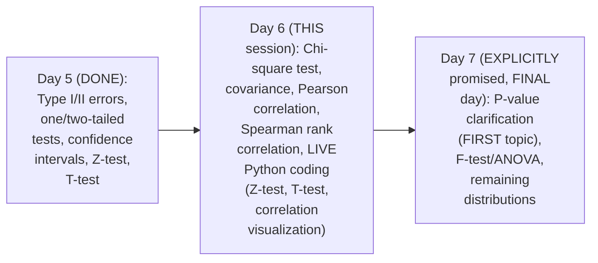

#### 🎯 Key Takeaways

* This is GENUINELY **Day 6**, DIRECTLY continuing FROM Day 5, and EXPLICITLY covering CHI-square, covariance, PEARSON correlation, SPEARMAN rank correlation, and EXTENSIVE live PYTHON coding.
* This session is GENUINELY, NOTABLY **HONEST** — it INCLUDES a REAL, extended SEQUENCE of live MISTAKES and self-CORRECTIONS around the p-VALUE decision rule (Section 13) — PRESERVED here AS genuine, VALUABLE learning CONTENT, not EDITED away.
* The instructor **directly, REPEATEDLY frames** definitional CLARITY as GENUINELY essential FOR interviews — EVEN when the SPECIFIC problem-solving APPROACH matters MORE in PRACTICE.

---
### 2. Chi-Square Test: A Precise, Genuine Definition

#### 📖 Definition — Chi-Square Test, Precisely Defined

> 💡 **Given directly:** *"If someone asks you in the interview, why is chi-square test used, you can just say that it is a non-parametric test that is performed on categorical variables — it can be nominal or ordinal data."*

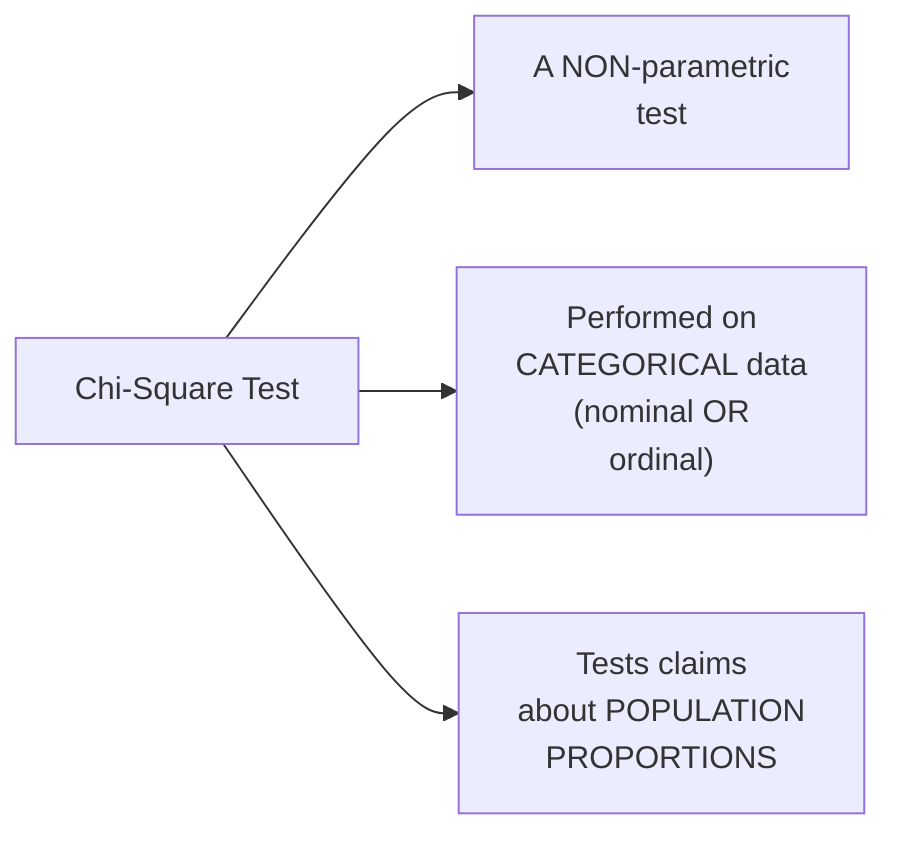

#### 🔍 Internal Working — A Direct, Precise Clarification: Why "Non-Parametric"?

> 💡 **Given directly:** *"Non-parametric test usually occurs with respect to population proportion — whenever you are given some kind of proportions of data, at that point of time you cannot specifically use a kind of parametric test, so you have to go with non-parametric test."*

#### ⚠ Common Mistakes

* Assuming the CHI-square test is GENUINELY, DIRECTLY applicable TO continuous, NUMERIC data — explicitly, directly, PRECISELY clarified: it's SPECIFICALLY, GENUINELY designed FOR categorical (NOMINAL or ORDINAL) data.
* Assuming DEFINITIONAL clarity is GENUINELY, PRACTICALLY less important THAN problem-solving ABILITY — explicitly, directly clarified: BOTH genuinely MATTER, ESPECIALLY in INTERVIEW contexts.

#### 🎯 Key Takeaways

* The **CHI-square test** is precisely a **NON-parametric test** performed ON **categorical** (NOMINAL or ORDINAL) data — TESTING claims ABOUT population **PROPORTIONS**.
* This DEFINITION is directly, EXPLICITLY framed as GENUINE, real INTERVIEW material — WORTH memorizing PRECISELY.
* This SETS UP the NEXT, COMPLETE worked EXAMPLE (Section 3), WHICH directly, CONCRETELY applies THIS definition TO a REAL, population-PROPORTION comparison PROBLEM.

---

### 3. A Complete, Real, Live-Worked Chi-Square Problem

#### 🪜 Step-by-Step — The Complete, Real Problem Statement

> 💡 **Given directly:** *"In the 2000 Indian census, the ages of the individual in a small town were found to be the following: less than 18 years, 20 [percent]; 18 to 35 years, 30 [percent]; greater than 35 years, 50 percent. Considering this, in 2010, ages of sample n=500 individuals were sampled — below are the results: less than 18, 121 people; 18 to 35, 288 people; greater than 35, 91 people. Using alpha as 0.05, would you conclude the population distribution of ages has changed in the last 10 years?"*

#### 🪜 Step-by-Step — Building the Expected & Observed Tables

> 💡 **Given directly:** *"This is the expected... because this is the population information... this is what your entire distribution is expected to be... 500 multiplied by 0.2... this is basically 100... this will be how much? This will be 150. And this will be 250."*

```text
Category:          <18      18-35     >35
2000 Census (%):    20%      30%       50%
Expected (2010, n=500): 100      150       250
Observed (2010):   121      288       91
```

#### 🪜 Step-by-Step — Defining the Hypotheses & Degree of Freedom

> 💡 **Given directly:** *"My null hypothesis is that the data meets the distribution of 2000 census. My alternate hypothesis will say that the data does not meet the distribution of 2000 census... [degree of freedom] this will be like this only, n minus 1... number of categories are coming into picture, one, two, and three — so three minus one is basically two."*

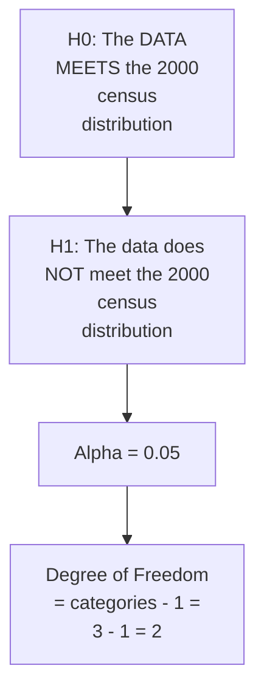

#### 🪜 Step-by-Step — The Decision Rule & Test Statistic Formula

> 💡 **Given directly:** *"Go and check in the chi-square table... df is 2... 5.991... your decision boundary is that if chi-square is greater than 5.99, [you] have to reject H0... calculate the test statistics, which is called as chi-square test — this is nothing but X squared is equal to summation of (fo minus fe) whole square, divided by fe."*

```text
Chi-Square Decision Boundary: reject H0 if χ² > 5.991 (df=2, α=0.05)

χ² = Σ [(fo - fe)² / fe]
   = (121-100)²/100 + (288-150)²/150 + (91-250)²/250
```

#### 🪜 Step-by-Step — A Complete, Real, Live-Computed Final Result

> 💡 **Given directly:** *"My x square is 232.94, which is obviously greater than 5.99, so what we have to do — we have to reject the null hypothesis, and which is absolutely true, because the population distribution has changed."*

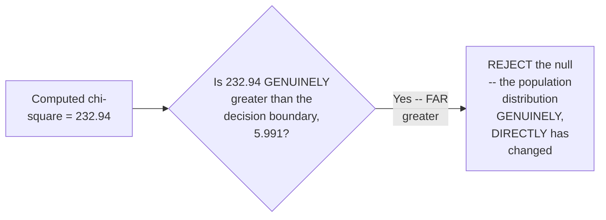

#### ⚠ Common Mistakes

* Assuming the "EXPECTED" table's OWN values are GENUINELY, DIRECTLY taken FROM the raw PERCENTAGES (20/30/50) — explicitly, directly, PRECISELY clarified: they MUST be SCALED to the SAME sample SIZE (n=500) as the OBSERVED data, VIA multiplication (500×0.2, ETC.), BEFORE comparison.
* Skipping the DEGREE-of-freedom calculation BEFORE the chi-SQUARE table lookup — explicitly, directly, PRECISELY confirmed as a REQUIRED, prerequisite STEP (categories MINUS 1).

#### 🎯 Key Takeaways

* A COMPLETE, real chi-SQUARE workflow REQUIRES BUILDING both an **EXPECTED** table (SCALED from KNOWN population PROPORTIONS) and an **OBSERVED** table (FROM the REAL sample), THEN comparing THEM via the **χ² = Σ[(fo−fe)²/fe]** formula.
* A COMPLETE, real, LIVE-computed EXAMPLE directly, CONCRETELY confirmed **χ² ≈ 232.94** — FAR exceeding the DECISION boundary of **5.991** (df=2, α=0.05) — LEADING to REJECTING the null HYPOTHESIS.
* This directly, CONCRETELY confirms the population's OWN age DISTRIBUTION GENUINELY, STATISTICALLY changed BETWEEN 2000 and 2010 — a COMPLETE, real-WORLD demonstration of the chi-SQUARE test's own, GENUINE purpose.

---
### 4. Python: Implementing the Z-Test (statsmodels)

#### 🪜 Step-by-Step — A Complete, Real, Live-Coded Z-Test Example

> 💡 **Given directly:** *"Suppose the IQ in certain population is normally distributed, with a mean of mu is equal to 100, and standard deviation of 15. A researcher wants to know if a new drug affects IQ level — he recruits 20 patients to try it and record the IQ level... for Z test we use this library, which is called as statsmodels.stats.weightstats import ztest as z."*

```python
from statsmodels.stats.weightstats import ztest as z

# 20 patients' own, recorded IQ levels, after medication:
data = [...]  # 20 real values

z_stat, p_value = z(data, value=100)
print(z_stat, p_value)
```

#### 🔍 Internal Working — A Genuine, Direct Confirmation: Two Return Values

> 💡 **Given directly:** *"The first value is the Z-test value, the second value is the p-value... this p-value can be used along with significance value, and suppose right now the p-value is 0.11 — if it is less than significance level... obviously we reject the null hypothesis."*

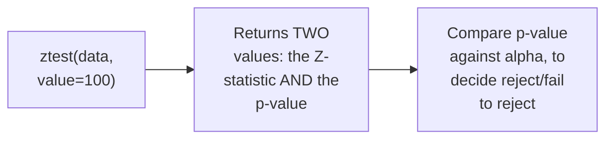

#### 🪜 Step-by-Step — A Genuine, Live Demonstration: Varying the Comparison Value

> 💡 **Given directly:** *"Suppose if we get 0.005 — let's say that in this particular case I am going to use the mean as 110 — now you see I am getting 0.002... this is obviously less than 0.05, so we reject the null hypothesis."*

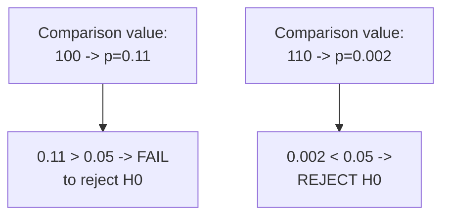

#### ⚠ Common Mistakes

* Assuming the Z-TEST function REQUIRES manually COMPUTING mean, standard DEVIATION, and standard ERROR yourself, AS taught MANUALLY in EARLIER sessions — explicitly, directly, PRACTICALLY demonstrated as UNNECESSARY: a SINGLE function CALL directly RETURNS both the Z-STATISTIC and the p-VALUE.
* Assuming a DIFFERENT comparison VALUE (100 versus 110) is GENUINELY, MERELY cosmetic — explicitly, directly, LIVE-demonstrated as GENUINELY, DIRECTLY changing the RESULTING p-value, and THEREFORE the FINAL, reject/fail-to-REJECT decision.

#### 🎯 Key Takeaways

* PYTHON's OWN `statsmodels` library GENUINELY, DIRECTLY implements the Z-test VIA a SINGLE function CALL — `ztest(data, VALUE=...)` — RETURNING both the Z-STATISTIC and the p-VALUE.
* A REAL, LIVE demonstration directly, CONCRETELY confirmed HOW changing the COMPARISON value (100 VERSUS 110) GENUINELY, DIRECTLY changes the RESULTING p-value (0.11 VERSUS 0.002) — and THEREFORE the FINAL decision (fail TO reject VERSUS reject).
* This directly, PRACTICALLY translates Day 5's own MANUAL Z-test FORMULA into a REAL, working PYTHON tool — DIRECTLY bridging THEORY and CODE.

---

### 5. Covariance: Quantifying Relationships Between Two Variables

#### ❓ Why It Exists — Two, Complete, Real Motivating Examples

> 💡 **Given directly, Example 1 (Positive Relationship):** *"Let's consider weight and height... when X is increasing, Y is increasing... when X is decreasing, Y is decreasing."*

> 💡 **Given directly, Example 2 (Negative Relationship):** *"Number of hours study and number of hours play... if I'm studying for two hours, I'm playing for six hours; if I'm studying for three hours, I'm playing for four hours... when X is increasing, Y is decreasing."*

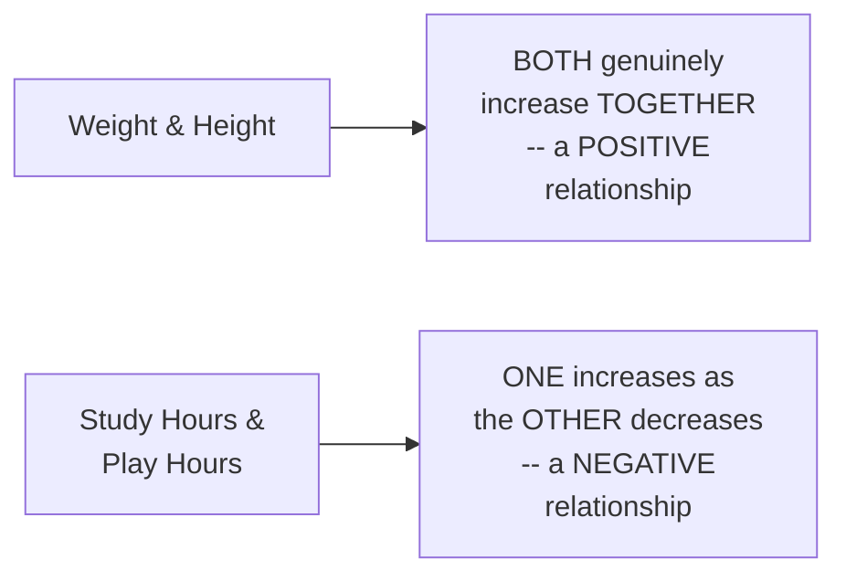

#### 📖 Definition — Covariance, Precisely Defined

> 💡 **Given directly:** *"Covariance is basically given by Cov(X,Y), which is nothing but summation of, i is equal to 1 to n, (x of i minus x bar)(y of i minus y bar), divided by n [or n-1 for a sample]."*

```text
Covariance Formula: Cov(X,Y) = Σ[(xᵢ - x̄)(yᵢ - ȳ)] / n   (population)
                     Cov(X,Y) = Σ[(xᵢ - x̄)(yᵢ - ȳ)] / (n-1)   (sample)
```

#### 🔍 Internal Working — Precisely Interpreting the Sign of Covariance

> 💡 **Given directly:** *"A positive number indicates two things: when X is increasing, Y is also increasing... when X is decreasing, Y is also decreasing... with a negative number... when X is decreasing, Y is increasing, as X is increasing Y is decreasing... if it is 0, that basically means... there is no relationship between X and Y."*

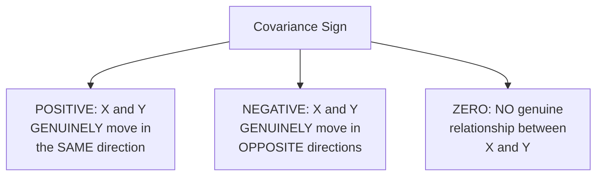

#### ⚠ Common Mistakes

* Assuming COVARIANCE's own SIGN (positive/NEGATIVE/zero) is the ONLY, genuinely IMPORTANT piece of INFORMATION it PROVIDES — explicitly, directly, DIRECTLY foreshadowed (Section 6): its OWN, raw MAGNITUDE carries a REAL, important LIMITATION.

#### 🎯 Key Takeaways

* **COVARIANCE** GENUINELY quantifies the RELATIONSHIP between TWO variables — ITS sign REVEALS the DIRECTION: **POSITIVE** (move TOGETHER), **NEGATIVE** (move OPPOSITELY), or **ZERO** (no GENUINE relationship).
* TWO, complete, real EXAMPLES (weight/HEIGHT for POSITIVE; study/PLAY hours for NEGATIVE) directly, CONCRETELY ground THIS concept in REAL, relatable SCENARIOS.
* This directly, PRECISELY sets UP the NEXT, essential DISCUSSION — covariance's OWN, genuine LIMITATION (Section 6), WHICH motivates the PEARSON correlation coefficient (Section 7).

---
### 6. Covariance's Own Genuine Limitation: Unbounded Magnitude

#### ⚠ A Direct, Honest, Genuine Limitation

> 💡 **Given directly:** *"With respect to the disadvantage, there is no fixed value — you may have plus 100 also, you may have plus 1000 also, you may find out minus 200 also, minus 2000 also... if we have two distributions, one is plus 100, the other one is plus 1000, you will not be able to identify [which is more strongly related], because it is just a magnitude value."*

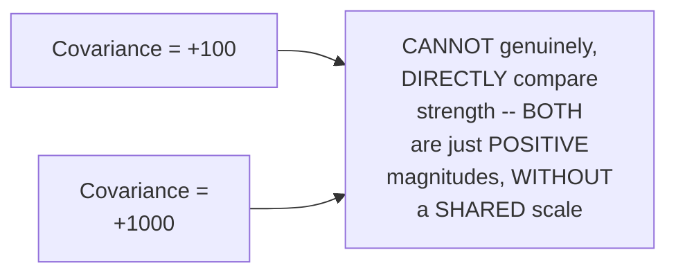

#### ⚠ Common Mistakes

* Assuming a LARGER covariance MAGNITUDE (e.g., +1000 versus +100) GENUINELY, DIRECTLY indicates a STRONGER relationship — explicitly, directly, HONESTLY clarified: covariance's OWN magnitude is GENUINELY, STRUCTURALLY unbounded — a LARGER number does NOT genuinely, RELIABLY mean a STRONGER relationship, SINCE it CAN be INFLUENCED by the UNDERLYING variables' OWN, raw SCALE/units.

#### 🎯 Key Takeaways

* Covariance's OWN, genuine LIMITATION: its MAGNITUDE is **UNBOUNDED** — VALUES could genuinely BE +100, +1000, −200, −2000, WITH no FIXED, comparable SCALE.
* This directly, DIRECTLY prevents COMPARING the RELATIVE strength OF relationships ACROSS different variable PAIRS, USING covariance ALONE.
* This GENUINE limitation directly, PRECISELY motivates the NEXT, essential CONCEPT — the **PEARSON correlation COEFFICIENT** (Section 7) — WHICH solves THIS exact problem.

---

### 7. Pearson Correlation Coefficient: Bounding the Relationship

#### ❓ Why It Exists — The Precise, Genuine Solution

> 💡 **Given directly:** *"That is the reason we really need to restrict these values between some range — for that specific region, we use another one which is called as Pearson correlation coefficient. What it does is that it basically restricts all your value between minus 1 to plus 1."*

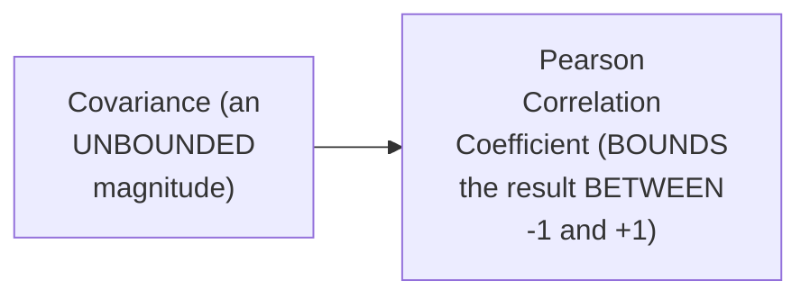

#### 📖 Definition — Pearson Correlation, Precisely Defined

> 💡 **Given directly:** *"For the Pearson correlation, you can basically use something like this: [correlation] of X comma Y, it is nothing but Covariance of X comma Y, divided by [the] standard deviation of X and standard deviation of Y — because of this multiplication, all your values will be between minus 1 to plus 1."*

```text
Pearson Correlation Formula: r(X,Y) = Cov(X,Y) / [SD(X) × SD(Y)]
```

#### 🔍 Internal Working — Precisely Interpreting the Resulting Value

> 💡 **Given directly:** *"The more towards plus one, the more positively it is correlated. The more towards minus one, the more negatively it is correlated."*

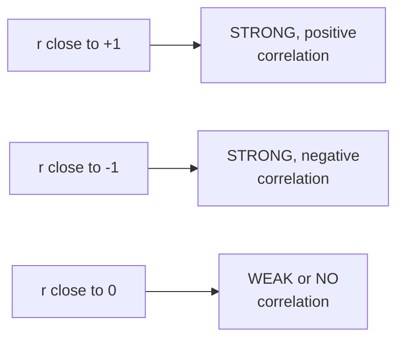

#### ⚠ Common Mistakes

* Assuming PEARSON correlation's OWN formula is GENUINELY, STRUCTURALLY unrelated to COVARIANCE — explicitly, directly, PRECISELY clarified: it's SIMPLY covariance DIVIDED by the PRODUCT of the TWO variables' OWN standard DEVIATIONS — a DIRECT, genuine EXTENSION of covariance, NOT a REPLACEMENT concept.
* Assuming a CORRELATION value's OWN sign (POSITIVE/negative) is ALL that MATTERS — explicitly, directly, PRECISELY clarified: the MAGNITUDE (HOW close to ±1) GENUINELY, DIRECTLY indicates the STRENGTH of the relationship TOO.

#### 🎯 Key Takeaways

* The **PEARSON correlation COEFFICIENT** GENUINELY solves COVARIANCE's own, established LIMITATION (Section 6) — BOUNDING every RESULT between **−1 and +1**.
* Formula: **r(X,Y) = Cov(X,Y) / [SD(X) × SD(Y)]** — a DIRECT, genuine EXTENSION of covariance, NOT a SEPARATE, unrelated concept.
* VALUES CLOSER to **+1** GENUINELY indicate STRONGER positive CORRELATION; values CLOSER to **−1** genuinely indicate STRONGER negative correlation; values NEAR **0** genuinely indicate WEAK or NO correlation.

---

### 8. A Genuine, Real, Visual Exploration of Pearson Correlation

#### 🪜 Step-by-Step — A Complete, Real, Live Exploration of Wikipedia's Own Illustrations

> 💡 **Given directly:** *"If you go and search for Pearson correlation coefficient, here you will be able to see this... all the points are in one straight line... your correlation... it is negatively correlated, and if it falls all in the straight line, it is minus 1."*

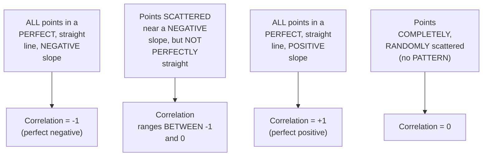

#### 🔍 Internal Working — A Genuine, Direct Confirmation of Pearson's Own, Key Strength & Limitation

> 💡 **Given directly:** *"It captures the linear properties very well, because everywhere you can see that there is a linear line, it captures it in an amazing way — that is the most advantageous thing with respect to Pearson correlation."*

#### ⚠ Common Mistakes

* Assuming EVERY, genuinely RANDOM-looking scatter PLOT necessarily has a correlation OF exactly zero — explicitly, directly, LIVE-demonstrated via MULTIPLE, real Wikipedia EXAMPLES: SOME "scattered-LOOKING" patterns GENUINELY have small, NON-zero correlations (e.g., 0.4, −0.4, −0.8), DEPENDING on the SUBTLE, underlying TREND.

#### 🎯 Key Takeaways

* A COMPLETE, real, LIVE exploration OF Wikipedia's own PEARSON-correlation illustrations directly, VISUALLY confirmed the RELATIONSHIP between SCATTER-plot shape and CORRELATION value — PERFECT straight LINES produce ±1; RANDOM scatter PRODUCES values NEAR 0.
* Pearson correlation is directly, EXPLICITLY confirmed as GENUINELY excelling at CAPTURING **LINEAR** relationships — its OWN, core STRENGTH.
* This directly, PRECISELY sets UP the NEXT, essential LIMITATION — Pearson's OWN, genuine WEAKNESS with **NON-linear** relationships — MOTIVATING Spearman rank CORRELATION (Section 9).

---
### 9. Spearman Rank Correlation: Capturing Non-Linear Relationships

#### ❓ Why It Exists — A Genuine, Real, Motivating Counterexample

> 💡 **Given directly:** *"This graph... is obviously having a positive correlation, because when the X is increasing, Y is increasing — and when I try to calculate with respect to Pearson correlation, it is giving me 0.88... this properties has not been able to capture by Pearson correlation... even though when X is increasing, Y is also increasing, we need to get 1 — and that is where Spearman rank correlation will come."*

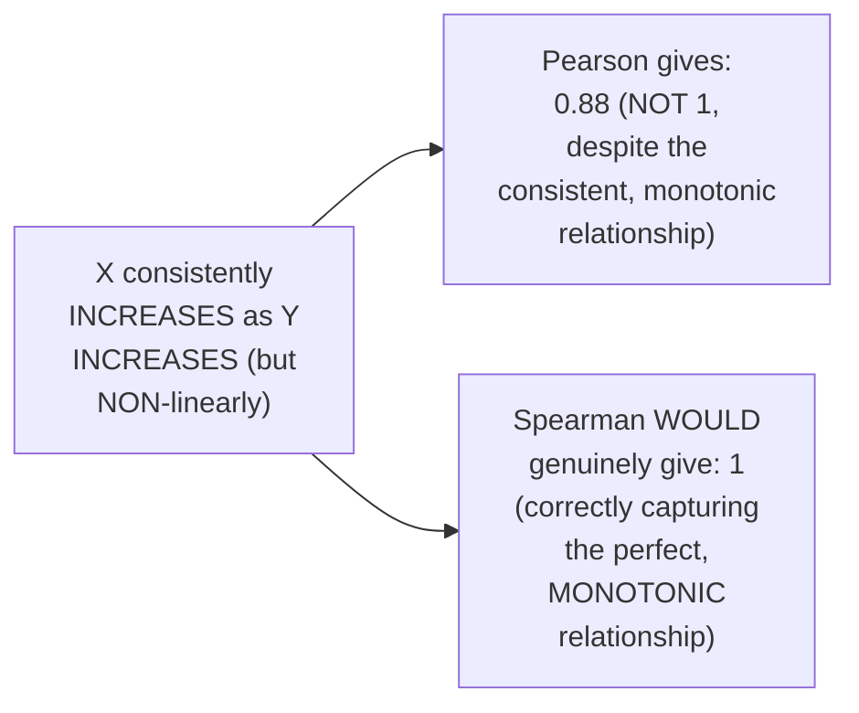

#### 📖 Definition — Spearman Rank Correlation, Precisely Introduced

> 💡 **Given directly:** *"Spearman rank correlation will also satisfy non-linear properties — Pearson correlation is good at satisfying linear properties... in this case, non-linear properties will also work well."*

#### 📖 Definition — The Precise Spearman Formula (Using Ranks)

> 💡 **Given directly:** *"Instead of writing... standard deviation of X, here you will be having rank of standard deviation of X multiplied by rank of standard deviation of Y... this will be covariance of rank of X comma rank of Y."*

```text
Spearman Rank Correlation Formula:
r(rank(X), rank(Y)) = Cov(rank(X), rank(Y)) / [SD(rank(X)) × SD(rank(Y))]
```

#### 🪜 Step-by-Step — A Complete, Real, Worked Example: Assigning Ranks

> 💡 **Given directly:** *"Height and weight... if I say the height is 170, the weight may be 75 kgs; if I say height is 160, then the weight may be... 62; 150, the weight may be 60; 145, the weight may be 55... rank of X, 180 is the highest, right? So I may give this rank as 1. Then 170 is the next highest."*

```text
Height (X):  180  170  160  150  145
Weight (Y):   85   75   62   60   55

Rank of X:    1    2    3    4    5
Rank of Y:    1    2    3    4    5

-> Compute correlation using these RANKS, not the original, raw values
```

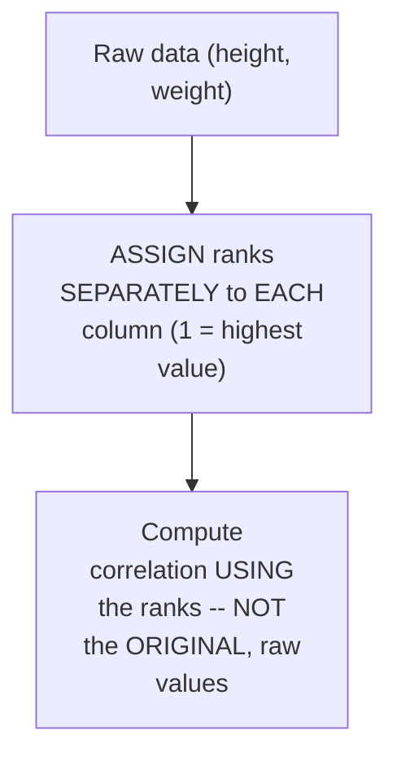

#### ⚠ Common Mistakes

* Assuming SPEARMAN rank CORRELATION uses a GENUINELY, ENTIRELY different FORMULA from PEARSON — explicitly, directly, PRECISELY clarified: it USES the EXACT SAME formula STRUCTURE, but SUBSTITUTES **RANKS** for the RAW, original VALUES.
* Assuming a HIGH Pearson correlation (LIKE 0.88) is ALWAYS, GENUINELY "good ENOUGH" — explicitly, directly, LIVE-demonstrated as GENUINELY, DIRECTLY missing a PERFECT (1.0) MONOTONIC relationship — Spearman WOULD correctly capture THIS as 1.0.

#### 🎯 Key Takeaways

* **SPEARMAN rank CORRELATION** GENUINELY captures **NON-linear** (but MONOTONIC) relationships THAT Pearson correlation CAN, genuinely, PARTIALLY miss.
* It USES the EXACT SAME underlying FORMULA structure as PEARSON, but SUBSTITUTES **ranks** of X and Y FOR their RAW, original values.
* A COMPLETE, real, WORKED example (HEIGHT and weight, RANKED 1-5) directly, CONCRETELY illustrates HOW ranks are ASSIGNED and USED — WITH the GENUINE, real MOTIVATION being a CASE where PEARSON's own 0.88 result SHOULD, more CORRECTLY, be a PERFECT 1.0.

---

### 10. Python: Implementing the One-Sample T-Test (scipy)

#### 🪜 Step-by-Step — A Complete, Real, Live-Coded T-Test Example

> 💡 **Given directly:** *"Let's compute the mean of this ages... ages_mean is equal to np.mean of ages... let's take my sample size as 10... np.random.choice... here I'm just going to give my ages, and this will basically be my sample size... from scipy.stats import ttest_1samp."*

```python
import numpy as np
from scipy.stats import ttest_1samp

ages = [...]  # a real, defined population of ages
ages_mean = np.mean(ages)   # -> 30.34 (live-confirmed)

sample_size = 10
age_sample = np.random.choice(ages, sample_size)

t_stat, p_value = ttest_1samp(age_sample, 30)   # comparing against the population mean
print(p_value)
```

#### 🔍 Internal Working — A Genuine, Live Demonstration: Varying Sample Composition

> 💡 **Given directly:** *"If I go and execute this... 0.76... if I execute the same code and I write sample size with respect to 31, now I'm getting 0.918... if I try to change this random value again and again, let's say that I have taken a different sample... my sample mean is nothing but 24.3, now if I execute this, this is 0.015."*

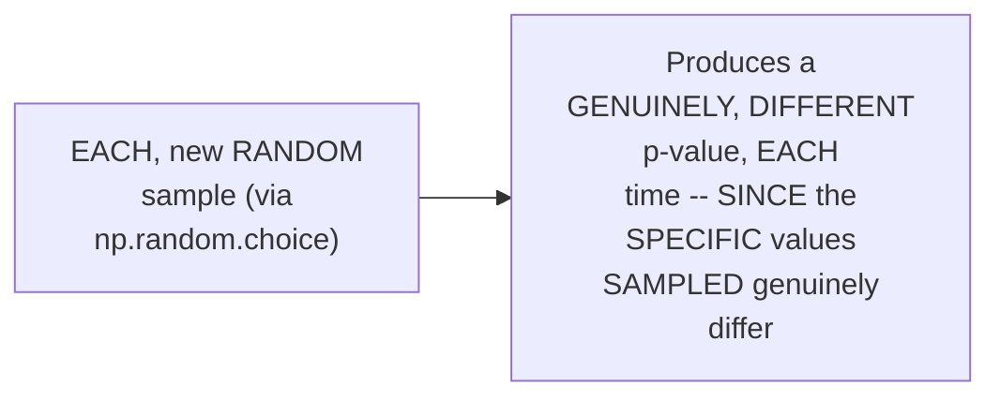

#### ⚠ Common Mistakes

* Assuming a T-TEST's own RESULT (p-value) is GENUINELY, DETERMINISTICALLY fixed FOR a GIVEN population — explicitly, directly, LIVE-demonstrated as GENUINELY, DIRECTLY varying EACH time a NEW, random SAMPLE is DRAWN — REFLECTING genuine, real SAMPLING variability.
* Assuming `np.RANDOM.choice()` REQUIRES manually SPECIFYING every INDIVIDUAL value TO sample — explicitly, directly, PRACTICALLY demonstrated as AUTOMATICALLY selecting a RANDOM subset OF the specified SIZE.

#### 🎯 Key Takeaways

* PYTHON's OWN `scipy.stats.ttest_1samp()` function DIRECTLY, PRACTICALLY implements the ONE-sample T-test — TAKING a SAMPLE and a COMPARISON mean, RETURNING a t-STATISTIC and p-VALUE.
* A REAL, LIVE demonstration directly, REPEATEDLY confirmed that EACH new, RANDOM sample GENUINELY produces a DIFFERENT p-value — a CONCRETE, real ILLUSTRATION of SAMPLING variability.
* This directly, PRACTICALLY translates Day 5's own MANUAL T-test FORMULA into a REAL, working PYTHON tool.

---
### 11. A Second, Complete Python T-Test Example (& a Genuine Aside on Poisson Distribution)

#### 🪜 Step-by-Step — A Complete, Real, Live-Coded Second Example

> 💡 **Given directly:** *"Suppose I take college — the ages of the entire college student, right? This will basically be my population... I'm going to take class... one class student's ages... find the mean of all the ages, and then we'll try to compare whether this will be able to give that specific output — can we come to the population mean ages of the college student?"*

```python
# A Poisson-distributed population (school_ages) and a smaller class sample:
school_ages = np.random.poisson(lam=35, size=1500)   # starting age 18, mean 35
class_a_ages = np.random.poisson(lam=30, size=60)     # starting age 18, mean 30

class_a_ages.mean()   # -> 46.9 (live-confirmed)

t_stat, p_value = ttest_1samp(class_a_ages, school_ages.mean())
print(p_value)
```

#### ⚠ A Direct, Honest, Deferred Explanation: Poisson Distribution

> 💡 **Given directly:** *"This is a Poisson distribution, I'll talk about Poisson distribution tomorrow."*

#### 🔍 Internal Working — A Genuine, Real, Live-Confirmed Conclusion

> 💡 **Given directly:** *"If I go and probably see the school ages mean, this [is] far away, right? It is 46.9, and this is 53... if you are considering alpha is 0.05, it will obviously be very, very far, right? I hope you are able to understand — so you have to reject it, not accept it."*

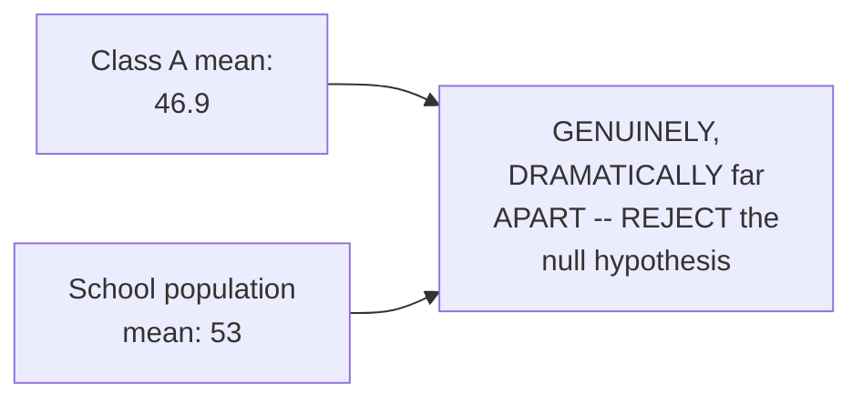

#### 🪜 Step-by-Step — A Complete, Real, Live-Coded Conditional Decision

> 💡 **Given directly:** *"Let's say I am putting this if p_value is less than 0.05, then... print... tell me the message... else print... accept H0."*

```python
if p_value < 0.05:
    print("Reject H0")
else:
    print("Accept H0")
```

#### ⚠ Common Mistakes

* Assuming this session's own, BRIEF mention of "POISSON distribution" REQUIRES a COMPLETE, immediate UNDERSTANDING — explicitly, directly, HONESTLY deferred: the instructor DIRECTLY promises FULL coverage "TOMORROW" — THIS session ONLY uses it AS a CONVENIENT, real DATA-GENERATION tool.
* Assuming a T-TEST comparing TWO, genuinely FAR-apart means (46.9 VERSUS 53) REQUIRES careful, PRECISE interpretation — explicitly, directly, CONFIDENTLY clarified: WHEN the GAP is this LARGE, the CONCLUSION (reject the NULL) is GENUINELY, OBVIOUSLY clear.

#### 🎯 Key Takeaways

* A SECOND, complete PYTHON T-test EXAMPLE directly, CONCRETELY reinforced the SAME workflow — COMPARING a SMALLER "class" sample AGAINST a LARGER "school" POPULATION, using `TTEST_1SAMP`.
* This example GENUINELY, HONESTLY uses **POISSON-distributed data** (VIA `np.random.POISSON`) — WITH the instructor DIRECTLY, HONESTLY deferring the FULL explanation OF this distribution to the NEXT session.
* A COMPLETE, real, LIVE-coded **CONDITIONAL** (`if p_value < 0.05: REJECT; else: accept`) directly, PRACTICALLY automates the FINAL, decision-making STEP of hypothesis TESTING.

---

### 12. Python: Visualizing Correlation (Seaborn)

#### 🪜 Step-by-Step — A Complete, Real, Live-Coded Correlation Matrix

> 💡 **Given directly:** *"Let's say that I'm using Seaborn... sns.load_dataset — let's consider that I'm going to use Iris dataset... if I use the correlation, df.corr — so this is how my diagram looks like... here you can see that it is basically showing you the correlation with sepal length and petal length, it is positively correlated."*

```python
import seaborn as sns

df = sns.load_dataset('iris')
df.corr()   # a numeric correlation matrix, across all numeric columns
```

#### 🪜 Step-by-Step — A Complete, Real, Live-Coded Pairwise Visualization

> 💡 **Given directly:** *"Instead, I can also use sns.pairplot(df) — so here also you have a way to see in a diagrammatic way... here you can see this is how your diagram looks like — the entire correlation in [a] visualized way."*

```python
sns.pairplot(df)
```

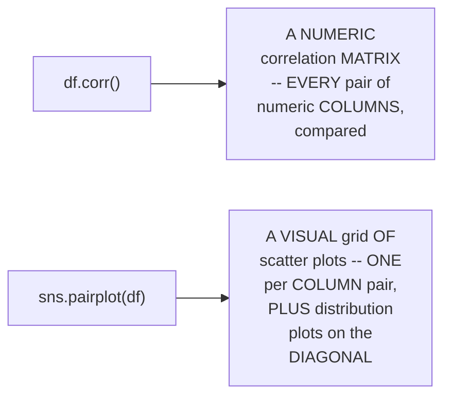

#### ⚠ Common Mistakes

* Assuming CORRELATION must GENUINELY be computed MANUALLY, COLUMN-pair by COLUMN-pair — explicitly, directly, PRACTICALLY demonstrated as UNNECESSARY: `df.CORR()` computes the ENTIRE, pairwise CORRELATION matrix AUTOMATICALLY, in ONE call.

#### 🎯 Key Takeaways

* PANDAS' OWN `df.corr()` method DIRECTLY, AUTOMATICALLY computes a COMPLETE, PAIRWISE correlation MATRIX across EVERY numeric COLUMN in a dataset.
* SEABORN's OWN `sns.pairplot(df)` DIRECTLY, VISUALLY presents THIS same INFORMATION — a GRID of SCATTER plots (ONE per COLUMN pair) PLUS distribution PLOTS on the DIAGONAL.
* This directly, PRACTICALLY demonstrates HOW the ENTIRE, theoretical CORRELATION discussion (Sections 5-9) TRANSLATES into REAL, immediately-USABLE Python TOOLS.

---
### 13. A Genuine, Honest, Live Correction: The P-Value Decision Rule

#### 🧠 Concept — Why This Section Exists

This session GENUINELY includes an EXTENDED, LIVE sequence WHERE the instructor WORKS through — and INITIALLY, GENUINELY mis-states, MULTIPLE times — the EXACT wording OF the p-value DECISION rule, BEFORE arriving AT the CORRECT, final STATEMENT. This is PRESERVED here HONESTLY, SINCE p-value INTERPRETATION is a **GENUINELY, WIDELY confused TOPIC** even AMONG experienced PRACTITIONERS, and WATCHING the CORRECT rule get ESTABLISHED (INCLUDING the INCORRECT, INTERMEDIATE attempts) is GENUINELY, PEDAGOGICALLY valuable.

#### 📖 Definition — The Correct, Final P-Value Decision Rule

> 💡 **Given directly, the instructor's own, FINAL, corrected statement:** *"If p-value is less than or equal to 0.05, in this particular case we reject the null hypothesis... it basically says that five percent probability the null hypothesis is correct... if p is greater than or equal to 0.05, here we accept the null hypothesis, which in turn is saying that there is [a] more than five percent probability for the null hypothesis [to be] correct."*

```text
CORRECT P-Value Decision Rule:
  p-value ≤ alpha  ->  REJECT the null hypothesis
  p-value > alpha  ->  FAIL TO REJECT (accept) the null hypothesis
```

#### 🔍 Internal Working — The Genuine, Underlying Reasoning

> 💡 **Given directly:** *"P is basically defining the probability part, right — now in this particular case, they are just saying that it is less than five percent probability that the null is correct... it basically says that five percent probability the null hypothesis is correct [threshold]."*

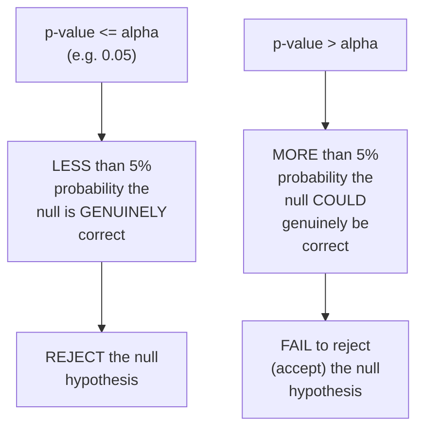

#### ⚠ A Direct, Honest Acknowledgment of the Live, Extended Confusion

> 💡 **Given directly, the instructor's own, honest, repeated acknowledgments:** *"I think I made a silly mistake today, in live sessions it usually happens when we are solving multiple problem statements... I still feel bad about myself, I was not able to, you know, every way I teach properly this one... I will repeat this tomorrow, don't worry... tomorrow, the first thing I will start with [is the] p-value thing."*

#### 🔍 Internal Working — A Genuine, Direct, Related Clarification: A Different Terminology Convention

> 💡 **Given directly, from a live audience correction the instructor accepted:** *"We never say we accept null hypothesis, instead we can say we fail to reject null hypothesis."*

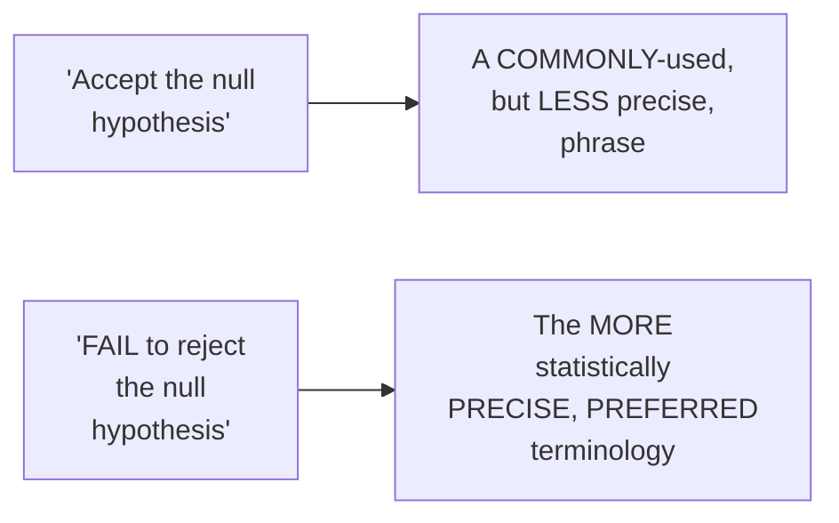

#### ⚠ Common Mistakes

* Confusing the DIRECTION of the p-value COMPARISON — explicitly, directly, EXTENSIVELY worked THROUGH live, WITH genuine, real MISTAKES along the WAY, BEFORE arriving at the CORRECT, final RULE: **p ≤ alpha → REJECT; p > alpha → fail TO reject**.
* Using the PHRASE "accept the null HYPOTHESIS" as though it were GENUINELY, STATISTICALLY equivalent to "PROVING" the null — explicitly, directly, HONESTLY corrected (VIA a live AUDIENCE member's own CONTRIBUTION): the MORE precise, PREFERRED phrase is "FAIL to reject the null HYPOTHESIS."

#### 🎯 Key Takeaways

* The **CORRECT, final p-VALUE decision rule**: **p-value ≤ alpha → REJECT the null HYPOTHESIS**; **p-value > alpha → FAIL to reject (ACCEPT) the null hypothesis**.
* This session **GENUINELY, HONESTLY includes** an EXTENDED, live SEQUENCE of REAL confusion and SELF-correction AROUND this EXACT rule — PRESERVED here as GENUINE, valuable CONTEXT, since p-value INTERPRETATION is a WIDELY, GENUINELY confused topic WORTH extra, careful ATTENTION.
* The MORE statistically PRECISE, preferred TERMINOLOGY is "**FAIL to reject** the null hypothesis," RATHER than "ACCEPT" the null — a GENUINE, important NUANCE (DIRECTLY connecting BACK to Day 4's own, SIMILAR, honest CLARIFICATION on THIS exact point).

---

### 14. Closing: A Personal Reflection & What's Deferred to Tomorrow

#### 🪜 Step-by-Step — A Direct, Honest, Personal Reflection

> 💡 **Given directly:** *"Today is the sixth day... first day when people joined, it was around 1400... then the second day it went around a thousand... then third day it went around 6-700... today it is 3-48... people lose interest... it is difficult, you know — machine learning, you have to basically write everything mathematically, showcase everything, so it becomes difficult, but anyhow I will be taking it."*


#### 🪜 Step-by-Step — A Complete, Honest, Direct Confirmation of Tomorrow's Own Plan

> 💡 **Given directly:** *"Tomorrow, the first thing I will start with [is the] p-value thing only, first topic... tomorrow we are probably going to discuss about F-test, and probably all the distribution that exists that we should definitely know."*

```mermaid
flowchart LR
    A["Day 6 (done):<br/>Chi-square test,<br/>covariance, Pearson<br/>correlation,<br/>Spearman rank<br/>correlation, LIVE<br/>Python (Z-test,<br/>T-test,<br/>correlation<br/>visualization)"] --> B["Day 7 (EXPLICITLY<br/>promised, FINAL<br/>day): P-value<br/>re-clarification<br/>(FIRST topic),<br/>F-test/ANOVA,<br/>remaining<br/>distributions,<br/>overall SUMMARY"]
```

#### ⚠ Common Mistakes

* Assuming a LIVE instructor's OWN, honest STRUGGLE with a SPECIFIC concept (p-VALUE interpretation) REFLECTS a GENUINE lack OF underlying EXPERTISE — explicitly, directly, HONESTLY reframed: it's a WIDELY, GENUINELY confusing TOPIC even for EXPERIENCED practitioners — the INSTRUCTOR's own, TRANSPARENT self-correction PROCESS is GENUINELY, PEDAGOGICALLY valuable, not a GENUINE weakness.

#### 🎯 Key Takeaways

* This episode **GENUINELY, COMPREHENSIVELY delivers** its OWN core GOALS — the CHI-square test, covariance, PEARSON and SPEARMAN correlation, and EXTENSIVE live PYTHON implementations.
* The instructor **directly, HONESTLY shares** a GENUINE, personal REFLECTION on DECLINING audience NUMBERS across the SEVEN-day series — a REAL, human MOMENT worth RESPECTING as GENUINE context.
* **P-value re-CLARIFICATION** is directly, EXPLICITLY confirmed as TOMORROW's own, FIRST topic — WITH the **F-test/ANOVA** and REMAINING distributions ALSO explicitly PROMISED for the SERIES' own, FINAL day.

---
## 📝 Glossary

| Term | Definition | Why It Matters |
|---|---|---|
| **Chi-Square Test** | A non-parametric test on categorical (nominal/ordinal) data | Tests claims about population proportions |
| **Expected vs. Observed** | Two tables compared in a chi-square test | Expected is scaled from known proportions; observed is real sample data |
| **Covariance** | Quantifies the relationship between two variables | Positive/negative/zero indicates direction; magnitude is unbounded |
| **Pearson Correlation Coefficient** | Covariance, normalized to a range of -1 to +1 | Captures LINEAR relationships well |
| **Spearman Rank Correlation** | Pearson's formula, applied to RANKS instead of raw values | Captures NON-LINEAR (monotonic) relationships |
| **ztest() (statsmodels)** | Python's direct Z-test implementation | Returns both a Z-statistic and a p-value |
| **ttest_1samp() (scipy)** | Python's direct one-sample T-test implementation | Returns both a t-statistic and a p-value |
| **df.corr() (pandas)** | Computes a full, pairwise correlation matrix | Automates manual correlation calculation |
| **sns.pairplot() (seaborn)** | Visualizes pairwise relationships across all columns | A visual companion to df.corr() |
| **Fail to Reject** | The statistically preferred term over "accept the null" | A more precise, honest phrasing |

---

## 🔄 Revision Notes — One-Minute Revision

* This is **Day 6**, covering the chi-square test, covariance, Pearson correlation, Spearman rank correlation, and extensive live Python coding -- plus a genuinely honest, extended live correction of the p-value decision rule.
* **Chi-square test**: a non-parametric test on categorical (nominal/ordinal) data, testing claims about population proportions.
* **Complete, live-worked chi-square example**: comparing a 2000 Indian census age distribution (20%/30%/50%) against a 2010 sample (n=500; observed 121/288/91). Expected values scaled to n=500 (100/150/250). Degree of freedom = categories-1 = 2. Chi-square table: df=2, α=0.05 -> critical value 5.991. Computed χ² ≈ 232.94 -> far exceeds 5.991 -> REJECT the null -> the population distribution genuinely changed.
* **Python Z-test**: `statsmodels.stats.weightstats.ztest(data, value=...)` returns both a Z-statistic and a p-value in one call. Live-demonstrated: changing the comparison value from 100 to 110 changed the p-value from 0.11 (fail to reject) to 0.002 (reject).
* **Covariance**: quantifies relationships between two variables. Positive = move together (e.g. weight/height); negative = move oppositely (e.g. study/play hours); zero = no relationship. Genuine LIMITATION: unbounded magnitude (+100 vs. +1000 -- can't compare relative strength).
* **Pearson Correlation Coefficient**: Cov(X,Y) / [SD(X) × SD(Y)] -- bounds results to [-1, +1]. Live-explored via Wikipedia's own illustrations: perfect straight lines = ±1; random scatter = ~0. Captures LINEAR relationships well.
* **Spearman Rank Correlation**: solves Pearson's own limitation with NON-linear (but monotonic) relationships -- a real example showed Pearson giving 0.88 for a perfectly monotonic (but non-linear) relationship, when Spearman would correctly give 1.0. Same formula as Pearson, but using RANKS of X and Y instead of raw values.
* **Python T-test**: `scipy.stats.ttest_1samp(sample, population_mean)`. Live-demonstrated: repeatedly re-sampling produces genuinely different p-values each time (sampling variability). A second example compared a "Class A" sample (mean 46.9, from Poisson-distributed data) against a "school" population (mean 53) -- genuinely far apart -> REJECT.
* **Python correlation visualization**: `df.corr()` (a full, pairwise correlation matrix) and `sns.pairplot(df)` (a visual grid of scatter plots), demonstrated on the Iris dataset.
* **The genuine, honest p-value correction**: after an extended, live sequence of real mistakes, the CORRECT rule is: p-value ≤ alpha -> REJECT the null; p-value > alpha -> FAIL TO REJECT (accept) the null. Also clarified: "fail to reject" is the statistically preferred phrase over "accept the null hypothesis."
* **Closing**: an honest, personal reflection on declining attendance across the 7-day series (1,400 -> 1,000 -> 600-700 -> 350). Tomorrow (the final day) explicitly starts with re-clarifying p-value, then covers the F-test/ANOVA and remaining distributions.

---

## 📋 Cheat Sheet

**Chi-Square Test:**
```text
Definition: non-parametric test, categorical data, tests population proportions
χ² = Σ[(observed - expected)² / expected]
Degree of Freedom = number of categories - 1
Decision: reject H0 if χ² > critical value (from chi-square table)
```

**Covariance & Correlation:**
```text
Covariance:  Cov(X,Y) = Σ[(xᵢ-x̄)(yᵢ-ȳ)] / n    [sign = direction; magnitude = UNBOUNDED]
Pearson:     r = Cov(X,Y) / [SD(X) × SD(Y)]      [bounded to -1 to +1; captures LINEAR relationships]
Spearman:    same as Pearson, but using RANKS     [captures NON-LINEAR, monotonic relationships]
```

**Python quick reference:**
```python
from statsmodels.stats.weightstats import ztest as z
z_stat, p_value = z(data, value=population_mean)

from scipy.stats import ttest_1samp
t_stat, p_value = ttest_1samp(sample, population_mean)

import seaborn as sns
df.corr()             # pairwise correlation matrix
sns.pairplot(df)      # visual, pairwise scatter grid
```

**The correct P-Value decision rule (after the session's own, honest correction):**
```text
p-value <= alpha  ->  REJECT the null hypothesis
p-value >  alpha  ->  FAIL TO REJECT (accept) the null hypothesis
```

---

## 🔥 Interview Questions & Answers

### 🟢 Beginner

**Q1.**

**Question:** What is a chi-square test used for?

**Answer:** A non-parametric test on categorical (nominal/ordinal) data, testing claims about population proportions.

**Explanation:** Directly, precisely defined.

**Why Interviewers Ask This:** The most basic, foundational chi-square question.

**Possible Follow-up:** "How do you compute the degree of freedom for a chi-square test?"

**Q2.**

**Question:** What is covariance's own, genuine limitation?

**Answer:** Its magnitude is unbounded, making it hard to compare relative strength across variable pairs.

**Explanation:** Directly, honestly explained.

**Why Interviewers Ask This:** Foundational, frequently-tested statistics knowledge.

**Possible Follow-up:** "What solves this limitation?"

**Q3.**

**Question:** What range does the Pearson correlation coefficient always fall within?

**Answer:** -1 to +1.

**Explanation:** Directly, explicitly stated.

**Why Interviewers Ask This:** Basic, essential correlation knowledge.

**Possible Follow-up:** "What does a value close to 0 genuinely indicate?"

**Q4.**

**Question:** What kind of relationship does Pearson correlation capture well, and what kind does it genuinely struggle with?

**Answer:** Linear relationships well; non-linear relationships less well.

**Explanation:** Directly, precisely distinguished.

**Why Interviewers Ask This:** Tests genuine understanding of Pearson's own scope.

**Possible Follow-up:** "What alternative correlation measure addresses this limitation?"

**Q5.**

**Question:** How does Spearman rank correlation's own formula differ from Pearson's?

**Answer:** It uses the same formula structure, but applied to ranks of X and Y, rather than raw values.

**Explanation:** Directly, precisely explained.

**Why Interviewers Ask This:** Basic, essential correlation-method knowledge.

**Possible Follow-up:** "When would you genuinely prefer Spearman over Pearson?"

**Q6.**

**Question:** In Python, what does `ztest()` from statsmodels genuinely return?

**Answer:** Both a Z-statistic and a p-value.

**Explanation:** Directly, explicitly demonstrated.

**Why Interviewers Ask This:** Basic, practical Python/statistics knowledge.

**Possible Follow-up:** "What library and function would you use for a one-sample T-test instead?"

**Q7.**

**Question:** What is the correct p-value decision rule?

**Answer:** p-value ≤ alpha -> reject the null hypothesis; p-value > alpha -> fail to reject (accept) the null.

**Explanation:** Directly, precisely stated (after this session's own, honest correction process).

**Why Interviewers Ask This:** A commonly-confused, genuine, essential hypothesis-testing rule.

**Possible Follow-up:** "Why is 'fail to reject' the preferred phrase over 'accept the null hypothesis'?"

**Q8.**

**Question:** What Python function computes a full, pairwise correlation matrix across a DataFrame?

**Answer:** `df.corr()`.

**Explanation:** Directly, explicitly demonstrated.

**Why Interviewers Ask This:** Basic, practical Python/pandas knowledge.

**Possible Follow-up:** "What Seaborn function provides a visual companion to this?"

**Q9.**

**Question:** In a chi-square test, what do "expected" and "observed" genuinely represent?

**Answer:** Expected is the theoretical distribution scaled to the sample size; observed is the actual, real sample data.

**Explanation:** Directly, precisely explained.

**Why Interviewers Ask This:** Basic, essential chi-square methodology knowledge.

**Possible Follow-up:** "How do you scale a known population percentage into an expected count?"

**Q10.**

**Question:** Why might re-running the same one-sample T-test code (with new random sampling) genuinely produce a different p-value each time?

**Answer:** Because each new, random sample genuinely differs, reflecting real sampling variability.

**Explanation:** Directly, live-demonstrated.

**Why Interviewers Ask This:** Tests genuine, practical understanding of sampling variability.

**Possible Follow-up:** "How would increasing the sample size genuinely affect this variability?"

---

### 🟡 Intermediate

**Q11.**

**Question:** Explain why the instructor deliberately preserves and shares his own, live mistakes in explaining the p-value decision rule, rather than simply re-recording a clean, error-free explanation.

**Answer:** While this is a genuinely LIVE, unscripted TEACHING format (RATHER than a DELIBERATE choice to PRESERVE errors), the instructor's OWN, HONEST response to the confusion — EXPLICITLY acknowledging the MISTAKE, ACCEPTING a live AUDIENCE correction, and PROMISING to RE-clarify at the START of the NEXT session — is GENUINELY, PEDAGOGICALLY valuable. It DIRECTLY demonstrates that EVEN experienced PRACTITIONERS can GENUINELY, TEMPORARILY confuse p-value DIRECTION, and MODELS the CORRECT, honest RESPONSE: acknowledging the ERROR directly, RATHER than GLOSSING over it OR leaving learners WITH incorrect information UNCORRECTED. This is CONSISTENT with THIS entire series' own, established TEACHING philosophy — GENUINE, unscripted, LIVE instruction, WITH honest CORRECTIONS, over a POLISHED, but POTENTIALLY less TRUSTWORTHY-feeling, edited PRESENTATION.

**Explanation:** Requires recognizing the genuine, honest value of transparent error correction in a live teaching format, rather than assuming errors are a deliberate pedagogical device.

**Why Interviewers Ask This:** Tests whether a learner can extract genuine value from an honestly-flawed but transparently-corrected explanation, rather than dismissing the entire section due to the initial confusion.

**Possible Follow-up:** "State, from memory, the FINAL, CORRECTED p-value decision rule, PRECISELY."

**Q12.**

**Question:** A learner argues that since covariance and Pearson correlation are directly, mathematically related (Pearson = Covariance / [SD(X) × SD(Y)]), a covariance of exactly 0 must always correspond to a Pearson correlation of exactly 0, and vice versa. Evaluate this claim.

**Answer:** This claim is GENUINELY, MATHEMATICALLY correct — a DIRECT, logical CONSEQUENCE of the FORMULA relationship ITSELF (per Section 7's own established FORMULA): SINCE Pearson correlation is COVARIANCE divided BY a PRODUCT of standard DEVIATIONS (which are ALWAYS, GENUINELY non-negative, ASSUMING non-CONSTANT data), a covariance OF exactly zero WILL, MATHEMATICALLY, ALWAYS produce a PEARSON correlation of EXACTLY zero TOO (ZERO divided by ANY non-zero number is STILL zero). This is a GENUINE, valid, LOGICAL deduction FROM the established FORMULA — NOT an OVERSTATEMENT, UNLIKE many OTHER claims in THIS session's own INTERVIEW-question set. HOWEVER, it's WORTH noting the REVERSE direction (a PEARSON correlation of ZERO IMPLYING covariance OF zero) is ALSO, GENUINELY, MATHEMATICALLY true FOR the SAME, direct REASON — BOTH directions HOLD, SINCE they're CONNECTED by a SIMPLE, DIRECT division RELATIONSHIP, NOT an APPROXIMATION.

**Explanation:** Tests whether a learner can correctly evaluate a genuinely valid mathematical claim, rather than reflexively looking for a flaw in every proposed statement.

**Why Interviewers Ask This:** Distinguishes candidates who can accurately evaluate the TRUTH of a claim (even when it holds) from those who assume every "evaluate this claim" question requires finding an error.

**Possible Follow-up:** "Explain WHY, GIVEN this DIRECT, mathematical relationship, Pearson correlation is STILL genuinely PREFERRED over covariance ALONE, for MOST practical, COMPARATIVE purposes."

**Q13.**

**Question:** Explain, precisely, why the instructor deliberately, live demonstrates the Z-test and T-test with MULTIPLE, repeated re-runs (changing sample size, random seed, or comparison value each time), rather than showing just one, single execution.

**Answer:** This is a genuinely deliberate, REPEATED-DEMONSTRATION teaching choice, DIRECTLY consistent with a PATTERN seen ACROSS THIS instructor's own, BROADER series (e.g., Day 5's OWN THREE, separate hypothesis-testing DECISION examples). By GENUINELY, LIVE re-running the SAME underlying TEST multiple TIMES, with SLIGHTLY different INPUTS (sample size, RANDOM seed, comparison VALUE), the instructor DIRECTLY, CONCRETELY demonstrates a GENUINE, important STATISTICAL reality — RESULTS (p-values, TEST statistics) GENUINELY, DIRECTLY depend on the SPECIFIC sample DRAWN, and CAN meaningfully VARY — RATHER than presenting a SINGLE, potentially MISLEADING impression that a HYPOTHESIS test ALWAYS produces the SAME, fixed ANSWER for a GIVEN population.

**Explanation:** Requires recognizing the deliberate, repeated-demonstration value of showing genuine result variability across multiple, real executions.

**Why Interviewers Ask This:** Tests whether a learner recognizes the practical, statistical reality of sampling variability, as demonstrated through repeated, live execution.

**Possible Follow-up:** "If you GENUINELY, DRAMATICALLY increased the sample SIZE in THIS session's own T-test EXAMPLE, would you EXPECT the p-value to GENUINELY vary AS much across REPEATED re-runs? Explain your REASONING."

**Q14.**

**Question:** Using this session's own precise "Spearman rank correlation" reasoning (Section 9), explain a GENUINE, real risk of relying EXCLUSIVELY on Pearson correlation when analyzing a genuinely, real-world dataset with an UNKNOWN, underlying relationship shape.

**Answer:** A precise, reasoned RISK analysis, directly extending Section 9's own established MOTIVATING counterexample: per Section 9's own, LIVE-demonstrated EXAMPLE, a GENUINELY perfect, MONOTONIC (but NON-linear) relationship PRODUCED only a 0.88 PEARSON correlation — NOT the TRUE, perfect 1.0 that SPEARMAN would CORRECTLY reveal. This directly, PRECISELY reveals a GENUINE, real RISK: a data SCIENTIST relying EXCLUSIVELY on PEARSON correlation could GENUINELY, INCORRECTLY conclude a RELATIONSHIP is "ONLY moderately STRONG" (e.g., 0.88, or EVEN LOWER for a MORE extreme non-LINEAR pattern), WHEN a GENUINELY, PERFECT, non-linear RELATIONSHIP actually EXISTS — POTENTIALLY leading to UNDERVALUING a GENUINELY, HIGHLY predictive FEATURE simply BECAUSE its OWN relationship WITH the target ISN'T linear. This directly, PRECISELY illustrates WHY computing BOTH Pearson AND Spearman correlation (per THIS session's own established DISTINCTION) provides a MORE complete, ROBUST picture OF a dataset's own, GENUINE relationships — RATHER than relying ON Pearson alone.

**Explanation:** Requires extending the Spearman-motivating counterexample to identify a genuine, real risk in exclusively relying on Pearson correlation for feature analysis.

**Why Interviewers Ask This:** Tests whether a learner understands the practical, real-world consequence of Pearson's own linear-only limitation, beyond just knowing Spearman exists as an alternative.

**Possible Follow-up:** "Describe a GENUINE, practical WORKFLOW step a data SCIENTIST could ADD to their OWN, standard exploratory DATA analysis, to SYSTEMATICALLY avoid THIS specific risk."

**Q15.**

**Question:** Synthesize this session's complete "chi-square test" reasoning (Sections 2-3) with its own "degree of freedom" concept (also used in Day 5's own T-test reasoning) to explain a GENUINE, structural similarity between HOW degree of freedom is computed in a chi-square test VERSUS a T-test, despite their genuinely different formulas.

**Answer:** A precise, synthesized explanation, directly connecting TWO, separately-established sections: per Section 3's own PRECISE mechanism, THIS session's own chi-square EXAMPLE computed degree OF freedom as "NUMBER of categories MINUS 1" (3 categories → df=2). Per Day 5's own PRECISELY established T-test REASONING, degree of FREEDOM there was COMPUTED as "SAMPLE size MINUS 1" (n−1). SYNTHESIZING these TWO facts directly, PRECISELY reveals a GENUINE, STRUCTURAL similarity: BOTH formulas GENUINELY follow the SAME, underlying PATTERN — "the NUMBER of INDEPENDENT categories/OBSERVATIONS, MINUS 1" — REFLECTING a SHARED, deeper STATISTICAL principle: ONCE you KNOW the TOTAL (SAMPLE size, OR total PROPORTION across ALL categories), the FINAL category/OBSERVATION is NO longer, GENUINELY "free to VARY" independently — it's DETERMINED by the OTHERS. This directly, PRECISELY illustrates WHY "n−1" (OR "categories−1") is a RECURRING, GENUINELY meaningful PATTERN across MULTIPLE, DIFFERENT statistical tests, RATHER than an ARBITRARY, memorized RULE UNIQUE to each, SEPARATE test type.

**Explanation:** Requires synthesizing the degree-of-freedom concept across two, genuinely different tests (chi-square and T-test) to identify a shared, underlying statistical principle.

**Why Interviewers Ask This:** A senior-level question testing whether a candidate can identify a deep, structural connection between the "-1" pattern appearing across multiple, seemingly unrelated statistical formulas.

**Possible Follow-up:** "Extend THIS SAME reasoning to explain WHY a TWO-way chi-square test (WITH BOTH rows AND columns) would GENUINELY compute degree OF freedom as (rows−1) × (COLUMNS−1), RATHER than SIMPLY 'total CATEGORIES minus 1.'"

---

### 🔴 Advanced

**Q16.**

**Question:** Design a complete, reasoned analysis plan (using ONLY this session's own established concepts) for a hypothetical dataset containing customer age, income, and purchase category, explicitly identifying which statistical tools (chi-square, covariance/Pearson, Spearman) you would apply to which pairs of variables, and why.

**Answer:** A reasonable, complete plan, directly applying this session's OWN, exact established CONCEPTS:

```text
1. Purchase Category (categorical) vs. a GENUINELY new, hypothesized
   population distribution: use the CHI-SQUARE test (per Sections
   2-3's own established mechanism) -- e.g., testing whether the
   CURRENT purchase-category distribution GENUINELY matches a
   PREVIOUSLY-established, historical distribution.

2. Age (continuous) vs. Income (continuous): FIRST, visualize the
   relationship (per Section 8's own established approach, e.g. a
   scatter plot) to assess WHETHER it appears GENUINELY linear.
   - IF the relationship LOOKS genuinely linear: compute PEARSON
     correlation (per Section 7's own established formula).
   - IF the relationship appears GENUINELY monotonic but NON-linear
     (e.g., income increases SHARPLY with age up to a POINT, then
     plateaus): compute SPEARMAN rank correlation instead (per
     Section 9's own established formula), SINCE it would more
     ACCURATELY capture this NON-linear, but STILL monotonic,
     pattern.

3. AS a general best PRACTICE (per Advanced Q14's own established
   REASONING), compute BOTH Pearson AND Spearman correlation for
   EVERY, genuinely important numeric PAIR, comparing the TWO
   results -- a LARGE gap between them (like Section 9's own 0.88
   VERSUS a TRUE 1.0) would GENUINELY signal a non-linear
   relationship WORTH further, DIRECT investigation.
```

This complete PLAN directly, precisely APPLIES every ESTABLISHED concept FROM this session — CHI-square for CATEGORICAL distribution TESTING, and Pearson/SPEARMAN for CONTINUOUS relationship QUANTIFICATION — to a GENUINELY realistic, MULTI-variable dataset.

**Explanation:** Requires synthesizing every major statistical tool from this session into one complete, reasoned analysis plan for a realistic, multi-variable dataset.

**Why Interviewers Ask This:** A realistic, senior-level question testing whether a candidate can correctly select and apply the appropriate statistical tool to different variable types and relationship shapes.

**Possible Follow-up:** "What GENUINE, additional Python code (per Section 12's own established approach) would you use to QUICKLY, VISUALLY screen ALL numeric column PAIRS for POTENTIAL non-linear relationships, BEFORE deciding WHICH correlation method to apply?"

**Q17.**

**Question:** Critically evaluate: "Since this session confirms Spearman rank correlation genuinely captures non-linear relationships that Pearson correlation misses, this means Spearman is UNCONDITIONALLY the better, more complete choice, and Pearson correlation should GENERALLY be avoided in favor of Spearman." Is this an accurate, complete characterization?

**Answer:** Not fully accurate — this OVERSTATES a GENUINE, specific ADVANTAGE (non-LINEAR capture) into an UNCONDITIONAL, general SUPERIORITY claim NEITHER this session's own CONTENT, nor sound STATISTICAL reasoning, fully SUPPORTS. Section 8's own PRECISE, DIRECT confirmation shows PEARSON "captures the LINEAR properties VERY well" — a GENUINE, real STRENGTH for THE (VERY common) case of GENUINELY linear RELATIONSHIPS. Converting DATA to ranks (PER Section 9's own established SPEARMAN mechanism) GENUINELY, STRUCTURALLY discards SOME information — SPECIFICALLY, the EXACT, numeric MAGNITUDE of differences BETWEEN values (SIMILAR to Day 1's own established "ORDINAL data LOSES the original VALUE" reasoning) — MEANING Spearman is NOT genuinely, UNCONDITIONALLY "MORE complete" in EVERY case; it TRADES precision ON linear relationships FOR robustness ON non-linear ONES. The ACCURATE, more PRECISE conclusion: PEARSON remains the GENUINELY appropriate, PREFERRED choice FOR relationships KNOWN or STRONGLY suspected to BE linear; SPEARMAN is GENUINELY preferred WHEN a relationship is SUSPECTED to be MONOTONIC but NON-linear — NEITHER is UNCONDITIONALLY "BETTER" — the CORRECT choice is GENUINELY, DIRECTLY dependent on the UNDERLYING relationship's OWN, actual shape.

**Explanation:** Tests whether a learner recognizes that Spearman's own non-linear advantage doesn't translate into unconditional superiority, since it trades away precision on genuinely linear relationships.

**Why Interviewers Ask This:** Distinguishes candidates who understand the context-dependent trade-offs between Pearson and Spearman from those who over-generalize one method's specific strength into universal superiority.

**Possible Follow-up:** "Construct a GENUINE, real example WHERE Pearson correlation would GENUINELY, DIRECTLY outperform Spearman, in TERMS of ACCURATELY reflecting the TRUE, underlying relationship."

**Q18.**

**Question:** Synthesize this session's complete "chi-square test, expected vs. observed" reasoning (Section 3) with its own "p-value decision rule" reasoning (Section 13) to construct a reasoned explanation of how you would GENUINELY, PRACTICALLY report the chi-square test's own result (Section 3) using p-value-based language, RATHER than only comparing test statistics against a critical value.

**Answer:** A precise, synthesized explanation, directly connecting TWO, separately-established sections: per Section 3's own PRECISE, live-COMPUTED result, the chi-SQUARE test statistic (232.94) was COMPARED directly AGAINST a CRITICAL value (5.991) FROM the chi-square TABLE — a DIRECT, "test-STATISTIC versus critical-VALUE" comparison APPROACH. Per Section 13's own PRECISE, corrected DECISION rule, a GENUINELY, MATHEMATICALLY EQUIVALENT approach EXISTS using p-VALUES DIRECTLY: a chi-SQUARE test statistic OF 232.94 (FAR exceeding the critical VALUE) would GENUINELY, MATHEMATICALLY correspond TO an EXTREMELY small p-VALUE (FAR, FAR below 0.05) — SYNTHESIZING these TWO facts directly, PRECISELY reveals that THESE are TWO, GENUINELY equivalent WAYS of REACHING and REPORTING the SAME, underlying CONCLUSION: EITHER "OUR chi-square STATISTIC (232.94) EXCEEDS the CRITICAL value (5.991), so we REJECT the null" (per Section 3's OWN, direct approach), OR "OUR chi-square TEST produced a p-VALUE far BELOW our ALPHA of 0.05, so PER Section 13's own established RULE, we REJECT the null" — BOTH are GENUINELY, MATHEMATICALLY valid, EQUIVALENT ways to REPORT and JUSTIFY the EXACT same, underlying STATISTICAL conclusion.

**Explanation:** Requires synthesizing the test-statistic/critical-value approach with the p-value decision rule to demonstrate their mathematical equivalence for reporting the same conclusion.

**Why Interviewers Ask This:** A capstone-level question testing whether a candidate understands that critical-value comparison and p-value comparison are two, equivalent framings of the same underlying statistical decision, connecting concepts from across this session.

**Possible Follow-up:** "In MODERN, real-world statistical REPORTING (e.g., in RESEARCH papers or DATA-science reports), which of THESE two APPROACHES (critical-value COMPARISON versus p-value REPORTING) is GENERALLY more COMMONLY used, and WHY might THAT be?"

---

## 🧪 Scenario-Based Interview Questions

> **Scenario 1:** A colleague computes both covariance and Pearson correlation for two variables in a dataset, and gets a covariance of +850 but a Pearson correlation of only +0.3. They're confused about why these two numbers seem to "disagree" about the strength of the relationship. Using this session's concepts, explain the resolution.

**Structured Answer:**
1. **Initial investigation:** Recognize this as directly connected to Section 6-7's own precise "covariance's own unbounded magnitude" reasoning — the TWO numbers are NOT genuinely, DIRECTLY comparable ON the SAME scale.
2. **Relevant principle:** Per Section 6's own established LIMITATION, COVARIANCE's own magnitude (LIKE +850) is GENUINELY, DIRECTLY influenced BY the UNDERLYING variables' OWN, raw units/SCALE — it does NOT, on its OWN, indicate the RELATIONSHIP's own, genuine STRENGTH in a STANDARDIZED sense.
3. **Possible causes:** The VARIABLES likely have GENUINELY LARGE, raw NUMERIC scales (e.g., ANNUAL income in DOLLARS, or POPULATION counts), WHICH would GENUINELY, DIRECTLY produce a LARGE covariance VALUE, EVEN for a RELATIVELY weak, GENUINE relationship.
4. **Debugging/evaluation approach:** Directly TRUST the Pearson CORRELATION (+0.3) as the GENUINELY, STANDARDIZED, comparable MEASURE of relationship STRENGTH (per Section 7's own established "BOUNDED to -1 TO +1" mechanism) — +0.3 GENUINELY indicates a WEAK-to-moderate positive RELATIONSHIP.
5. **Resolution:** EXPLAIN to the colleague that COVARIANCE's own RAW magnitude (+850) is NOT genuinely, DIRECTLY interpretable as "STRONG" or "weak" WITHOUT context — ONLY the NORMALIZED Pearson correlation (+0.3) GENUINELY, RELIABLY indicates the relationship's OWN, true strength.
6. **Prevention:** Establish a standing team PRACTICE of ALWAYS reporting PEARSON correlation (NOT raw covariance) WHEN communicating relationship STRENGTH to STAKEHOLDERS, per Section 7's own established, STANDARDIZED advantage.

> **Scenario 2 (Advanced):** Your team runs a chi-square test on a large dataset and gets a test statistic that's only very slightly larger than the critical value (e.g., 6.1 vs. a critical value of 5.99). A colleague wants to immediately, confidently declare "the population distribution has definitely changed." Using this session's own concepts, construct a complete, reasoned response.

**Structured Answer:**
1. **Initial investigation:** Recognize this as directly connected to Advanced Q17 (from Day 5's own established reasoning) -- "hypothesis testing is BINARY, but NOT a matter of DEGREE of certainty" -- COMBINED with the GENUINE, real IMPLICATION of a BORDERLINE result.
2. **Relevant principle:** Per Section 3's own established DECISION rule, a test STATISTIC (6.1) GENUINELY, TECHNICALLY exceeding the CRITICAL value (5.99) DOES, FORMALLY, lead to REJECTING the null — but THIS is a GENUINELY, PRACTICALLY borderline RESULT, MUCH closer to the BOUNDARY than THIS session's own, dramatic 232.94 EXAMPLE.
3. **Possible risks:** A BORDERLINE result GENUINELY, PRACTICALLY carries MORE risk of BEING a "FALSE positive" (a TYPE I error, per Day 5's own established REASONING) THAN a DRAMATICALLY large TEST statistic would.
4. **Debugging/evaluation approach:** Directly CALCULATE and REPORT the EXACT p-value (per Section 13's own established, EQUIVALENT approach), RATHER than SIMPLY stating "REJECTED" — a p-value VERY close to alpha (e.g., 0.048) WARRANTS more CAUTIOUS language THAN a DRAMATICALLY small ONE.
5. **Resolution:** RECOMMEND the colleague use MORE cautious, PROBABILISTIC language ("THE data provides STATISTICALLY significant, THOUGH borderline, evidence OF a distribution CHANGE, at the alpha=0.05 LEVEL") RATHER than an UNQUALIFIED, "DEFINITELY changed" claim — DIRECTLY connecting BACK to Day 5's own established "HYPOTHESIS testing is PROBABILISTIC, not DEFINITIVE" caution.
6. **Prevention:** Establish a standing team PRACTICE of ALWAYS distinguishing "DRAMATICALLY significant" from "BORDERLINE significant" results IN reporting, and CONSIDERING replication OR additional DATA collection FOR borderline CASES, before making CONFIDENT, real-world DECISIONS.

---

## 🛠 Hands-on Exercises

### 🟢 Easy

1. Write out, from memory, the chi-square test's own precise definition, and when it's genuinely used.
2. Explain, in your own words, covariance's own genuine limitation, and how Pearson correlation solves it.
3. State, from memory, the CORRECT, final p-value decision rule (per this session's own honest correction).

### 🟡 Medium

4. Reproduce this session's own exact chi-square calculation (2000 vs. 2010 census data), confirming your χ² matches ~232.94.
5. Implement a Z-test in Python using statsmodels, and a T-test using scipy, on datasets of your own choosing.
6. Compute both Pearson and Spearman correlation for a genuinely non-linear (but monotonic) dataset of your own construction, confirming Spearman gives a higher value.

### 🔴 Advanced

7. Complete the full, reasoned analysis plan proposed in Advanced Interview Q16, for a genuinely different, multi-variable dataset of your own choosing.
8. Implement the debugging scenario proposed in Scenario 1 -- construct two variables with a large covariance but weak Pearson correlation, and explain the discrepancy in your own words.
9. Research the two-way chi-square test (with rows and columns), extending Advanced Q15's own degree-of-freedom reasoning to this more general case.

---

## 🏗 Practice Assignment

### Build: "Complete Statistical Toolkit: Chi-Square, Correlation & Python Testing"

**Objective:** Directly reproduce this session's own complete, real workflow -- from a manual chi-square test through Python-based Z-test, T-test, and correlation analysis.

**Requirements:**
- Reproduce this session's own exact chi-square test calculation, by hand.
- Implement both a Z-test (statsmodels) and a T-test (scipy) in Python, on datasets of your own choosing.
- Compute both covariance and Pearson correlation for a real or realistic dataset, explaining the genuine difference between the two results.
- Compute both Pearson and Spearman correlation for a dataset with a genuinely non-linear, monotonic relationship.
- Visualize correlation using both `df.corr()` and `sns.pairplot()`.
- A written reflection (200-300 words) explaining, in your own words, the correct p-value decision rule, and why "fail to reject" is the statistically preferred phrase.

**Architecture (suggested):**

```text
stats_day6_assignment/
├── chi_square_manual_calculation.md      # your hand-worked chi-square test
├── python_z_test.py                          # your Z-test implementation
├── python_t_test.py                             # your T-test implementation
├── covariance_pearson_comparison.md                # your covariance vs. Pearson analysis
├── pearson_spearman_comparison.md                     # your Pearson vs. Spearman analysis
├── correlation_visualization.py                          # your df.corr() + sns.pairplot() code
└── REFLECTION.md                                            # your written reflection
```

**Expected Functionality:**
- Your chi-square calculation should genuinely, precisely match this session's own established result (~232.94).
- Your Python implementations should genuinely, correctly reproduce Z-test and T-test results.

**Challenges:**
- Correctly building the expected-values table, scaled to the observed sample size.
- Correctly interpreting the p-value decision rule, given this session's own, honest, extended correction process.

**Bonus Improvements:**
- Research and implement a two-way chi-square test, extending beyond this session's own, one-way example.
- Research the Central Limit Theorem and Poisson distribution independently, both explicitly deferred/mentioned briefly in this session.

---

## 📚 Additional Resources

- **Days 1-5 of this series** (in this same workspace) -- the direct prerequisite sessions, establishing foundational statistics, Z-scores, probability, and the complete hypothesis-testing framework, all of which this session directly builds on.
- **The instructor's own new Hindi-language YouTube channel** (referenced directly) -- for learners who prefer instruction in Hindi.
- **Wikipedia's own "Pearson correlation coefficient" page** (referenced directly, live) -- the source of the visual illustrations explored in Section 8.
- **Day 7 of this series** (explicitly, directly promised, the FINAL day) -- covering p-value re-clarification (as the first topic), the F-test/ANOVA, and remaining distributions.

---

## 📌 Final Revision Sheet

### ⭐ Core Concepts
- **Chi-square test**: non-parametric, categorical data, tests population proportions.
- **Covariance**: quantifies relationship direction; unbounded magnitude (a genuine limitation).
- **Pearson correlation**: covariance, normalized to [-1, +1]; captures linear relationships.
- **Spearman rank correlation**: same formula, using ranks; captures non-linear, monotonic relationships.
- **Python implementations**: `ztest()`, `ttest_1samp()`, `df.corr()`, `sns.pairplot()`.
- **The correct p-value rule**: p ≤ alpha -> reject; p > alpha -> fail to reject (accept).

### ⭐ Important Definitions
- **Expected vs. Observed, Fail to Reject** (see Glossary for full definitions).

### ⭐ Important Commands/Code
```python
from statsmodels.stats.weightstats import ztest as z
from scipy.stats import ttest_1samp
df.corr()
sns.pairplot(df)
```

### ⭐ Architecture/Process
- Complete chi-square workflow: build expected/observed tables -> compute degree of freedom -> look up critical value -> compute test statistic -> compare and decide.
- Complete correlation workflow: check for linearity (visualize) -> compute Pearson (if linear) or Spearman (if non-linear, monotonic) -> interpret magnitude and sign.

### ⭐ Best Practices
- Always scale expected values to match the observed sample size in a chi-square test.
- Report Pearson correlation, not raw covariance, when communicating relationship strength.
- Compute both Pearson and Spearman correlation to screen for non-linear relationships.
- Use "fail to reject the null hypothesis," not "accept the null hypothesis."

### ⭐ Common Mistakes
- Confusing the p-value decision rule's own direction (this session's own, honestly-acknowledged, live confusion).
- Assuming a larger covariance magnitude always means a stronger relationship.
- Relying exclusively on Pearson correlation without checking for non-linear relationships.
- Treating a borderline test statistic the same as a dramatically significant one.

### ⭐ Interview Points
- Be ready to define and perform a complete chi-square test.
- Be ready to explain covariance's own limitation and how Pearson correlation solves it.
- Be ready to explain when Spearman is genuinely preferred over Pearson.
- Be ready to state the correct p-value decision rule precisely, and explain why "fail to reject" is preferred terminology.

### ⭐ Things to Remember
- This session **genuinely, honestly includes** an extended, live correction sequence around the p-value decision rule — preserved here as valuable, real learning content.
- The **chi-square census example** (Section 3) is this session's own central, complete, worked demonstration of the full chi-square testing process.
- **P-value re-clarification** is explicitly the first topic of Day 7 (the series' final day), alongside the F-test/ANOVA and remaining distributions.

---

## 🔗 Source

- [Chi-Square, Covariance & Correlation](https://www.youtube.com/live/g9f0bjaaiu0?si=muLzpz5WmzrYuc7B)