# 📊 Statistics for Data Science — Day 7 (Final Day): Deriving P-Values, Central Limit Theorem & Remaining Distributions

- <i>**Series:** A live, 7-day "Statistics for Data Science" course (Day 7 of 7 — the FINAL day, direct continuation of Days 1-6) · 
- **Instructor:** Krish Naik
- **Note on scope:** This is GENUINELY the **FINAL session** of the SEVEN-day series. It OPENS by DIRECTLY, EXPLICITLY resolving Day 6's own, HONESTLY-acknowledged CONFUSION around the p-value DECISION rule — WALKING through the COMPLETE, precise PROCESS of DERIVING a p-value FROM a Z-score, TWICE, on TWO separate, real PROBLEMS. It THEN covers the **CENTRAL Limit Theorem**, a BRIEF recap OF log-normal DISTRIBUTION, and TWO, genuinely NEW distributions — **Bernoulli** and **BINOMIAL** — BEFORE closing WITH the **PARETO distribution/80-20 POWER LAW**. The **F-test/ANOVA** is EXPLICITLY, HONESTLY deferred to a SEPARATE, dedicated VIDEO (due to ITS own, genuine COMPLEXITY), and the **POISSON distribution** is EXPLICITLY left as a GENUINE, independent RESEARCH assignment.</i>

---

## 📑 Table of Contents

1. [Session Overview](#-session-overview)
2. [Learning Objectives](#-learning-objectives)
3. [Detailed Notes](#-detailed-notes)
   - [1. Session Context: Day 7 — The Final Day, Resolving Yesterday's Confusion](#1-session-context-day-7--the-final-day-resolving-yesterdays-confusion)
   - [2. Deriving the P-Value From a Z-Score: A Complete, Real Worked Example](#2-deriving-the-p-value-from-a-z-score-a-complete-real-worked-example)
   - [3. The Complete P-Value Decision Rule, Restated Precisely](#3-the-complete-p-value-decision-rule-restated-precisely)
   - [4. A Second, Complete Worked Example: Reinforcing the Full Process](#4-a-second-complete-worked-example-reinforcing-the-full-process)
   - [5. The Central Limit Theorem](#5-the-central-limit-theorem)
   - [6. Log-Normal Distribution: A Brief, Genuine Recap](#6-log-normal-distribution-a-brief-genuine-recap)
   - [7. Bernoulli Distribution: A Single-Trial, Two-Outcome Distribution](#7-bernoulli-distribution-a-single-trial-two-outcome-distribution)
   - [8. PMF vs. PDF: A Precise, Genuine Distinction](#8-pmf-vs-pdf-a-precise-genuine-distinction)
   - [9. Binomial Distribution: Multiple Bernoulli Trials Combined](#9-binomial-distribution-multiple-bernoulli-trials-combined)
   - [10. Pareto Distribution & the 80-20 Power Law](#10-pareto-distribution--the-80-20-power-law)
   - [11. A Genuine, Real Connection: Pareto, Log-Normal & Data Transformation](#11-a-genuine-real-connection-pareto-log-normal--data-transformation)
   - [12. Closing: The Complete Series Wrap-Up & What Comes Next](#12-closing-the-complete-series-wrap-up--what-comes-next)
4. [Glossary](#-glossary)
5. [Revision Notes — One-Minute Revision](#-revision-notes--one-minute-revision)
6. [Cheat Sheet](#-cheat-sheet)
7. [Interview Questions & Answers](#-interview-questions--answers)
8. [Scenario-Based Interview Questions](#-scenario-based-interview-questions)
9. [Hands-on Exercises](#-hands-on-exercises)
10. [Practice Assignment](#-practice-assignment)
11. [Additional Resources](#-additional-resources)
12. [Final Revision Sheet](#-final-revision-sheet)

---

## 🎯 Session Overview

This FINAL episode DIRECTLY resolves the SERIES' own, MOST significant SOURCE of confusion, and COMPLETES the REMAINING, promised DISTRIBUTION topics. It covers:

1. **A COMPLETE, precise DERIVATION of p-VALUE from a Z-score** — WALKING through the ENTIRE process TWICE, on TWO separate, REAL problems — DIRECTLY, EXPLICITLY resolving Day 6's own, HONESTLY-acknowledged CONFUSION.
2. **The FINAL, precise p-VALUE decision RULE**, restated CLEARLY: **p-value ≤ ALPHA → reject the NULL**; **p-value > ALPHA → fail to REJECT (accept) the NULL**.
3. **The CENTRAL Limit Theorem**, precisely EXPLAINED — ANY distribution (NORMAL or not), WHEN you take MULTIPLE samples (n≥30 EACH) and COMPUTE each sample's OWN mean, the RESULTING collection OF sample means ITSELF follows a **NORMAL distribution** — REGARDLESS of the ORIGINAL data's own SHAPE.
4. **A BRIEF, genuine RECAP of log-normal DISTRIBUTION** — Y FOLLOWS log-normal IF log(Y) FOLLOWS a normal DISTRIBUTION — WITH real EXAMPLES (wealth DISTRIBUTION, comment LENGTH).
5. **BERNOULLI distribution**, precisely DEFINED — a **SINGLE-trial**, TWO-outcome distribution (GOVERNED by p AND q=1−p) — WITH a DIRECT, precise DISTINCTION between **PMF** (probability MASS function, for CATEGORICAL data) and **PDF** (probability DENSITY function, for CONTINUOUS data).
6. **BINOMIAL distribution**, precisely DEFINED — **MULTIPLE** Bernoulli trials COMBINED — notation (n, p), WHERE n = NUMBER of trials, p = SUCCESS probability PER trial.
7. **PARETO distribution and the 80-20 POWER law**, precisely introduced VIA MULTIPLE, genuinely MEMORABLE, real EXAMPLES — WITH a GENUINE, direct CONNECTION to log-NORMAL distribution and DATA transformation (BOX-Cox, QQ plots).

> 💡 **Key framing, given directly, on precisely WHY this session opens by returning to yesterday's own confusion:** *"Yesterday we had lot of confusion regarding this, right? So today I'm going to talk about the exact relationship between this p-value and significance value — because from the tests that we were doing, you know, we were seeing that, okay, most of the tests — from that test, how do we derive this p-value? That is what I'm actually going to discuss about."*

---

## 🎯 Learning Objectives

By the end of this guide, you will be able to:

- [ ] Derive a p-value directly from a computed Z-score, using a Z-table.
- [ ] State the correct p-value decision rule precisely, and apply it consistently.
- [ ] Explain the Central Limit Theorem, and why sample size (n≥30) matters.
- [ ] Explain log-normal distribution, using the "log(Y) is normal" definition.
- [ ] Define Bernoulli distribution, and distinguish PMF from PDF.
- [ ] Define binomial distribution, as multiple, combined Bernoulli trials.
- [ ] Explain the Pareto distribution and the 80-20 power law rule, with real examples.
- [ ] Explain the genuine, real connection between Pareto and log-normal distributions.

---

## 📚 Detailed Notes

### 1. Session Context: Day 7 — The Final Day, Resolving Yesterday's Confusion

#### 🧠 Concept

> 💡 **Given directly, opening the session:** *"Today is the last day of stat session... today I'm going to talk about the exact relationship between this p-value and significance value."*

#### 🪜 Step-by-Step — A Direct, Explicit List of Today's Own Topics

> 💡 **Given directly:** *"First we will discuss about Central Limit Theorem... then we are going to discuss about distributions like Bernoulli's distribution... binomial distribution... and then sixth we are also going to see something called as Pareto's distribution... one final thing that is pending is called as F-test, which is also called as ANOVA test — this will take one hour time, guys, just to do this — I will upload a separate video."*

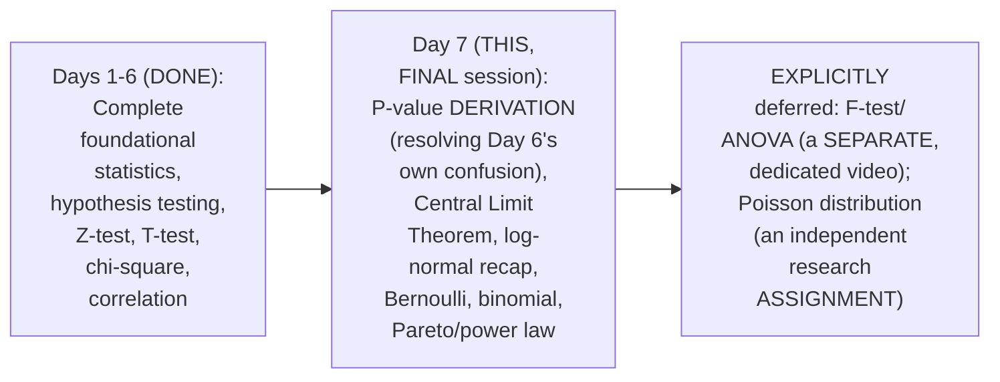

#### ⚠ A Direct, Honest Acknowledgment

> 💡 **Given directly:** *"So yesterday, how many people had confusion with respect to p-value and significance value? Today I will show you how you will derive the p-value."*

#### 🎯 Key Takeaways

* This is GENUINELY the **FINAL day** of the SEVEN-day series, EXPLICITLY, DIRECTLY opening BY resolving Day 6's own, HONESTLY-acknowledged CONFUSION.
* Today's COMPLETE, explicit TOPIC list: p-value DERIVATION, CENTRAL Limit Theorem, log-NORMAL recap, BERNOULLI, binomial, and PARETO/power-law DISTRIBUTIONS.
* The **F-test/ANOVA** is EXPLICITLY, HONESTLY deferred to a SEPARATE, dedicated VIDEO (due to ITS own, genuine COMPLEXITY); the **POISSON distribution** is LEFT as a GENUINE, independent RESEARCH assignment.

---

### 2. Deriving the P-Value From a Z-Score: A Complete, Real Worked Example

#### 🪜 Step-by-Step — A Complete, Real Problem Statement

> 💡 **Given directly:** *"The average weight of all residents in Bangalore city is 168 pounds, with a standard deviation [of] 3.9. We take a sample of 36 individuals, and the mean is 169.5 pounds... our confidence interval is basically 95 percentage."*

```text
Given: μ = 168, σ = 3.9, n = 36, x̄ = 169.5, CI = 95% (α = 0.05)
```

#### 🪜 Step-by-Step — The Complete, Familiar Decision-Boundary Approach (Recap)

> 💡 **Given directly:** *"H0: mean is equal to 168. H1: mean is not equal to 168... it's a two-tailed test... decision boundary... plus minus 1.96... Z is equal to X minus mu, divided by standard deviation by root n... 169.5 minus 168, divided by 3.9 by root 36... 2.307... is it greater than 1.96? It is greater than 1.96, so we reject the null hypothesis."*

```text
z = (169.5 - 168) / (3.9/√36) = 1.5 / 0.65 ≈ 2.307
Decision: |2.307| > 1.96 -> REJECT the null hypothesis
```

#### 🪜 Step-by-Step — NOW, Deriving the P-Value From This Same Z-Score

> 💡 **Given directly:** *"If I really want to find out the p-value... I will take out my Z-table, and I will try to find out what is those values with respect to my Z-score... 2.307... I am getting somewhere around 0.9911... if I subtract with one... I will be getting 0.0089... this is nothing but 0.0089, and this is nothing but 0.0089... since this is two-tailed, I have to add this up."*

```text
Z-table lookup for z=2.307 (or nearest, e.g. 2.30-2.31): ~0.9911 (area to the LEFT)
Tail area (one side) = 1 - 0.9911 = 0.0089
SINCE this is a TWO-TAILED test, add BOTH, symmetric tail areas:
p-value = 0.0089 + 0.0089 ≈ 0.0178 (approximately)
```

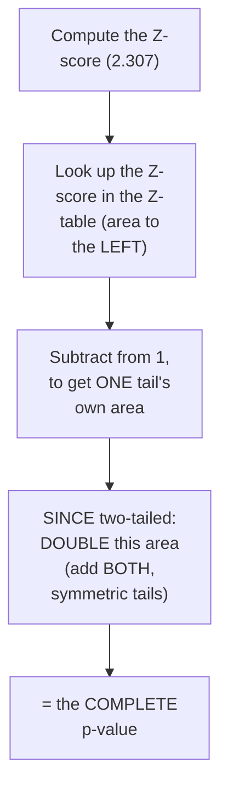

#### 🔍 Internal Working — A Genuine, Honest, Live Self-Correction Process

> 💡 **Given directly:** *"Again I'm going to repeat this... okay, let's see, I'm planning to repeat it... okay, fine, not a problem... obviously my Z is 2.30... it is greater than 1.96, so I have told you we have to reject the null hypothesis... in this case, this is with the help of Z score."*

#### ⚠ Common Mistakes

* Assuming the Z-TABLE lookup ALONE, WITHOUT any FURTHER adjustment, GENUINELY gives you the COMPLETE p-value FOR a two-tailed TEST — explicitly, directly, PRECISELY clarified: you MUST **DOUBLE** the ONE-tail area (SINCE the DISTRIBUTION is SYMMETRIC, and BOTH tails GENUINELY, DIRECTLY count TOWARD the two-tailed p-VALUE).
* Assuming a GENUINE, live TEACHING session WOULD naturally PRODUCE a PERFECTLY smooth, ERROR-free calculation — explicitly, directly, HONESTLY demonstrated as GENUINELY, REALISTICALLY requiring SEVERAL, live self-CORRECTIONS — a NORMAL, real part OF working through GENUINELY detailed, MULTI-step calculations.

#### 🎯 Key Takeaways

* Deriving a p-VALUE FROM a Z-score REQUIRES: (1) LOOK UP the Z-score IN the Z-table (GETTING the AREA to ONE side); (2) SUBTRACT from 1 TO get the TAIL area; (3) FOR a two-tailed TEST, **DOUBLE** this tail AREA (SINCE both SIDES are symmetric).
* A COMPLETE, real, LIVE-computed EXAMPLE (Bangalore RESIDENTS' weight) directly, CONCRETELY confirmed z=2.307 → a p-VALUE of APPROXIMATELY 0.0178 — CONSISTENT with the EARLIER, decision-BOUNDARY-based conclusion (REJECT the null).
* This session **GENUINELY, HONESTLY includes** SEVERAL, real, live SELF-corrections DURING this calculation — A NORMAL, realistic PART of working THROUGH detailed, multi-STEP statistical CALCULATIONS, NOT a sign OF genuine unpreparedness.

---
### 3. The Complete P-Value Decision Rule, Restated Precisely

#### 📖 Definition — The Final, Precise, Complete Rule

> 💡 **Given directly:** *"If [the p-value] is less than or equal to the significance value, this means we have to reject the null hypothesis... if the p-value is greater than significance value, then what we do — we fail to reject the null hypothesis, [or] we accept the null hypothesis."*

```text
FINAL, Complete P-Value Decision Rule:
  p-value ≤ alpha  ->  REJECT the null hypothesis
  p-value >  alpha  ->  FAIL TO REJECT (accept) the null hypothesis
```

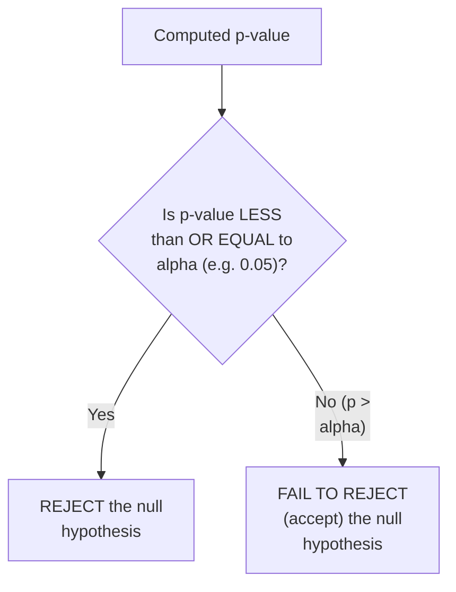

#### 🔍 Internal Working — A Genuine, Direct Confirmation, Applied to This Session's Own Example

> 💡 **Given directly:** *"Now this p-value is obviously less than 0.05, right, which is my significance value — so obviously 0.0088 is less than 0.05, so what happens over here, we basically reject the null hypothesis."*

#### ⚠ Common Mistakes

* Assuming this RULE genuinely REQUIRES a DIFFERENT, SEPARATE mental MODEL from the DECISION-boundary APPROACH (Section 2's own FIRST method) — explicitly, directly, PRECISELY confirmed as **GENUINELY, MATHEMATICALLY equivalent** — BOTH approaches LEAD to the SAME, consistent CONCLUSION, for the SAME underlying DATA.

#### 🎯 Key Takeaways

* The **FINAL, precise p-VALUE decision RULE**: **p-value ≤ alpha → REJECT** the null HYPOTHESIS; **p-value > alpha → FAIL to reject** (accept) the null HYPOTHESIS.
* This RULE is directly, CONCRETELY confirmed as **GENUINELY, MATHEMATICALLY equivalent** to the DECISION-boundary approach (COMPARING the RAW Z/T statistic AGAINST a CRITICAL value) — BOTH methods GENUINELY, CONSISTENTLY arrive AT the SAME conclusion.
* This directly, PRECISELY resolves Day 6's own, HONESTLY-acknowledged CONFUSION — WORTH remembering PRECISELY, GIVEN how WIDELY confused THIS specific rule GENUINELY is, EVEN among EXPERIENCED practitioners.

---

### 4. A Second, Complete Worked Example: Reinforcing the Full Process

#### 🪜 Step-by-Step — A Complete, Real, Second Problem Statement

> 💡 **Given directly:** *"The average age of a college is 24 years, with a standard deviation [of] 1.5... we take a sample of 35 students [treated as 36, for easier calculation]... the mean is 25 years... with alpha as 0.05."*

```text
Given: μ = 24, σ = 1.5, n = 36 (rounded from 35), x̄ = 25, α = 0.05
```

#### 🪜 Step-by-Step — The Complete, Full Process, Repeated

> 💡 **Given directly:** *"H0: mean is equal to 24. H1: mean is not equal to 24... Z score, X bar minus mu, divided by standard deviation by root n... 25 minus 24, divided by 1.5 multiplied by 6... 1.2... [after a live, honest correction] it's actually 4... 4 is greater than 1.96, so we reject the null hypothesis."*

```text
z = (25 - 24) / (1.5/√36) = 1 / 0.25 = 4
Decision: |4| > 1.96 -> REJECT the null hypothesis
```

#### 🪜 Step-by-Step — Deriving the P-Value for This Second Example

> 💡 **Given directly:** *"Go to the Z table, try to find out what is the 4 value... 0.99997... if I subtract this to this... 1 minus 0.99997... I have to divide this by 2, since this is two-tailed... my p-value is [very small]... obviously very, very lesser than significance value, so what we have to do, we have to reject."*

```text
Z-table lookup for z=4: ~0.99997 (area to the LEFT)
Tail area (one side) = 1 - 0.99997 = 0.00003
Two-tailed p-value ≈ 0.00003 + 0.00003 = 0.00006 (an EXTREMELY small p-value)
-> Far below alpha (0.05) -> REJECT the null hypothesis
```

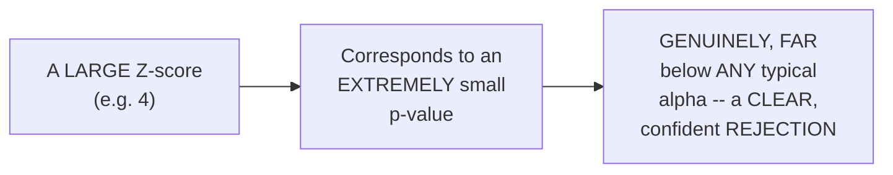

#### ⚠ Common Mistakes

* Assuming a QUESTION's own WORDING ("does the AGE have a different RATE") is GENUINELY, DIRECTLY obvious WITHOUT careful READING — explicitly, directly, REPEATEDLY emphasized: CAREFULLY determining ONE-tailed versus TWO-tailed REMAINS a REQUIRED, first STEP, EVERY time — "IT can be GREATER than 24, it CAN be less THAN 24... SO it becomes a TWO-tailed test."
* Assuming a LARGER Z-score (LIKE 4, VERSUS 2.307 IN the FIRST example) requires a GENUINELY different, more COMPLEX calculation PROCESS — explicitly, directly, PRECISELY confirmed as the EXACT SAME process — ONLY the SPECIFIC table VALUES and RESULTING p-value GENUINELY differ.

#### 🎯 Key Takeaways

* A SECOND, complete, real WORKED example (COLLEGE age SCENARIO) directly, CONCRETELY reinforced the EXACT SAME, complete PROCESS — FROM hypothesis DEFINITION through Z-score CALCULATION, decision-BOUNDARY comparison, AND p-value derivation.
* This EXAMPLE produced a GENUINELY, DRAMATICALLY LARGER Z-score (4, VERSUS 2.307 EARLIER) — CORRESPONDING to an **EXTREMELY small p-VALUE** — a CLEAR, confident REJECTION of the null HYPOTHESIS.
* REPEATING this COMPLETE process ON a genuinely NEW, second PROBLEM directly, PEDAGOGICALLY reinforces the SAME workflow — DIRECTLY connecting BACK to this SERIES' own, ESTABLISHED "learn THROUGH repeated, REAL examples" philosophy.

---
### 5. The Central Limit Theorem

#### 📖 Definition — The Central Limit Theorem, Precisely Defined

> 💡 **Given directly:** *"If I have a distribution that is either normal, that is not normal, or that is any kind of distribution that I have... whenever we basically take up multiple samples... let's say that n is greater than or equal to 30... and for every sample, if I start finding the mean... if I take this entire data of this sample mean, all the sample mean, and if I populate it in the form of PDF, then that basically says that it will get converted into a normal distribution."*

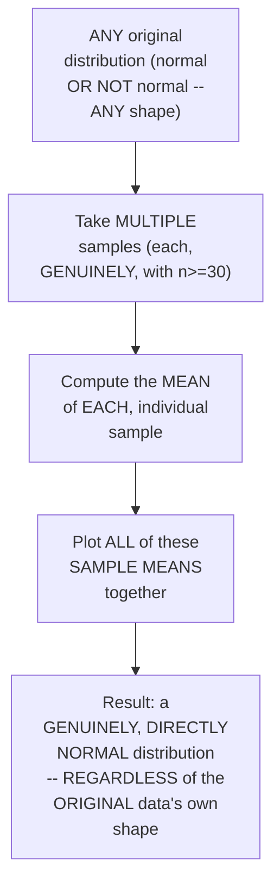

#### 🔍 Internal Working — Precisely Why n≥30 Matters

> 💡 **Given directly:** *"Why I'm saying n should be greater than or equal to 30 — because the more greater than or equal to 30, the more the Central Limit Theorem holds."*

#### 🔍 Internal Working — A Genuine, Direct Confirmation of the Core, Foundational Result

> 💡 **Given directly:** *"Whatever distribution it may be, if we take some samples, specifically n is greater than or equal to 30, for each and every sample, if I try to find out the sample mean... sample mean will follow a normal distribution."*

#### ⚠ Common Mistakes

* Assuming the CENTRAL Limit Theorem REQUIRES the ORIGINAL, underlying DATA to ALREADY be NORMALLY distributed — explicitly, directly, PRECISELY corrected: it GENUINELY, DIRECTLY applies "WHETHER [the original data] is NORMAL, [or] that is NOT normal" — the ORIGINAL shape GENUINELY does NOT matter.
* Assuming a SMALLER sample SIZE (e.g., n=5 OR n=10) would GENUINELY, EQUALLY satisfy the THEOREM — explicitly, directly, PRECISELY clarified: n **≥ 30** is GENUINELY, DIRECTLY required FOR the theorem to RELIABLY hold.

#### 🎯 Key Takeaways

* The **CENTRAL Limit Theorem** GENUINELY states: REGARDLESS of the ORIGINAL data's own DISTRIBUTION shape, if you TAKE multiple SAMPLES (EACH with n≥30) and COMPUTE each sample's OWN mean, the RESULTING collection OF sample means WILL itself GENUINELY follow a **NORMAL distribution**.
* This is directly, PRECISELY confirmed as a GENUINELY foundational, powerful RESULT — DIRECTLY, PRACTICALLY explaining WHY Z-tests and T-TESTS (WHICH assume normality) CAN genuinely, RELIABLY be applied to SAMPLE means, EVEN when the UNDERLYING, original DATA is NOT itself normally DISTRIBUTED.
* **n ≥ 30** is directly, EXPLICITLY confirmed as the GENUINE, standard THRESHOLD for the theorem TO reliably hold — a REAL, PRACTICAL rule of THUMB worth REMEMBERING.

---

### 6. Log-Normal Distribution: A Brief, Genuine Recap

#### 📖 Definition — Log-Normal Distribution, Precisely Re-Confirmed

> 💡 **Given directly:** *"If Y is a random variable that belongs to a log-normal distribution, with [a] mean [of some value]... then if I apply log of Y, [it] should follow a normal distribution. If it is satisfying this condition, we can say a distribution is basically [a] log-normal distribution."*

```text
Log-Normal Definition: If Y ~ LogNormal, then log(Y) ~ Normal
```

#### 🏢 Real-World / Production Usage — Genuine, Real Examples

> 💡 **Given directly:** *"Wealth distribution... there are very less number of people who will be having huge wealth, and they will be normal salaried people... people writing comment[s]... people writing bigger comments... there will be very less number of people who write big comments."*

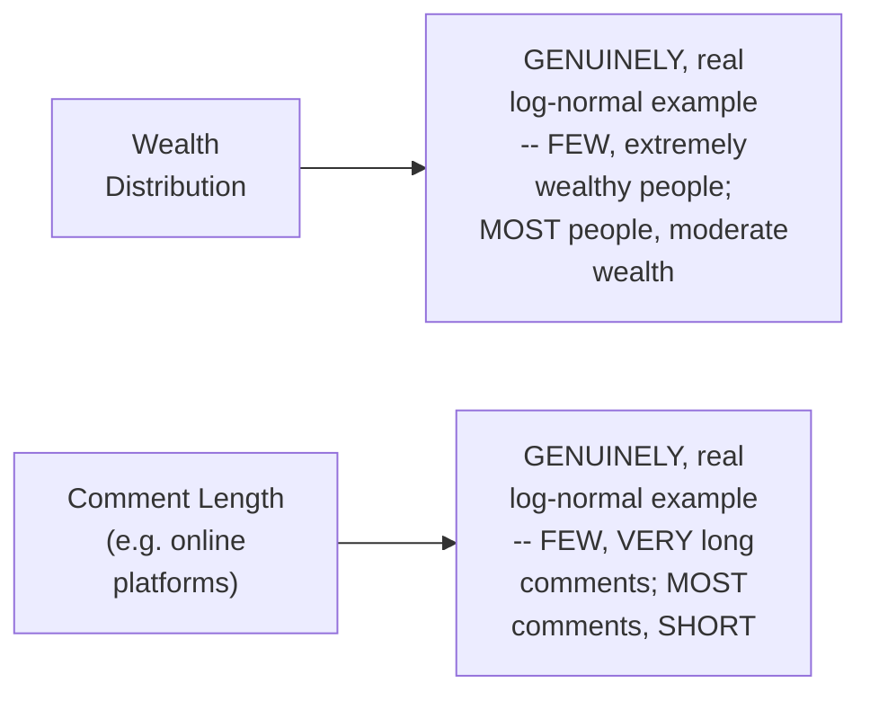

#### ⚠ Common Mistakes

* Assuming LOG-normal distribution is a GENUINELY, ENTIRELY new CONCEPT introduced ONLY in THIS final session — explicitly, directly, HONESTLY clarified: it was ALREADY, PREVIOUSLY covered — THIS is a DELIBERATE, brief RECAP.

#### 🎯 Key Takeaways

* **LOG-normal distribution** is precisely DEFINED: IF Y follows a LOG-normal distribution, THEN **log(Y)** GENUINELY follows a **NORMAL** distribution.
* REAL, genuine EXAMPLES include WEALTH distribution (FEW extremely WEALTHY people, MOST moderately WEALTHY) and COMMENT length (FEW very LONG comments, MOST short).
* This is directly, HONESTLY confirmed as a **BRIEF recap** of ALREADY-covered CONTENT — SETTING up the GENUINE, direct CONNECTION explored LATER in Section 11 (PARETO distribution's OWN relationship to LOG-normal).

---
### 7. Bernoulli Distribution: A Single-Trial, Two-Outcome Distribution

#### 📖 Definition — Bernoulli Distribution, Precisely Defined

> 💡 **Given directly:** *"In Bernoulli distribution... there are specifically two outcomes... it can be either zero or one... this is only related to single trial, single try, not multiple trials."*

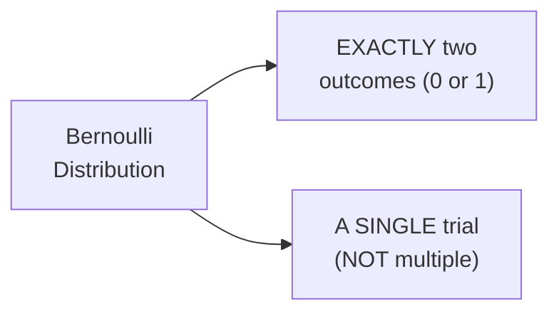

#### 📖 Definition — P and Q, Precisely Defined

> 💡 **Given directly:** *"When we need to focus on probability with respect to Bernoulli distribution, we define [it] by two values: one is P and one is Q... I'm considering an experiment which is called as tossing a coin... probability of head... 0.5... so this will basically become my P value. When I talk about the Q value, it will become 1 minus P."*

```text
Bernoulli Distribution: P (success probability) and Q = 1 - P (failure probability)
Fair coin:   P(Head) = 0.5,  Q = 1 - 0.5 = 0.5
Unfair coin: P(Head) = 0.3,  Q = 1 - 0.3 = 0.7
```

#### 🔍 Internal Working — A Genuine, Real, Historical Note

> 💡 **Given directly:** *"A Bernoulli distribution, named after Swiss mathematician Jacob Bernoulli, has a discrete probability distribution."*

#### ⚠ Common Mistakes

* Assuming BERNOULLI distribution GENUINELY, DIRECTLY applies to MULTIPLE, repeated TRIALS — explicitly, directly, PRECISELY clarified: it's SPECIFICALLY, GENUINELY a **single-TRIAL** distribution — MULTIPLE, combined TRIALS become the SUBJECT of the NEXT distribution (BINOMIAL, Section 9).
* Assuming P and Q are GENUINELY, INDEPENDENTLY specified VALUES — explicitly, directly, PRECISELY confirmed: Q is ALWAYS, DIRECTLY derived FROM P — **Q = 1 − P**, GENUINELY, ALWAYS.

#### 🎯 Key Takeaways

* **BERNOULLI distribution** is precisely a **SINGLE-trial**, TWO-outcome (0 OR 1) distribution — GOVERNED by **P** (success PROBABILITY) and **Q = 1−P** (failure PROBABILITY).
* A REAL, relatable EXAMPLE (COIN tossing, FAIR and UNFAIR) directly, CONCRETELY illustrates HOW P and Q GENUINELY, DIRECTLY relate.
* This directly, PRECISELY sets UP the NEXT, essential DISTINCTION — BETWEEN probability MASS functions (FOR discrete DATA like THIS) and probability DENSITY functions (Section 8).

---

### 8. PMF vs. PDF: A Precise, Genuine Distinction

#### 📖 Definition — PMF (Probability Mass Function), Precisely Introduced

> 💡 **Given directly:** *"This is not a probability density function — understand, this is a probability mass function... in probability density function, it is completely different. Probability density function is for continuous variable, this is specifically for categorical variables."*

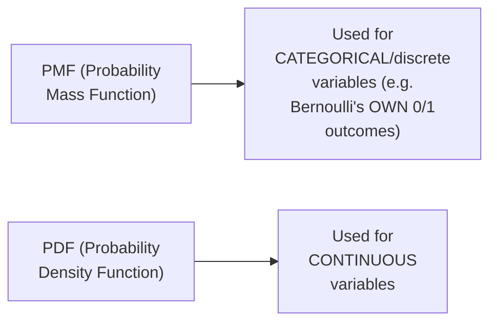

#### 🔍 Internal Working — A Genuine, Direct Confirmation of the PMF Formula

> 💡 **Given directly:** *"The PMF is basically defined in this particular manner: if K is equal to 0, I will write Q is equal to 1 minus P, [and] P if K is equal to 1."*

```text
Bernoulli PMF: P(X=k) = P, if k=1 (success)
               P(X=k) = Q = 1-P, if k=0 (failure)
```

#### ⚠ Common Mistakes

* Assuming "PDF" is GENUINELY, UNIVERSALLY the CORRECT term for ANY probability DISTRIBUTION visualization — explicitly, directly, PRECISELY corrected: FOR categorical/DISCRETE variables (LIKE Bernoulli's OWN 0/1 outcomes), the CORRECT, precise TERM is **PMF**, NOT PDF.

#### 🎯 Key Takeaways

* **PMF (probability MASS function)** is used FOR **CATEGORICAL/discrete** variables (e.g., BERNOULLI's own 0/1 OUTCOMES); **PDF (probability DENSITY function)** is used FOR **CONTINUOUS** variables.
* This is a GENUINE, precise, FREQUENTLY-confused terminological DISTINCTION worth REMEMBERING carefully.
* This directly, PRECISELY sets UP the NEXT, essential DISTRIBUTION — BINOMIAL (Section 9) — WHICH GENUINELY extends BERNOULLI's own, single-TRIAL framework INTO multiple, COMBINED trials.

---
### 9. Binomial Distribution: Multiple Bernoulli Trials Combined

#### 📖 Definition — Binomial Distribution, Precisely Defined

> 💡 **Given directly:** *"Binomial distribution says that, obviously, with respect to every trial, there will be a Bernoulli distribution — but here we have multiple trial[s]... that basically means we have the combination of many Bernoulli distribution[s]."*

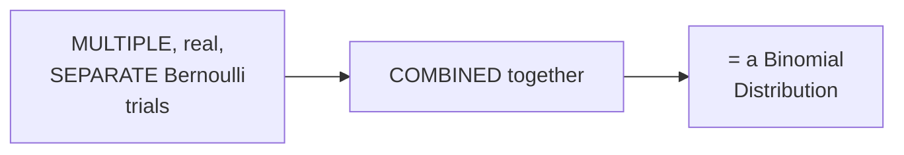

#### 📖 Definition — The Precise Notation & Formula

> 💡 **Given directly:** *"The binomial distribution is given by two notation, n comma p — n is nothing but number of trials, p is nothing but success [probability] for each try, where q is equal to 1 minus p."*

```text
Binomial Distribution Notation: (n, p)
  n = number of trials
  p = success probability, PER trial
  q = 1 - p
```

#### ⚠ Common Mistakes

* Assuming BINOMIAL distribution is a GENUINELY, ENTIRELY different, unrelated CONCEPT from BERNOULLI — explicitly, directly, PRECISELY clarified: it's DIRECTLY, STRUCTURALLY built FROM multiple, COMBINED Bernoulli TRIALS — a DIRECT, genuine EXTENSION, not a SEPARATE concept.
* Confusing the ROLES of n AND p in the BINOMIAL notation — explicitly, directly, PRECISELY distinguished: **n** = NUMBER of trials; **p** = SUCCESS probability PER individual trial.

#### 🎯 Key Takeaways

* **BINOMIAL distribution** GENUINELY represents **MULTIPLE, combined Bernoulli TRIALS** — a DIRECT, structural EXTENSION of Bernoulli's own, single-TRIAL framework.
* Notation: **(n, p)** — WHERE **n** = number OF trials, and **p** = SUCCESS probability PER trial (WITH q = 1−p).
* This directly, PRECISELY completes the BERNOULLI-to-binomial PROGRESSION — SINGLE trial (BERNOULLI) versus MULTIPLE, combined trials (BINOMIAL).

---

### 10. Pareto Distribution & the 80-20 Power Law

#### 📖 Definition — Pareto Distribution, Precisely Introduced

> 💡 **Given directly:** *"Pareto distribution is a non-Gaussian... it is not a Gaussian distribution... one application of Pareto distribution is nothing but power law distribution."*

#### 📖 Definition — The 80-20 Rule, Precisely Explained

> 💡 **Given directly:** *"Power law distribution basically says that you have to remember this rule, which is called as 80-20 rule... 80 percentage of this entire value [falls here], and this is my 20 percentage of the entire value."*

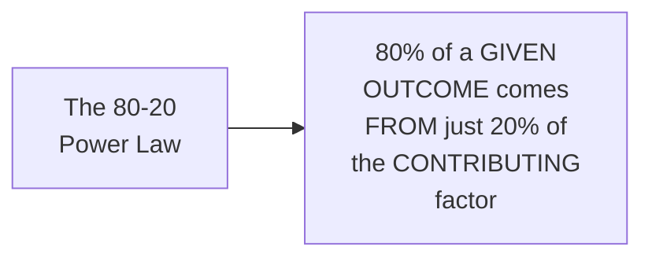

#### 🏢 Real-World / Production Usage — Multiple, Genuinely Memorable, Real Examples

> 💡 **Given directly:** *"80 percentage of the wealth is distributed with 20 percentage of the people... 80 percentage of the company projects are done by 20 percentage of the people in a team... 80 percentage of sales is done by 20 percentage of the most famous product[s]... 80 percentage of the syllabus [is] completed by 20 percentage of the people... 80 percentage of oil [is] coming from 20 percentage of the land."*

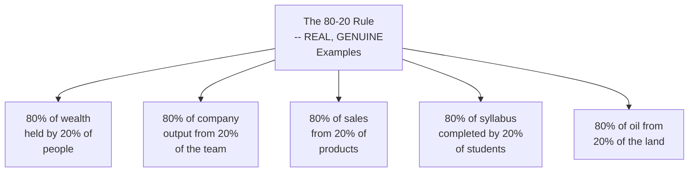

#### ⚠ Common Mistakes

* Assuming the 80-20 RULE is GENUINELY, PRECISELY exact IN every, real SCENARIO — explicitly, directly IMPLIED as a GENERAL, illustrative PATTERN, NOT a PRECISE, mathematically GUARANTEED ratio in EVERY, single CASE.
* Assuming PARETO distribution is GENUINELY, DIRECTLY the SAME as a NORMAL/Gaussian distribution — explicitly, directly, PRECISELY corrected: it's EXPLICITLY confirmed as **NON-Gaussian**.

#### 🎯 Key Takeaways

* **PARETO distribution** (a NON-Gaussian distribution) is DIRECTLY, GENUINELY connected TO the **80-20 POWER law** — a GENERAL pattern WHERE 80% of an OUTCOME comes FROM just 20% of a CONTRIBUTING factor.
* MULTIPLE, genuinely MEMORABLE, real EXAMPLES (wealth, COMPANY output, sales, SYLLABUS completion, OIL production) directly, CONCRETELY illustrate THIS pattern's own, WIDE applicability.
* This directly, PRECISELY sets UP the NEXT, final CONNECTION — a GENUINE, real relationship BETWEEN Pareto DISTRIBUTION and log-normal DISTRIBUTION (Section 11).

---
### 11. A Genuine, Real Connection: Pareto, Log-Normal & Data Transformation

#### 🔍 Internal Working — A Genuine, Direct, Visual Connection Between Pareto and Log-Normal

> 💡 **Given directly:** *"This diagram that you see, it looks something like this — if I extend this diagram... what kind of distribution is this? This is my power law distribution... if I probably extend this diagram and make it like this... this is a very important thing... this is not normal — this is, can I say, this is log-normal distribution?"*

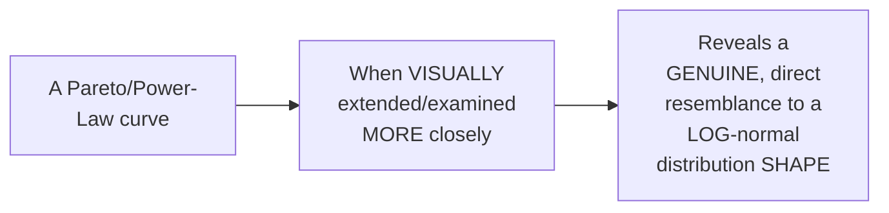

#### 🔍 Internal Working — A Genuine, Direct Pointer to Data Transformation

> 💡 **Given directly:** *"Mathematically, if I talk about, you can also convert this distribution into normal distribution also... for this, you have to watch one of my video which is called as transformation, data transformation... Box-Cox transformation is basically used in order to convert this data into normal distribution."*

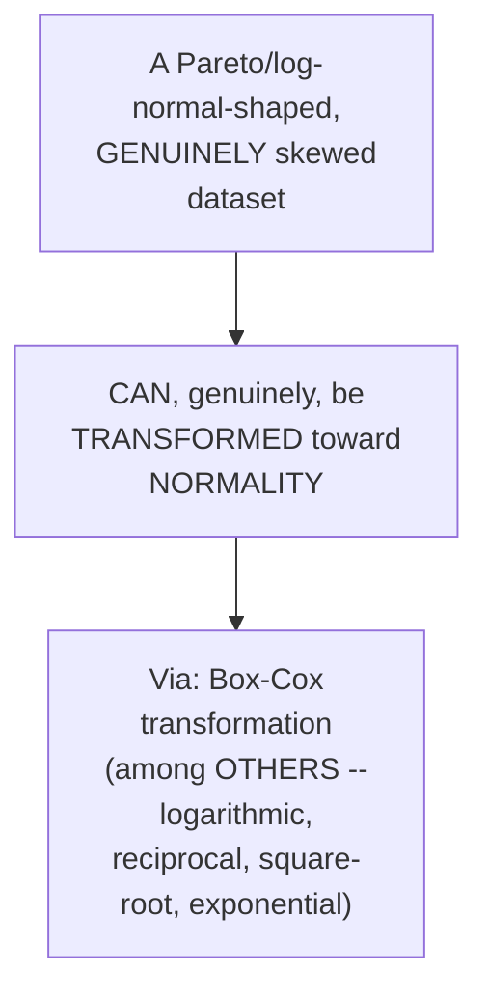

#### 🏢 Real-World / Production Usage — A Genuine, Direct Confirmation of Practical Relevance

> 💡 **Given directly:** *"All the different types of transformation in machine learning, whether you can convert this or not, so I have given the link, you can check it out whenever you have time, but remember, this is an important video."*

#### ⚠ Common Mistakes

* Assuming PARETO, log-NORMAL, and NORMAL distributions are GENUINELY, ENTIRELY unrelated, SEPARATE categories — explicitly, directly, VISUALLY demonstrated as GENUINELY, DIRECTLY connected — SKEWED distributions (LIKE Pareto/log-normal) CAN, genuinely, be TRANSFORMED toward NORMALITY, via TECHNIQUES like BOX-Cox transformation.
* Assuming THIS session's own, BRIEF mention of data TRANSFORMATION represents a COMPLETE treatment — explicitly, directly, HONESTLY pointed TO a SEPARATE, dedicated VIDEO for FULL, detailed coverage.

#### 🎯 Key Takeaways

* PARETO/power-LAW distributions, WHEN examined CLOSELY, GENUINELY, VISUALLY resemble **LOG-normal** distributions — a REAL, direct CONNECTION between THESE two, seemingly SEPARATE concepts.
* SKEWED distributions (LIKE Pareto/log-NORMAL) CAN, genuinely, be **TRANSFORMED** toward NORMALITY — VIA techniques LIKE **Box-Cox TRANSFORMATION** (AMONG others: logarithmic, RECIPROCAL, square-root, EXPONENTIAL).
* This is directly, HONESTLY confirmed as a **BRIEF pointer**, WITH the instructor DIRECTLY referring learners TO a SEPARATE, dedicated VIDEO for COMPLETE, detailed coverage OF data-transformation TECHNIQUES.

---

### 12. Closing: The Complete Series Wrap-Up & What Comes Next

#### 🪜 Step-by-Step — A Complete, Honest, Direct Confirmation

> 💡 **Given directly:** *"I think I was able to cover up most of the things in this seven days session. I hope you like this session, and I hope you learn a lot — now it's time for you just to think more ahead, solve multiple use cases, and do some amazing work."*

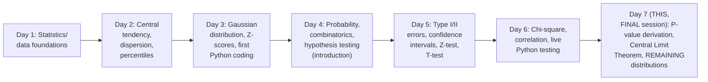

#### 🪜 Step-by-Step — A Direct, Honest Announcement of What Comes Next

> 💡 **Given directly:** *"Next week, probably on Monday, if everything goes on fine, I'll also start machine learning, another machine learning algorithms part... in this seven-day session of machine learning, I'll discuss about all the machine learning algorithms."*

#### ⚠ A Direct, Honest, Personal Reflection

> 💡 **Given directly:** *"I know I'm running a company, but I would definitely like to give it to the community all the time... I hope you liked it — again, for supporting us, please join iNeuron platform, help us in innovating the tech world with the affordability and with the quality that we can provide."*

#### ⚠ Common Mistakes

* Assuming THIS complete, SEVEN-day series REPRESENTS the ABSOLUTE totality OF statistics NEEDED for data SCIENCE — explicitly, directly, HONESTLY clarified: F-TEST/ANOVA (a SEPARATE video), POISSON distribution (an INDEPENDENT assignment), and DATA-transformation techniques (ANOTHER, separate VIDEO) all REMAIN, genuinely, WORTH further, DEDICATED study.

#### 🎯 Key Takeaways

* This episode **GENUINELY, COMPLETELY concludes** the ENTIRE, seven-day STATISTICS series — DELIVERING on EVERY, MAJOR topic PROMISED across the COMPLETE arc (EXCEPT F-test/ANOVA, EXPLICITLY deferred to a SEPARATE video).
* A NEW, **SEVEN-day machine-LEARNING series** is directly, HONESTLY announced as LIKELY starting the FOLLOWING Monday — CONTINUING this INSTRUCTOR's own, established, LIVE-teaching FORMAT.
* The instructor **directly, GENUINELY shares** a PERSONAL reflection on RUNNING an ed-TECH company ALONGSIDE this FREE, community-focused TEACHING — a REAL, human CONTEXT worth RESPECTING as GENUINE closing SENTIMENT for THIS entire series.

---
## 📝 Glossary

| Term | Definition | Why It Matters |
|---|---|---|
| **P-Value Derivation** | Looking up a Z-score in a Z-table, then adjusting for tails | Directly, mathematically consistent with the decision-boundary approach |
| **Central Limit Theorem** | Sample means (n≥30 each) follow a normal distribution, regardless of original data shape | Explains why Z/T-tests work even on non-normal underlying data |
| **Log-Normal Distribution** | Y follows log-normal if log(Y) follows normal | e.g., wealth distribution, comment length |
| **Bernoulli Distribution** | A single-trial, two-outcome (0/1) distribution | Governed by P and Q=1-P |
| **PMF (Probability Mass Function)** | Used for categorical/discrete variables | Distinct from PDF |
| **PDF (Probability Density Function)** | Used for continuous variables | Distinct from PMF |
| **Binomial Distribution** | Multiple, combined Bernoulli trials | Notation: (n, p) |
| **Pareto Distribution** | A non-Gaussian distribution | Related to the 80-20 power law |
| **80-20 Power Law** | 80% of an outcome comes from 20% of a contributing factor | A general, widely-applicable pattern |
| **Box-Cox Transformation** | A technique to convert skewed data toward normality | Covered in a separate, dedicated video |

---

## 🔄 Revision Notes — One-Minute Revision

* This is **Day 7, the FINAL day** of the 7-day series -- opening by directly resolving Day 6's own, honestly-acknowledged p-value confusion.
* **P-value derivation** (via TWO, complete, real worked examples): compute the Z-score -> look up in the Z-table (getting the area to one side) -> subtract from 1 for the tail area -> for a TWO-tailed test, DOUBLE this tail area (both sides are symmetric) -> this IS the p-value. Live example 1: Bangalore weight problem, z≈2.307 -> p-value≈0.0178. Live example 2: college age problem, z=4 -> an extremely small p-value. Both confirm the SAME conclusion (reject the null) as the decision-boundary approach -- the two methods are mathematically equivalent.
* **The FINAL, correct p-value rule**: p-value ≤ alpha -> REJECT the null; p-value > alpha -> FAIL TO REJECT (accept) the null.
* **Central Limit Theorem**: regardless of the ORIGINAL data's own distribution shape (normal or not), taking multiple samples (each with n≥30) and computing each sample's own mean produces a collection of sample means that itself follows a NORMAL distribution. n≥30 is the standard threshold for this to reliably hold.
* **Log-normal distribution** (a brief recap): Y follows log-normal if log(Y) follows normal. Real examples: wealth distribution, comment length.
* **Bernoulli distribution**: a SINGLE-trial, two-outcome (0/1) distribution, governed by P (success) and Q=1-P (failure). Real example: coin tossing (fair: P=0.5; unfair: P=0.3).
* **PMF vs. PDF**: PMF (probability mass function) is for categorical/discrete variables (like Bernoulli's own 0/1 outcomes); PDF (probability density function) is for continuous variables -- a precise, frequently-confused distinction.
* **Binomial distribution**: MULTIPLE, combined Bernoulli trials. Notation: (n, p) -- n = number of trials, p = success probability per trial.
* **Pareto distribution & the 80-20 power law**: a non-Gaussian distribution, connected to the general pattern where 80% of an outcome comes from 20% of a contributing factor. Real examples: wealth, company output, sales, syllabus completion, oil production.
* **A genuine connection**: Pareto/power-law curves, when examined closely, visually resemble log-normal distributions. Skewed distributions can be transformed toward normality via Box-Cox and other transformations (logarithmic, reciprocal, square-root, exponential) -- covered fully in a separate, dedicated video.
* **Closing**: this concludes the entire, 7-day statistics series. F-test/ANOVA is explicitly deferred to a separate video (due to its own complexity); Poisson distribution is left as an independent research assignment. A new, 7-day machine learning series is announced as likely starting the following Monday.

---

## 📋 Cheat Sheet

**Deriving a P-Value from a Z-Score (two-tailed test):**
```text
1. Compute the Z-score: z = (x̄ - μ) / (σ/√n)
2. Look up z in the Z-table -> get the area to ONE side
3. Subtract from 1 -> get the tail area (one side)
4. DOUBLE this tail area (since two-tailed, both sides are symmetric)
5. This doubled value IS your complete p-value
```

**The FINAL, correct P-Value decision rule:**
```text
p-value <= alpha  ->  REJECT the null hypothesis
p-value >  alpha  ->  FAIL TO REJECT (accept) the null hypothesis
```

**Central Limit Theorem:**
```text
ANY original distribution (normal or not)
  + multiple samples (each, n >= 30)
  + compute each sample's own mean
  = the resulting sample means follow a NORMAL distribution
```

**Bernoulli vs. Binomial:**
```text
Bernoulli: a SINGLE trial, 2 outcomes (0/1), governed by P and Q=1-P
Binomial:  MULTIPLE, combined Bernoulli trials, notation (n, p)
```

**PMF vs. PDF:**
```text
PMF (Probability Mass Function)    -- CATEGORICAL/discrete variables
PDF (Probability Density Function) -- CONTINUOUS variables
```

**Pareto & the 80-20 rule:**
```text
80% of an outcome  <-  from just 20% of the contributing factor
(e.g. 80% of wealth from 20% of people; 80% of sales from 20% of products)
```

---

## 🔥 Interview Questions & Answers

### 🟢 Beginner

**Q1.**

**Question:** What is the final, correct p-value decision rule?

**Answer:** p-value ≤ alpha -> reject the null hypothesis; p-value > alpha -> fail to reject (accept) the null.

**Explanation:** Directly, precisely stated, after this session's own resolution of Day 6's confusion.

**Why Interviewers Ask This:** The most basic, foundational, and commonly-confused hypothesis-testing rule.

**Possible Follow-up:** "Why is 'fail to reject' the preferred phrase over 'accept the null'?"

**Q2.**

**Question:** How do you derive a p-value from a computed Z-score, for a two-tailed test?

**Answer:** Look up the Z-score in a Z-table (getting the area to one side), subtract from 1 to get the tail area, then double this tail area.

**Explanation:** Directly, precisely explained.

**Why Interviewers Ask This:** Tests genuine, practical p-value calculation skill.

**Possible Follow-up:** "Why do you double the tail area specifically for a two-tailed test?"

**Q3.**

**Question:** What does the Central Limit Theorem state?

**Answer:** Regardless of the original data's own distribution shape, sample means (each sample with n≥30) will themselves follow a normal distribution.

**Explanation:** Directly, precisely defined.

**Why Interviewers Ask This:** A foundational, frequently-tested statistical theorem.

**Possible Follow-up:** "Why does n need to be at least 30?"

**Q4.**

**Question:** What is the genuine difference between Bernoulli and binomial distributions?

**Answer:** Bernoulli is a single trial with two outcomes; binomial is multiple, combined Bernoulli trials.

**Explanation:** Directly, precisely distinguished.

**Why Interviewers Ask This:** Basic, essential distribution knowledge.

**Possible Follow-up:** "What is the binomial distribution's own notation?"

**Q5.**

**Question:** What is the genuine difference between PMF and PDF?

**Answer:** PMF is for categorical/discrete variables; PDF is for continuous variables.

**Explanation:** Directly, precisely distinguished.

**Why Interviewers Ask This:** A commonly-confused, genuine terminological distinction.

**Possible Follow-up:** "Which one applies to a Bernoulli distribution?"

**Q6.**

**Question:** What is the 80-20 rule (power law)?

**Answer:** 80% of an outcome comes from just 20% of a contributing factor.

**Explanation:** Directly, explicitly stated.

**Why Interviewers Ask This:** Basic, widely-applicable statistical pattern knowledge.

**Possible Follow-up:** "Give a real example of this pattern."

**Q7.**

**Question:** What distribution is genuinely, directly connected to the Pareto/power-law distribution?

**Answer:** Log-normal distribution.

**Explanation:** Directly, visually confirmed.

**Why Interviewers Ask This:** Tests genuine understanding of distribution relationships.

**Possible Follow-up:** "What technique can convert a skewed distribution toward normality?"

**Q8.**

**Question:** What defines a log-normal distribution?

**Answer:** Y follows log-normal if log(Y) follows a normal distribution.

**Explanation:** Directly, precisely defined.

**Why Interviewers Ask This:** Basic, essential distribution terminology.

**Possible Follow-up:** "Give a real example of log-normally distributed data."

**Q9.**

**Question:** In Bernoulli distribution, if P(success)=0.3, what is Q?

**Answer:** 0.7 (Q = 1 - P).

**Explanation:** Directly, explicitly demonstrated.

**Why Interviewers Ask This:** Basic, essential Bernoulli formula knowledge.

**Possible Follow-up:** "Is this a single-trial or multiple-trial distribution?"

**Q10.**

**Question:** Are the decision-boundary approach and the p-value approach to hypothesis testing genuinely different methods, or equivalent?

**Answer:** Genuinely equivalent -- both lead to the same conclusion for the same underlying data.

**Explanation:** Directly, concretely confirmed via two, parallel worked examples.

**Why Interviewers Ask This:** Tests genuine, deep understanding connecting two commonly-taught approaches.

**Possible Follow-up:** "Which approach is more commonly used in modern, real-world statistical reporting?"

---

### 🟡 Intermediate

**Q11.**

**Question:** Explain why the instructor deliberately works through the COMPLETE p-value derivation process TWICE, on two separate, real problems, at the start of this final session, rather than simply restating the correct rule once.

**Answer:** This is a genuinely deliberate, REPEATED-DEMONSTRATION teaching choice, DIRECTLY motivated by Day 6's own, HONESTLY-acknowledged, EXTENDED confusion around THIS exact topic. By GENUINELY, LIVE working through the COMPLETE derivation process TWICE — on TWO, DIFFERENT problems, EACH producing a DIFFERENT z-score AND p-value — the instructor ENSURES the CORRECT process is GENUINELY, THOROUGHLY reinforced, RATHER than RISKING a REPEAT of the SAME, single-explanation confusion FROM the PRIOR session. This DIRECTLY, CONCRETELY demonstrates a GENUINE, responsible TEACHING response to IDENTIFIED, real STUDENT confusion — PRIORITIZING thorough, REPEATED clarification OVER moving QUICKLY to NEW content.

**Explanation:** Requires recognizing the deliberate, responsive teaching choice to repeat a clarification thoroughly, directly motivated by previously-identified, genuine student confusion.

**Why Interviewers Ask This:** Tests whether a learner recognizes the pedagogical value of repeated, worked reinforcement following identified confusion, rather than a single restatement.

**Possible Follow-up:** "Work through a THIRD, genuinely NEW example, computing BOTH the decision-boundary CONCLUSION and the p-value, CONFIRMING they GENUINELY agree."

**Q12.**

**Question:** A learner argues that since the Central Limit Theorem says sample means follow a normal distribution "regardless of the original data's shape," this means you never need to check a dataset's own, original distribution shape before applying statistical tests. Evaluate this claim.

**Answer:** This claim overstates the case, missing a GENUINELY important, PRECISE scope THIS session's own content DIRECTLY implies. The CENTRAL Limit Theorem SPECIFICALLY, GENUINELY applies to the DISTRIBUTION of **SAMPLE MEANS** (per Section 5's own established MECHANISM) — NOT to the ORIGINAL, individual DATA points themselves. MANY, real ANALYSES (e.g., Day 3's own established DISTRIBUTION-shape checking, VIA `sns.displot`) GENUINELY, DIRECTLY care ABOUT the shape OF the original, RAW data — FOR example, WHEN deciding whether the EMPIRICAL rule (Day 3's own established 68-95-99.7% RULE) genuinely, RELIABLY applies. The ACCURATE, more PRECISE conclusion: the CENTRAL Limit Theorem GENUINELY, SPECIFICALLY justifies USING normal-distribution-BASED tests (like Z-TESTS) on **SAMPLE MEANS**, EVEN when the UNDERLYING, original data ISN'T normal — but it does NOT genuinely, UNIVERSALLY eliminate the NEED to EVER examine a DATASET's own, original DISTRIBUTION shape FOR other, DIFFERENT analytical PURPOSES.

**Explanation:** Tests whether a learner correctly scopes the Central Limit Theorem to sample means specifically, rather than over-generalizing it to eliminate all distribution-shape analysis.

**Why Interviewers Ask This:** Distinguishes candidates who understand the theorem's own precise, specific scope from those who over-generalize its "regardless of shape" framing.

**Possible Follow-up:** "Construct a GENUINE, real analytical SCENARIO where you WOULD still, genuinely need to EXAMINE a dataset's own, ORIGINAL distribution shape, DESPITE the Central Limit Theorem's own established GUARANTEE about sample MEANS."

**Q13.**

**Question:** Explain, precisely, why the instructor deliberately shows the Pareto distribution's own, visual resemblance to log-normal distribution (Section 11), rather than treating these as two, entirely separate, unrelated topics.

**Answer:** This is a genuinely deliberate, CONNECTIVE teaching choice, DIRECTLY consistent with a PATTERN seen ACROSS THIS instructor's own, entire series (e.g., Section 3's OWN "degree of freedom" pattern, SHARED across chi-square AND T-tests, per Day 6's own established REASONING). By DIRECTLY, VISUALLY demonstrating that a PARETO/power-law CURVE, when EXAMINED closely, RESEMBLES a log-NORMAL shape, the instructor HELPS learners BUILD a GENUINE, unified mental MODEL of skewed DISTRIBUTIONS — RATHER than memorizing EACH distribution TYPE as a COMPLETELY isolated, unrelated FACT. This directly, GENUINELY reinforces a BROADER, important LESSON: many, REAL statistical CONCEPTS are GENUINELY, STRUCTURALLY interconnected, RATHER than existing as SEPARATE, unrelated silos OF knowledge.

**Explanation:** Requires recognizing the deliberate, connective value of showing structural relationships between distributions, rather than presenting each as an isolated fact.

**Why Interviewers Ask This:** Tests whether a learner recognizes the pedagogical and practical value of understanding connections between related statistical concepts.

**Possible Follow-up:** "Name ANOTHER, GENUINE pair of concepts FROM this ENTIRE, seven-day series THAT share a SIMILAR, underlying STRUCTURAL connection, SIMILAR to Pareto AND log-normal."

**Q14.**

**Question:** Using this session's own precise "Central Limit Theorem" reasoning (Section 5), explain a GENUINE, real, practical implication for a data scientist who has ONLY a small number of samples (e.g., 5 samples, each with n=50) available, when trying to estimate a population's own true distribution shape.

**Answer:** A precise, reasoned IMPLICATION, directly extending Section 5's own established MECHANISM: per Section 5's own PRECISE reasoning, the CENTRAL Limit Theorem GENUINELY, SPECIFICALLY requires "M samples" (MULTIPLE samples), WITH the INSTRUCTOR directly NOTING "the BIGGER value, MORE better we will be ABLE to solve THIS particular Central LIMIT theorem." WITH only 5 samples (EVEN though EACH individually SATISFIES n≥30), the RESULTING collection OF just 5 SAMPLE means is GENUINELY, STATISTICALLY too SMALL to RELIABLY, CONFIDENTLY confirm that THESE means THEMSELVES follow a GENUINELY, PRECISELY normal distribution — the THEOREM's own, GENUINE guarantee BECOMES increasingly RELIABLE as the NUMBER of samples (M) GENUINELY, DIRECTLY grows LARGER, NOT merely as EACH, individual sample's OWN size (n) exceeds 30. This directly, PRECISELY reveals a GENUINE, PRACTICAL implication: a data SCIENTIST should GENUINELY, DIRECTLY seek BOTH a SUFFICIENT sample SIZE (n≥30) PER sample, AND a SUFFICIENT NUMBER of samples (M) OVERALL, to GENUINELY, CONFIDENTLY rely ON the Central Limit Theorem's own GUARANTEE.

**Explanation:** Requires extending the Central Limit Theorem's own mechanism to distinguish between "sample size per sample" and "number of samples," identifying a genuine, practical implication when the latter is small.

**Why Interviewers Ask This:** Tests whether a learner understands the theorem requires both a sufficient sample size AND a sufficient number of samples, not just one of these two conditions.

**Possible Follow-up:** "In a REAL, practical data-SCIENCE project, how might you GENUINELY, PRACTICALLY obtain a SUFFICIENT number of SEPARATE samples, RATHER than just ONE, large dataset?"

**Q15.**

**Question:** Synthesize this session's complete "PMF vs. PDF" reasoning (Section 8) with its own "binomial distribution" reasoning (Section 9) to explain WHY a binomial distribution's own probability calculations would GENUINELY use a PMF, rather than a PDF, even though it involves MULTIPLE, combined trials.

**Answer:** A precise, synthesized explanation, directly connecting TWO, separately-established sections: per Section 8's own PRECISE, established DISTINCTION, PMF is USED for **CATEGORICAL/discrete** variables, WHILE PDF is used FOR **continuous** variables. Per Section 9's own PRECISE reasoning, a BINOMIAL distribution is GENUINELY, DIRECTLY built from MULTIPLE, combined **BERNOULLI** trials — and EACH, individual Bernoulli TRIAL (per Section 7's own established DEFINITION) GENUINELY produces a **DISCRETE** outcome (EXACTLY 0 or 1). SYNTHESIZING these TWO facts directly, PRECISELY reveals WHY binomial DISTRIBUTION calculations GENUINELY, STRUCTURALLY use a **PMF**, NOT a PDF: EVEN though a BINOMIAL distribution INVOLVES multiple, COMBINED trials (UNLIKE Bernoulli's own, SINGLE trial), the RESULTING outcome (e.g., "HOW many successes OUT of n trials") REMAINS a **DISCRETE, countable NUMBER** (0, 1, 2, ...UP to n) — NEVER a continuous VALUE — MEANING it GENUINELY, STRUCTURALLY inherits the SAME, "categorical/DISCRETE" classification FROM its OWN, underlying Bernoulli COMPONENTS, REGARDLESS of the NUMBER of trials COMBINED.

**Explanation:** Requires synthesizing the PMF/PDF distinction with the binomial-as-combined-Bernoulli-trials structure to explain why binomial outcomes remain discrete despite involving multiple trials.

**Why Interviewers Ask This:** A senior-level question testing whether a candidate can trace a structural property (discreteness) from a foundational concept (Bernoulli) through a derived one (binomial).

**Possible Follow-up:** "Would a distribution built from COMBINING multiple, GENUINELY continuous (rather than DISCRETE) sub-distributions GENUINELY, STRUCTURALLY use a PDF instead? Explain your reasoning."

---

### 🔴 Advanced

**Q16.**

**Question:** Design a complete, reasoned analysis plan (using ONLY this session's own established concepts, plus prior days' established concepts) for a hypothetical company wanting to determine whether their customer complaint response times genuinely follow a Pareto-like (80-20) pattern, and whether this data could be meaningfully analyzed using normal-distribution-based statistical tests.

**Answer:** A reasonable, complete plan, directly applying this session's OWN, exact established CONCEPTS:

```text
1. VISUALIZE the raw distribution of customer complaint response
   times (per Day 3's own established `sns.displot` approach) --
   CONFIRM whether it GENUINELY, VISUALLY resembles a Pareto/log-
   normal SHAPE (per Section 11's own established visual
   connection) -- e.g., MOST complaints resolved QUICKLY, but a
   SMALL number taking EXTREMELY long.

2. TEST the 80-20 hypothesis DIRECTLY (per Section 10's own
   established pattern): CALCULATE whether roughly 80% of the
   TOTAL response-time "BURDEN" (e.g., total STAFF hours spent) is
   GENUINELY concentrated WITHIN just 20% of the COMPLAINTS (the
   MOST time-consuming ones).

3. IF this data is GENUINELY, VISIBLY skewed (per Step 1), do NOT
   directly apply Z-tests/T-tests to the RAW, individual response
   times -- per Section 11's own established REASONING, CONSIDER a
   Box-Cox or LOGARITHMIC transformation FIRST, to move the data
   TOWARD normality.

4. ALTERNATIVELY (per Section 5's own established Central Limit
   Theorem mechanism), collect MULTIPLE, SEPARATE samples (each
   with n>=30 response times), COMPUTE each sample's own MEAN, and
   APPLY normal-distribution-based tests (Z-test/T-test) TO these
   SAMPLE MEANS instead -- SINCE the theorem GUARANTEES these means
   will GENUINELY, DIRECTLY follow a normal distribution,
   REGARDLESS of the ORIGINAL, skewed shape.
```

This complete PLAN directly, precisely APPLIES every ESTABLISHED concept FROM this session — PARETO/80-20 pattern TESTING, DATA transformation, and the CENTRAL Limit Theorem — TO a GENUINELY realistic, real-world BUSINESS analysis SCENARIO.

**Explanation:** Requires synthesizing the Pareto pattern, data transformation, and Central Limit Theorem concepts into one complete, reasoned analysis plan for a realistic business scenario.

**Why Interviewers Ask This:** A realistic, senior-level question testing whether a candidate can apply multiple, related statistical concepts from across an entire course to a genuine, practical business analysis.

**Possible Follow-up:** "Which of THESE two approaches (Box-Cox TRANSFORMATION, versus the Central LIMIT Theorem's own sample-MEANS approach) would you GENERALLY prefer, and WHY, for THIS specific business SCENARIO?"

**Q17.**

**Question:** Critically evaluate: "Since this session confirms that the decision-boundary approach and the p-value approach to hypothesis testing are mathematically equivalent, this means it genuinely doesn't matter which one a data scientist uses in professional practice, and the choice is purely a matter of personal preference." Is this an accurate, complete characterization?

**Answer:** Partially accurate, but MISSING a GENUINE, important, PRACTICAL nuance. WHILE THIS session's own content DIRECTLY confirms BOTH approaches are GENUINELY, MATHEMATICALLY equivalent (PRODUCING the SAME, underlying CONCLUSION), this does NOT genuinely mean the CHOICE is PURELY, ENTIRELY a matter OF "personal preference" in ALL professional CONTEXTS. The p-VALUE approach GENUINELY, DIRECTLY provides ADDITIONAL, useful INFORMATION beyond a SIMPLE binary decision — SPECIFICALLY, it QUANTIFIES exactly HOW strong the EVIDENCE against the null IS (per Day 5's own established REASONING about "DRAMATICALLY significant" VERSUS "borderline SIGNIFICANT" results) — INFORMATION the SIMPLE decision-boundary APPROACH (a BINARY "greater/less THAN" comparison) does NOT, on its OWN, directly CONVEY as clearly. In MODERN, real-world statistical REPORTING (e.g., research PAPERS, data-science REPORTS), p-values are GENUINELY, OVERWHELMINGLY the MORE commonly reported STANDARD, PRECISELY because of THIS additional, GENUINE informativeness. The ACCURATE, more PRECISE conclusion: WHILE mathematically EQUIVALENT for the BASIC reject/fail-to-reject DECISION, the p-value approach GENUINELY, PRACTICALLY provides MORE useful, ADDITIONAL context — MAKING it the GENERALLY preferred, STANDARD choice in MODERN, professional practice, RATHER than a PURELY arbitrary preference.

**Explanation:** Tests whether a learner recognizes that mathematical equivalence for the binary decision doesn't mean the two approaches are equally informative or equally preferred in practice.

**Why Interviewers Ask This:** Distinguishes candidates who understand the practical, additional value of p-value reporting from those who conflate "mathematically equivalent" with "equally preferred in all contexts."

**Possible Follow-up:** "Describe a SPECIFIC, real reporting CONTEXT where the decision-BOUNDARY approach ALONE might GENUINELY be considered SUFFICIENT, WITHOUT needing to report an EXACT p-value."

**Q18.**

**Question:** Synthesize this session's complete "Bernoulli/binomial distinction" reasoning (Sections 7-9) with its own "Central Limit Theorem" reasoning (Section 5) to explain a GENUINE, real way these two concepts could combine in a practical, data-science scenario involving a large number of repeated, binary (success/failure) experiments.

**Answer:** A precise, synthesized explanation, directly connecting TWO, separately-established sections: per Sections 7-9's own PRECISE, established MECHANISM, a LARGE number of REPEATED, binary (success/FAILURE) experiments is GENUINELY, DIRECTLY modeled AS a **BINOMIAL distribution** (MULTIPLE, combined BERNOULLI trials, WITH notation (n, p)). Per Section 5's own PRECISE, established CENTRAL Limit Theorem, TAKING multiple SAMPLES (each WITH n≥30) and COMPUTING each sample's OWN mean PRODUCES a collection OF sample means that GENUINELY follows a NORMAL distribution — REGARDLESS of the ORIGINAL data's shape. SYNTHESIZING these TWO facts directly, PRECISELY reveals a GENUINE, PRACTICAL data-science APPLICATION: a data SCIENTIST analyzing a GENUINELY, EXTREMELY large binomial PROCESS (e.g., MILLIONS of website CLICKS, EACH genuinely a SUCCESS/failure BERNOULLI trial) could GENUINELY, PRACTICALLY divide THIS massive dataset INTO multiple, SEPARATE samples (EACH n≥30), COMPUTE the SUCCESS rate (MEAN) for EACH sample, and THEN, per the CENTRAL Limit Theorem (Section 5), CONFIDENTLY apply NORMAL-distribution-based statistical TESTS (Z-tests) to THESE sample MEANS — EVEN though the UNDERLYING, individual TRIALS are GENUINELY, STRUCTURALLY discrete/BINOMIAL, NOT continuous/normal THEMSELVES. This directly, PRECISELY illustrates HOW these TWO, seemingly SEPARATE distribution CONCEPTS genuinely, PRACTICALLY combine IN real-world, large-scale DATA analysis.

**Explanation:** Requires synthesizing the binomial distribution's own discrete nature with the Central Limit Theorem's own guarantee about sample means to construct a genuine, practical, large-scale data-science application.

**Why Interviewers Ask This:** A capstone-level question testing whether a candidate can combine two, genuinely different statistical concepts from across an entire course into one coherent, realistic, large-scale application.

**Possible Follow-up:** "In THIS SAME, large-scale WEBSITE-click scenario, what GENUINE, real-world business QUESTION might a data SCIENTIST be trying to ANSWER, using THIS combined, Bernoulli/binomial-plus-Central-Limit-Theorem APPROACH?"

---

## 🧪 Scenario-Based Interview Questions

> **Scenario 1:** A colleague reports computing a Z-test's own decision-boundary conclusion (reject the null) but is confused because their independently-computed p-value seems inconsistent with this conclusion. Using this session's concepts, diagnose the most likely cause.

**Structured Answer:**
1. **Initial investigation:** Recognize this as directly connected to Section 3's own precise "MATHEMATICALLY equivalent" reasoning — a GENUINE inconsistency SUGGESTS a CALCULATION error, SOMEWHERE in the PROCESS, RATHER than a GENUINE, real discrepancy BETWEEN the two APPROACHES themselves.
2. **Metrics/logs to check:** Directly REVIEW whether the COLLEAGUE correctly APPLIED the "DOUBLE the tail AREA for two-tailed TESTS" step (per Section 2's own established MECHANISM) — a COMMON, genuine source OF error.
3. **Possible causes:** Per Section 2's own PRECISE reasoning, FORGETTING to DOUBLE the tail AREA (or, CONVERSELY, DOUBLING it WHEN the test is ACTUALLY one-tailed) is a GENUINE, common MISTAKE that would PRODUCE a GENUINELY inconsistent p-VALUE.
4. **Debugging approach:** Directly RE-VERIFY whether the TEST is GENUINELY one-tailed OR two-tailed (per Day 5's own established DISTINCTION), THEN re-COMPUTE the p-value, CAREFULLY applying (OR correctly OMITTING) the doubling STEP.
5. **Resolution:** CORRECT the p-value CALCULATION based on the CORRECTLY-identified test TYPE — the RESULT should THEN, GENUINELY, mathematically ALIGN with the decision-BOUNDARY conclusion.
6. **Prevention:** Establish a standing team PRACTICE of ALWAYS cross-VALIDATING the p-value APPROACH against the decision-BOUNDARY approach (per THIS session's own established EQUIVALENCE), DIRECTLY catching CALCULATION errors THROUGH this consistency CHECK.

> **Scenario 2 (Advanced):** Your team is analyzing sales data and observes it appears to genuinely follow the 80-20 rule (Pareto pattern). A colleague suggests directly applying a standard Z-test to compare average sales figures between two regions, without any further consideration. Using this session's own concepts, construct a complete, reasoned response.

**Structured Answer:**
1. **Initial investigation:** Recognize this as directly connected to Section 11's own precise "Pareto/log-normal, GENUINELY skewed data" reasoning — SALES data FOLLOWING an 80-20 pattern is LIKELY, GENUINELY, SIGNIFICANTLY skewed, NOT normally distributed.
2. **Relevant principle:** Per Section 11's own established REASONING, DIRECTLY applying a Z-test (WHICH ASSUMES normality, OR relies on the CENTRAL Limit Theorem's own SAMPLE-size guarantee) to RAW, individual, GENUINELY skewed sales FIGURES could GENUINELY, DIRECTLY produce MISLEADING results.
3. **Possible risks:** A FEW, GENUINELY extreme, high-sales OUTLIERS (CONSISTENT with the 80-20 PATTERN) could GENUINELY, DISPROPORTIONATELY influence a DIRECT, raw-data Z-test'S own mean CALCULATION (per Day 2's own established OUTLIER-sensitivity reasoning).
4. **Debugging/evaluation approach:** Directly VISUALIZE the RAW sales data's own DISTRIBUTION (per Day 3's own established `sns.DISPLOT` approach), CONFIRMING the GENUINE, visible SKEW.
5. **Resolution:** RECOMMEND EITHER (a) applying a BOX-Cox or LOGARITHMIC transformation FIRST (per Section 11's own established mechanism) TO move the data TOWARD normality BEFORE testing, OR (b) using the CENTRAL Limit Theorem's own established APPROACH (Section 5) — COLLECTING multiple, SEPARATE samples (EACH n≥30) FROM each region, COMPUTING sample MEANS, and APPLYING the Z-test to THESE sample means INSTEAD of the raw, SKEWED data directly.
6. **Prevention:** Establish a standing team PRACTICE of ALWAYS checking a DATASET's own distribution SHAPE (per Day 3's own established visualization APPROACH) BEFORE directly applying NORMAL-distribution-based tests — DIRECTLY connecting THIS session's own PARETO/skewness discussion BACK to the ENTIRE series' own established, FOUNDATIONAL emphasis ON verifying assumptions BEFORE applying statistical TESTS.

---

## 🛠 Hands-on Exercises

### 🟢 Easy

1. Write out, from memory, the final, correct p-value decision rule.
2. Explain, in your own words, the Central Limit Theorem, and why n≥30 matters.
3. Explain, in your own words, the genuine difference between Bernoulli and binomial distributions.

### 🟡 Medium

4. Reproduce this session's own exact p-value derivation for the Bangalore weight problem, confirming your p-value matches approximately 0.0178.
5. Reproduce this session's own exact p-value derivation for the college age problem, confirming your p-value is extremely small.
6. Research and identify 3 real-world examples of the 80-20 (Pareto) pattern, beyond the ones given in this session.

### 🔴 Advanced

7. Complete the full, reasoned analysis plan proposed in Advanced Interview Q16, for a genuinely different business scenario of your own choosing.
8. Implement the debugging scenario proposed in Scenario 1 -- deliberately introduce a "forgot to double the tail area" error, confirm the resulting inconsistency, then correctly diagnose and fix it.
9. Research the F-test/ANOVA and the Poisson distribution independently (both explicitly deferred in this session), and write a complete, original explanation of each.

---

## 🏗 Practice Assignment

*(This session's own stated, direct assignment, reproduced faithfully)*

> 💡 **The instructor's own words, given directly:** *"One assignment for you all will be Poisson distribution — now you have got a lot of idea about data, now you just go and search in Wikipedia... it also follows a Pareto distribution, you can see in this way, just go and check it out, that's it."*

### Build: "Complete Series Capstone: P-Value Mastery & Remaining Distributions"

**Objective:** Directly complete this session's own genuine, stated assignment, while consolidating the entire, seven-day series' own complete framework.

**Requirements:**
- Reproduce both of this session's own p-value derivation examples, by hand.
- Research and answer this session's own explicit assignment: what is the Poisson distribution, and how does it relate to the Pareto distribution?
- Write a complete summary (300-400 words) connecting the Central Limit Theorem, Bernoulli/binomial distributions, and the Pareto/log-normal relationship, in your own words.
- Watch (or research) the instructor's own referenced data-transformation video, and summarize the Box-Cox transformation in your own words.
- A written reflection (200-300 words) on your own, complete learning journey across all seven days of this series.

**Architecture (suggested):**

```text
stats_day7_final_assignment/
├── p_value_derivation_practice.md          # your two, reproduced p-value calculations
├── poisson_distribution_research.md           # your researched answer
├── complete_series_summary.md                    # your CLT/Bernoulli/binomial/Pareto synthesis
├── box_cox_transformation_summary.md                # your researched summary
└── REFLECTION.md                                        # your complete, 7-day journey reflection
```

**Expected Functionality:**
- Your p-value derivations should genuinely, precisely match this session's own established results.

**Challenges:**
- Correctly researching and reasoning through the Poisson distribution's own genuine relationship to Pareto, without having been given the full answer.
- Correctly synthesizing concepts from across the ENTIRE, seven-day series into one, coherent summary.

**Bonus Improvements:**
- Research and implement the F-test/ANOVA independently, ahead of the instructor's own promised, separate video.
- Implement the Central Limit Theorem yourself in Python, by simulating multiple samples from a genuinely non-normal distribution and confirming their means follow a normal distribution.

---

## 📚 Additional Resources

- **Days 1-6 of this series** (in this same workspace) -- the direct prerequisite sessions, establishing the complete, foundational statistics arc this final session concludes.
- **The instructor's own separate, dedicated video on the F-test/ANOVA** (referenced directly) -- explicitly deferred due to its own, genuine length and complexity.
- **The instructor's own separate, dedicated video on data transformation** (referenced directly) -- covering Box-Cox, logarithmic, reciprocal, square-root, and exponential transformations, plus QQ plots.
- **The instructor's own, existing stats playlist** (referenced directly) -- containing additional, standalone videos on related topics.
- **A new, 7-day machine learning algorithms live series** (announced directly, likely starting the following Monday) -- the instructor's own, next planned series.

---

## 📌 Final Revision Sheet

### ⭐ Core Concepts
- **P-value derivation**: from a Z-score, via Z-table lookup, tail-area subtraction, and (for two-tailed tests) doubling.
- **The final p-value rule**: p ≤ alpha -> reject; p > alpha -> fail to reject.
- **Central Limit Theorem**: sample means (n≥30 each) follow a normal distribution, regardless of original shape.
- **Bernoulli (single trial) vs. binomial (multiple, combined trials)**.
- **PMF (categorical) vs. PDF (continuous)**.
- **Pareto distribution & the 80-20 rule**, connected to log-normal distribution.

### ⭐ Important Definitions
- **Central Limit Theorem, 80-20 Rule** (see Glossary for full definitions).

### ⭐ Important Commands/Code
```text
(This final session is primarily theoretical/manual; no new Python syntax was introduced beyond prior sessions' own established tools.)
```

### ⭐ Architecture/Process
- Complete p-value derivation flow: compute Z-score -> Z-table lookup -> tail-area subtraction -> (if two-tailed) double -> compare against alpha.

### ⭐ Best Practices
- Always cross-validate the decision-boundary and p-value approaches against each other, as a consistency check.
- Verify a dataset's own distribution shape before assuming normal-distribution-based tests directly apply.
- Use the Central Limit Theorem's own sample-means approach when working with genuinely skewed, original data.
- Report exact p-values, not just binary reject/fail-to-reject decisions, in professional practice.

### ⭐ Common Mistakes
- Forgetting to double the tail area for two-tailed p-value calculations.
- Assuming the Central Limit Theorem eliminates all need to check original data distribution shape.
- Confusing Bernoulli (single trial) with binomial (multiple trials).
- Confusing PMF (discrete) with PDF (continuous).

### ⭐ Interview Points
- Be ready to derive a p-value from a Z-score, completely, by hand.
- Be ready to state the Central Limit Theorem precisely, including the n≥30 threshold.
- Be ready to explain Bernoulli, binomial, and Pareto distributions, with real examples.
- Be ready to explain the genuine, visual connection between Pareto and log-normal distributions.

### ⭐ Things to Remember
- This is genuinely the **FINAL session** of the complete, 7-day statistics series — opening by directly, honestly resolving Day 6's own acknowledged confusion.
- The **two, complete, parallel p-value derivation examples** (Sections 2 and 4) are this session's own central, memorable proof that the decision-boundary and p-value approaches are mathematically equivalent.
- **F-test/ANOVA** (a separate, dedicated video) and the **Poisson distribution** (an independent research assignment) remain the genuine, final, deferred pieces of this complete statistics arc.

---

## 🔗 Source

- [Deriving P-Values, Central Limit Theorem & Remaining Distributions](https://www.youtube.com/live/xKCrCyJV9Os?si=G2IGi2VbRTwO1IR2)