# 📈 Cracking Any Stats Interview: Understanding PDF, PMF & CDF

- <i>**Format:** A standalone, focused YouTube video (NOT part of the 7-day "Statistics for Data Science" series already processed in this workspace, though BY the SAME instructor) · 
- **Instructor:** Krish Naik
- **Note on scope:** This is a GENUINELY SHORT, TIGHTLY-focused, single-CONCEPT video — EXPLICITLY, DIRECTLY framed AS interview PREPARATION, WITH the instructor CONFIRMING this EXACT question was GENUINELY asked BY a real HIRING company (VIA his OWN, iNeuron platform's HIRING process). The ENTIRE video BUILDS toward ONE, genuinely POWERFUL, GENERALIZABLE insight: **PDF is the DERIVATIVE of CDF** — and ONCE you UNDERSTAND this, the SAME, underlying LOGIC applies to EVERY distribution you'll EVER encounter.</i>

---

## 📑 Table of Contents

1. [Video Overview](#-video-overview)
2. [Learning Objectives](#-learning-objectives)
3. [Detailed Notes](#-detailed-notes)
   - [1. Video Context: A Standalone, Interview-Focused Deep Dive](#1-video-context-a-standalone-interview-focused-deep-dive)
   - [2. PDF vs. PMF vs. CDF: The Precise, Foundational Distinction](#2-pdf-vs-pmf-vs-cdf-the-precise-foundational-distinction)
   - [3. A Complete, Real, Worked PDF Example: Student Weights](#3-a-complete-real-worked-pdf-example-student-weights)
   - [4. Building Toward the Key Insight: The CDF as Cumulative, S-Shaped Probability](#4-building-toward-the-key-insight-the-cdf-as-cumulative-s-shaped-probability)
   - [5. The Key Insight: PDF Is the Derivative of CDF](#5-the-key-insight-pdf-is-the-derivative-of-cdf)
   - [6. PMF: A Complete, Real, Worked Example (Coin Toss & Dice Roll)](#6-pmf-a-complete-real-worked-example-coin-toss--dice-roll)
   - [7. A Genuine, Practical PMF/CDF Application: Solving P(X≤4)](#7-a-genuine-practical-pmfcdf-application-solving-px4)
   - [8. The Generalizable "Interview Trick": Applying This Logic to Any Distribution](#8-the-generalizable-interview-trick-applying-this-logic-to-any-distribution)
   - [9. Closing: A Confident Framing & What's Next](#9-closing-a-confident-framing--whats-next)
4. [Glossary](#-glossary)
5. [Revision Notes — One-Minute Revision](#-revision-notes--one-minute-revision)
6. [Cheat Sheet](#-cheat-sheet)
7. [Interview Questions & Answers](#-interview-questions--answers)
8. [Scenario-Based Interview Questions](#-scenario-based-interview-questions)
9. [Hands-on Exercises](#-hands-on-exercises)
10. [Practice Assignment](#-practice-assignment)
11. [Additional Resources](#-additional-resources)
12. [Final Revision Sheet](#-final-revision-sheet)

---

## 🎯 Video Overview

This FOCUSED video builds a COMPLETE, precise UNDERSTANDING of THREE core, FOUNDATIONAL concepts — GROUNDED in REAL, worked EXAMPLES and a LIVE tour THROUGH multiple, REAL distribution PAGES. It covers:

1. **A precise DISTINCTION** between **PDF** (probability DENSITY function, FOR continuous RANDOM variables), **PMF** (probability MASS function, for DISCRETE random VARIABLES), and **CDF** (cumulative DISTRIBUTION function, applicable TO both).
2. **A GENUINE, direct CLARIFICATION** that "probability DISTRIBUTION function" (a BROADER, general TERM) is NOT genuinely the SAME thing as "probability DENSITY function" (PDF SPECIFICALLY) — a COMMON, real SOURCE of confusion.
3. **A COMPLETE, real, worked PDF EXAMPLE** — student WEIGHTS in a classroom — DIRECTLY addressing a GENUINE, important QUESTION: WHAT does a "probability DENSITY" value (LIKE 0.05) ACTUALLY mean, IF it's NOT a probability ITSELF?
4. **The CDF**, precisely EXPLAINED as an **S-shaped**, CUMULATIVE probability CURVE (RANGING from 0 to 1) — REPRESENTING the AREA under the PDF curve UP to a GIVEN point.
5. **The SESSION's own, CENTRAL, genuinely POWERFUL insight**: **PDF is PRECISELY the DERIVATIVE (SLOPE/gradient) of the CDF**, AT any GIVEN point — DIRECTLY, PRECISELY resolving the EARLIER "what DOES 0.05 mean" QUESTION.
6. **PMF**, precisely EXPLAINED via TWO, complete, REAL, worked EXAMPLES — COIN tossing (a BERNOULLI distribution) and DICE rolling (a UNIFORM, six-outcome DISTRIBUTION) — INCLUDING a GENUINE, PRACTICAL application: SOLVING "P(X≤4)" DIRECTLY from the PMF/cumulative STRUCTURE.
7. **A GENUINE, genuinely GENERALIZABLE "interview TRICK"** — the SAME, underlying LOGIC (continuous → PDF; DISCRETE → PMF; EVERY distribution → a CDF TOO) applies to **EVERY** distribution you'll EVER encounter — DIRECTLY, LIVE-demonstrated ACROSS Normal, BERNOULLI, log-normal, EXPONENTIAL, Poisson, AND binomial distributions.

> 💡 **Key framing, given directly, on precisely WHY this specific video exists:** *"Recently, in one of the company, right, they had asked this specific question — so I'm actually making it for you, so that you will be able to understand... please make sure that you watch this video till the end, because today I am going to teach you something regarding this distribution that you will never forget in any kind of interviews."*

---

## 🎯 Learning Objectives

By the end of this guide, you will be able to:

- [ ] Precisely distinguish PDF, PMF, and CDF, and know when each applies.
- [ ] Explain what a PDF value (like 0.05) genuinely represents, and what it does NOT represent.
- [ ] Explain the CDF as a cumulative, S-shaped probability curve.
- [ ] Explain and apply the key insight: PDF is the derivative of CDF.
- [ ] Compute PMF-based probabilities for discrete distributions, like coin tosses and dice rolls.
- [ ] Apply the generalizable "continuous vs. discrete" logic to identify PDF/PMF for any new distribution you encounter.

---

## 📚 Detailed Notes

### 1. Video Context: A Standalone, Interview-Focused Deep Dive

#### 🧠 Concept

> 💡 **Given directly, opening the video:** *"In any stats interview, specifically in data science, right, stats is asked a lot in any companies that you probably go — they really want to check, like, how is your understanding with respect to various data."*

#### 🪜 Step-by-Step — A Direct, Honest Confirmation of This Video's Own, Real Origin

> 💡 **Given directly:** *"Recently, in one of the company, right, they had asked this specific question — specifically in iNeuron, there is a lot of hiring that usually [happens] — so in one of the company, I'd asked the specific question, so I'm actually making it for you."*

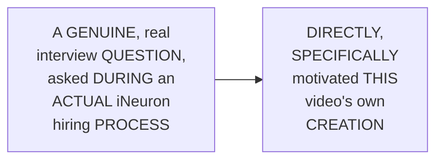

#### 🎯 Key Takeaways

* This is a GENUINELY SHORT, focused VIDEO — EXPLICITLY, DIRECTLY framed AS interview PREPARATION — NOT part OF the SEVEN-day series ALREADY processed IN this workspace, THOUGH BY the SAME instructor.
* The instructor **directly, HONESTLY confirms** this EXACT question was GENUINELY asked DURING a REAL, actual hiring PROCESS — DIRECTLY motivating THIS video's own CREATION.
* The ENTIRE video BUILDS toward ONE, GENERALIZABLE insight — WORTH watching COMPLETELY, per the instructor's OWN, direct FRAMING.

---

### 2. PDF vs. PMF vs. CDF: The Precise, Foundational Distinction

#### ⚠ A Direct, Genuine, Important Clarification

> 💡 **Given directly:** *"I hope you may have heard about one more word which is called as probability distribution function... what is so special [about] this... some people will also say that, okay, it is similar to probability density function — no, nothing like that."*

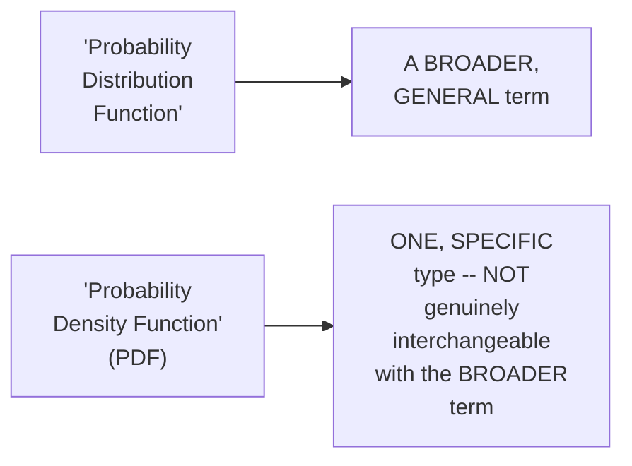

#### 📖 Definition — PDF, PMF & CDF, Precisely Defined

> 💡 **Given directly:** *"Probability density function is specifically used when your distribution is continuous... belonging to a continuous random variable... probability mass function, over here your random variable [is] discrete... cumulative distribution function... we try to combine — we, as the word says, cumulative, right?"*

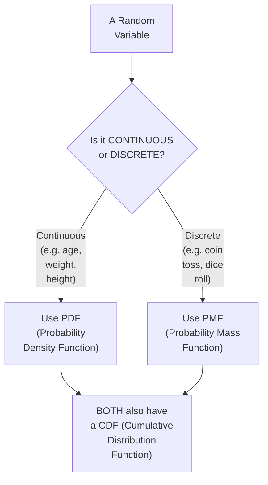

#### ⚠ Common Mistakes

* Assuming "PROBABILITY distribution FUNCTION" and "PROBABILITY density FUNCTION" are GENUINELY, DIRECTLY the SAME term — explicitly, directly, PRECISELY corrected: THEY are GENUINELY different — the FORMER is a BROADER, general TERM; the LATTER (PDF) is ONE, specific TYPE.
* Assuming PDF and PMF are GENUINELY, INTERCHANGEABLY applicable to ANY kind OF random variable — explicitly, directly, PRECISELY distinguished: PDF is SPECIFICALLY for **CONTINUOUS** variables; PMF is SPECIFICALLY for **DISCRETE** variables.

#### 🎯 Key Takeaways

* **"PROBABILITY distribution FUNCTION"** is a BROADER, GENERAL term — GENUINELY, DIRECTLY DIFFERENT from "PROBABILITY density FUNCTION" (PDF SPECIFICALLY) — a COMMON, real point OF confusion, DIRECTLY clarified.
* **PDF** applies TO **CONTINUOUS** random VARIABLES (e.g., AGE, weight, HEIGHT); **PMF** applies TO **DISCRETE** random VARIABLES (e.g., COIN toss, dice ROLL); **CDF** (cumulative DISTRIBUTION function) applies to BOTH.
* This THREE-way distinction directly, PRECISELY sets UP the REST of THIS video's own CONTENT — EVERY subsequent SECTION builds DIRECTLY on THIS foundational FRAMEWORK.

---
### 3. A Complete, Real, Worked PDF Example: Student Weights

#### 🪜 Step-by-Step — A Complete, Real, Relatable Scenario

> 💡 **Given directly:** *"Let us consider that I have a distribution... the weight of students in a classroom, so let's say it is following this kind of bell curve... this is nothing but weights of students in classroom... let's say the mean weight... let's say it is 50 kgs — 50 is too much, I guess, right? For 10th standard, I was hardly weighing around 45 kgs — so the mean is 45."*

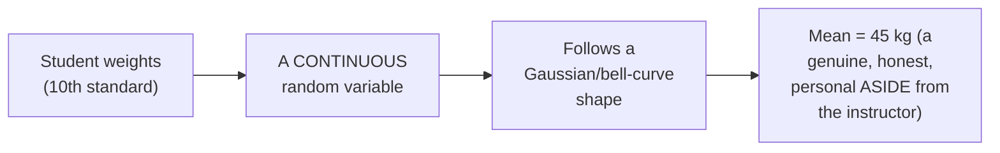

#### ❓ Why It Exists — The Precise, Genuine, Central Question

> 💡 **Given directly:** *"If I probably plot with respect to this mean point, and if I bring it on the y-axis, it will come [to] somewhere around 0.05 — now, what does this basically mean? Does it mean that [the] probability of a random variable to become 45 is nothing but 0.05, like 5 percent? The answer is NO, right? In the case of a continuous value, this probability density has a completely different meaning."*

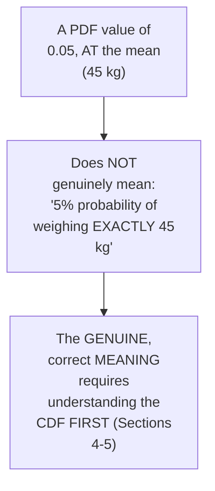

#### ⚠ Common Mistakes

* Assuming a PDF value (LIKE 0.05) is GENUINELY, DIRECTLY a PROBABILITY, in the SAME way a PMF value WOULD be — explicitly, directly, HONESTLY clarified as a GENUINE, common MISCONCEPTION — "the ANSWER is NO."
* Assuming this QUESTION is GENUINELY, MERELY academic — explicitly, directly, HONESTLY confirmed as a REAL, GENUINE interview question — WORTH understanding PRECISELY, not JUST superficially.

#### 🎯 Key Takeaways

* A COMPLETE, real, RELATABLE example (STUDENT weights, mean=45KG) directly, CONCRETELY grounds the PDF discussion IN a FAMILIAR, real-WORLD scenario.
* The GENUINE, central QUESTION this section DIRECTLY poses: a PDF value (LIKE 0.05, AT the mean) is **NOT** genuinely a PROBABILITY (NOT "5% chance OF weighing exactly 45kg") — its TRUE meaning REQUIRES further EXPLANATION.
* This directly, PRECISELY sets UP the NEXT, essential STEP — UNDERSTANDING the **CDF FIRST** (Section 4), SINCE the PDF's own, TRUE meaning is GENUINELY, DIRECTLY derived FROM it (Section 5).

---

### 4. Building Toward the Key Insight: The CDF as Cumulative, S-Shaped Probability

#### 📖 Definition — CDF, Precisely Introduced

> 💡 **Given directly:** *"With respect to the CDF, that is cumulative distribution function, with respect to PDF — that basically means if I am creating a CDF of a continuous value... on the y-axis, you specifically have something called as cumulative probability."*

#### 🔍 Internal Working — The Precise, Genuine Shape & Range

> 💡 **Given directly:** *"Whenever we see a cumulative probability with respect to a PDF function, it will look something [like] this S shape... and the value will be ranging between 0 to 1."*

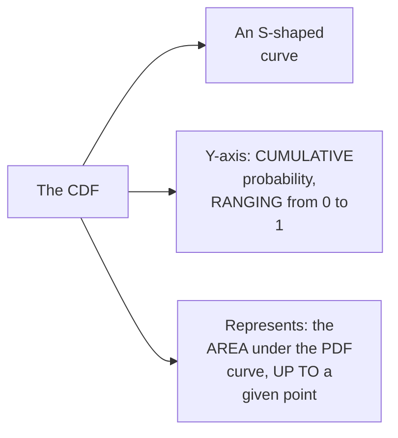

#### 🪜 Step-by-Step — A Complete, Real, Worked Example

> 💡 **Given directly:** *"Let us say if I have this area, if I am considering this 50 percentage of area, right, this area — now with respect to this area, I know my central element is nothing but 45... if I plot it, then this will be pointing towards 0.5... let us say over here I have another value which is like, let's say, 60... my area will look somewhere here, right, so let's say it is 0.8, as my entire 80 percentage of the distribution."*

```text
CDF (cumulative probability), for the student-weight example:
  At x=45 (the mean):  CDF = 0.5  (50% of the distribution falls at or below 45kg)
  At x=60:               CDF = 0.8  (80% of the distribution falls at or below 60kg)
```

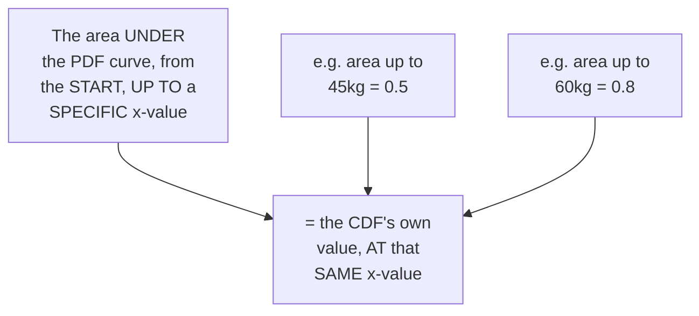

#### ⚠ Common Mistakes

* Assuming the CDF and PDF are GENUINELY, VISUALLY the SAME kind OF curve (BOTH bell-SHAPED) — explicitly, directly, PRECISELY distinguished: the PDF is BELL-shaped; the CDF is **S-SHAPED**, RANGING from 0 TO 1.
* Assuming "CUMULATIVE probability" is a VAGUE, imprecise CONCEPT — explicitly, directly, CONCRETELY anchored: it's PRECISELY the **AREA under the PDF curve**, UP to a GIVEN point.

#### 🎯 Key Takeaways

* The **CDF** is precisely an **S-SHAPED** curve, WITH its OWN y-axis RANGING from **0 to 1** — REPRESENTING **CUMULATIVE probability** (the AREA under the PDF CURVE, up TO a given POINT).
* A COMPLETE, real, WORKED example directly, CONCRETELY confirmed: AT x=45 (the MEAN), CDF=0.5; AT x=60, CDF=0.8.
* This directly, PRECISELY sets UP THIS video's own, CENTRAL, most IMPORTANT insight (Section 5) — THE precise RELATIONSHIP between PDF and CDF.

---
### 5. The Key Insight: PDF Is the Derivative of CDF

#### 📖 Definition — The Precise, Central, Genuine Insight

> 💡 **Given directly:** *"In short, if you want to define PDF — PDF is nothing but it is the derivative of a CDF, at any point... for every point, we're just going to calculate this."*

```text
KEY INSIGHT: PDF = the derivative (slope/gradient) of the CDF, at any given point
```

#### 🔍 Internal Working — Precisely WHY This Resolves the Earlier "What Does 0.05 Mean" Question

> 💡 **Given directly:** *"There before yesterday, guys, I uploaded a video regarding derivatives, right — so for this point, the reason we are getting 0.05 is that because here we calculate the gradient... whenever we say gradient, this is nothing but the slope, or a derivative, of a specific point."*

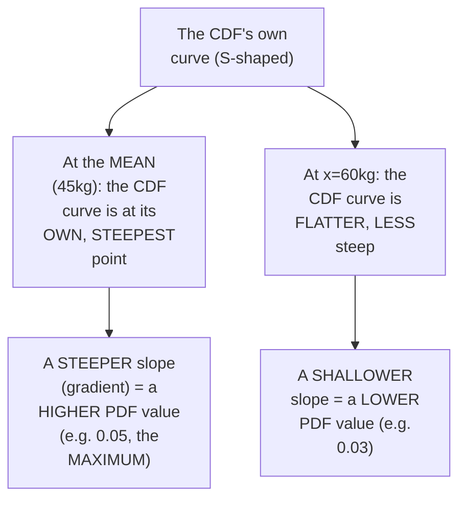

#### 🪜 Step-by-Step — A Complete, Real, Direct Confirmation With Specific Numbers

> 💡 **Given directly:** *"Always in the middle, right, the steepness will be high, so that is the reason you are able to get the maximum probability density function for the mean — if I probably consider for 60, you'll be able to see my probability density will come somewhere as 0.03, why? Let us say 60 is over here, this is the point of 60 — over here my steepness is not that much, so if I try to calculate the slope of this point, in the terms of derivative, I will be able to get 0.03."*

```text
PDF value at x=45 (the mean, WHERE the CDF is steepest):  0.05  (the MAXIMUM PDF value)
PDF value at x=60 (further out, WHERE the CDF is flatter): 0.03  (a LOWER PDF value)
```

#### ⚠ Common Mistakes

* Assuming a PDF value is GENUINELY, DIRECTLY a probability — explicitly, directly, PRECISELY corrected (RESOLVING Section 3's own, OPEN question): it's GENUINELY the **RATE of change** (SLOPE/gradient) of the CUMULATIVE probability (THE CDF), NOT a probability ITSELF.
* Assuming the PDF's own MAXIMUM value GENUINELY occurs AT a RANDOM, arbitrary POINT — explicitly, directly, PRECISELY confirmed: it GENUINELY occurs WHERE the CDF's own CURVE is **STEEPEST** — TYPICALLY, for a SYMMETRIC, Gaussian DISTRIBUTION, AT the MEAN.

#### 🎯 Key Takeaways

* THIS video's own, **CENTRAL, most IMPORTANT insight**: **PDF is precisely the DERIVATIVE (slope/GRADIENT) of the CDF**, AT any given POINT — a GENUINE, frequently-tested INTERVIEW answer WORTH memorizing PRECISELY.
* This DIRECTLY, PRECISELY resolves Section 3's own, OPEN question: a PDF VALUE (like 0.05) is GENUINELY, DIRECTLY the **RATE of change** of CUMULATIVE probability AT that point — NOT a probability ITSELF.
* A COMPLETE, real, worked EXAMPLE directly, CONCRETELY confirmed: the PDF's own MAXIMUM value (0.05) OCCURS at the MEAN (WHERE the CDF's own S-curve is STEEPEST); a LOWER PDF value (0.03) OCCURS further OUT (WHERE the CDF is FLATTER).

---

### 6. PMF: A Complete, Real, Worked Example (Coin Toss & Dice Roll)

#### 📖 Definition — PMF, Precisely Re-Confirmed

> 💡 **Given directly:** *"Second one is still more easier — if I probably consider with respect to PMF... whenever your random variable is a discrete random variable... discrete random variable means a whole number within some specific range."*

#### 🪜 Step-by-Step — A Complete, Real, Worked Example: Coin Toss (Bernoulli)

> 💡 **Given directly:** *"If I probably consider tossing a coin — now in tossing a coin, I may either get heads or tails, right? So what is the probability of head? It is nothing but 0.5. What is the probability of tail? It is nothing but 0.5. So we usually say this distribution is Bernoulli distribution."*

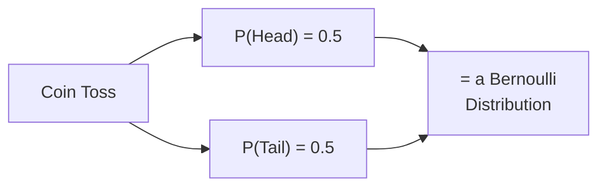

#### 🪜 Step-by-Step — A Complete, Real, Worked Example: Dice Roll (Uniform)

> 💡 **Given directly:** *"Rolling a dice — now if I probably consider rolling a dice... the output is always one, two, three, four, five, six, right, and the probability... will be same — over here my probability will be one by six... my graph will look something like this... one by six, because [for] all these numbers, I have the same probability, that is one by six."*

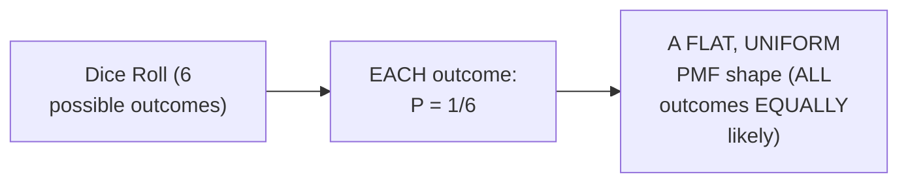

#### 🪜 Step-by-Step — The Cumulative Version (CDF, for the Dice Roll)

> 💡 **Given directly:** *"If I try to relate this with a cumulative density function, or cumulative distribution function... I'll be having the cumulative probability, that basically means I'm just going to do the summation of all the probability... 1/6... then 2/6... then 3/6... then 4/6... then 5/6... and then 6/6."*

```text
Dice Roll, Cumulative Probability (CDF):
  P(X≤1) = 1/6
  P(X≤2) = 2/6
  P(X≤3) = 3/6
  P(X≤4) = 4/6
  P(X≤5) = 5/6
  P(X≤6) = 6/6 = 1
```

#### ⚠ Common Mistakes

* Assuming PMF and CDF, FOR a DISCRETE distribution, are GENUINELY, VISUALLY the SAME kind OF graph — explicitly, directly, PRECISELY distinguished: PMF is FLAT/uniform (EACH outcome's OWN, individual probability); CDF is a RISING, STEP-like accumulation (SUMMING probabilities AS you go).
* Assuming a COIN toss and a DICE roll are GENUINELY, STRUCTURALLY different KINDS of distributions — explicitly, directly, PRECISELY confirmed as BOTH being PMF-based (DISCRETE), THOUGH the COIN toss is SPECIFICALLY named BERNOULLI (TWO outcomes), WHILE the dice ROLL is a MORE general, UNIFORM discrete DISTRIBUTION (six OUTCOMES).

#### 🎯 Key Takeaways

* **PMF** applies TO discrete VARIABLES — DIRECTLY, CONCRETELY illustrated VIA COIN tossing (P(HEAD)=P(tail)=0.5, a BERNOULLI distribution) and DICE rolling (EACH of SIX outcomes, P=1/6, a UNIFORM distribution).
* The **CUMULATIVE** version (CDF) for a DISCRETE distribution GENUINELY, DIRECTLY sums UP individual PROBABILITIES as YOU go — DIRECTLY, CONCRETELY confirmed FOR the dice-roll EXAMPLE (1/6, 2/6, 3/6, 4/6, 5/6, 6/6).
* This directly, PRECISELY sets UP the NEXT, PRACTICAL application (Section 7) — USING this SAME cumulative STRUCTURE to SOLVE a REAL, concrete PROBABILITY question.

---
### 7. A Genuine, Practical PMF/CDF Application: Solving P(X≤4)

#### 🪜 Step-by-Step — A Complete, Real, Worked Practical Problem

> 💡 **Given directly:** *"Suppose if I ask, what is the probability of X is less than or equal to 4 — that basically means I want to find out the area within, for the outcome to come in this, right, within less than or equal to four... it is very simple, what we'll do — I'll write probability of X is equal to 1, plus probability of X is equal to 2, plus probability of X is equal to 3, plus probability of X is equal to 4."*

```text
P(X ≤ 4) = P(X=1) + P(X=2) + P(X=3) + P(X=4)
         = 1/6 + 1/6 + 1/6 + 1/6
         = 4/6
```

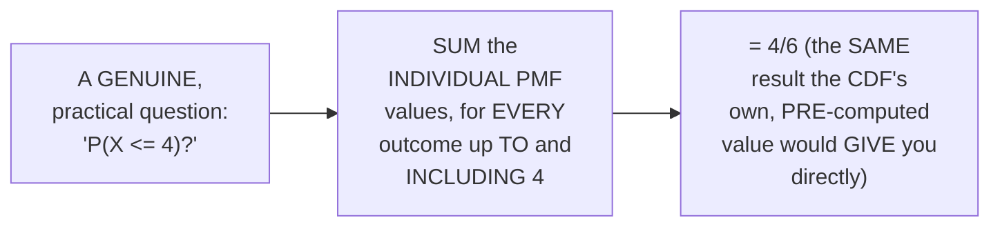

#### 🔍 Internal Working — A Genuine, Direct Confirmation: Why Understanding This Relationship Matters

> 💡 **Given directly:** *"Why we are learning all these things — because this kind of operations can be easily performed with respect to probability... similarly, for this, what kind of problem statement I can get? I can ask that, what percentage of distribution falls in this region, that is below, let us say, 30 — and then for this, I can probably use this kind of PDF functions and I can calculate it."*

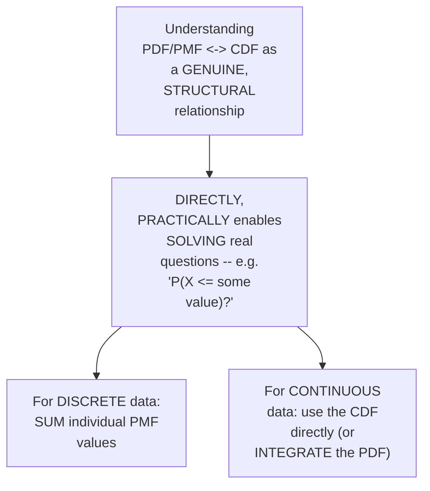

#### ⚠ Common Mistakes

* Assuming THIS theoretical PDF/PMF/CDF DISTINCTION is GENUINELY, PURELY academic, WITHOUT any REAL, practical USE — explicitly, directly, CONCRETELY demonstrated as GENUINELY, DIRECTLY useful FOR solving REAL, common PROBABILITY questions (e.g., "P(X ≤ SOME value)?").
* Assuming SOLVING "P(X ≤ 4)" requires a GENUINELY NEW, different formula FROM what's ALREADY been established — explicitly, directly, PRECISELY confirmed as SIMPLY, DIRECTLY summing the INDIVIDUAL PMF values — a DIRECT application OF the CUMULATIVE logic ALREADY established (Section 6).

#### 🎯 Key Takeaways

* A COMPLETE, real, WORKED example directly, CONCRETELY confirmed: **P(X≤4) = 4/6**, COMPUTED by SUMMING individual PMF VALUES — DIRECTLY matching the CUMULATIVE structure ALREADY established (Section 6).
* This directly, CONCRETELY demonstrates WHY understanding the PDF/PMF-TO-CDF relationship GENUINELY MATTERS — it ENABLES solving REAL, practical PROBABILITY questions, NOT merely REMEMBERING abstract DEFINITIONS.
* This SAME logic GENERALIZES to CONTINUOUS distributions TOO — DIRECTLY, PRACTICALLY using the CDF (OR integrating the PDF) to ANSWER "WHAT percentage falls BELOW a given VALUE?" questions.

---

### 8. The Generalizable "Interview Trick": Applying This Logic to Any Distribution

#### 🧠 Concept — The Precise, Genuine, Generalizable Framework

> 💡 **Given directly:** *"Now since we have learned about PDF, CDF, and PMF, now it's time to learn different kind of distribution... one thing, [in] every distribution, you will be having a PDF function, [and you] will have a CDF function."*

#### 🪜 Step-by-Step — A Complete, Real, Live Tour Through Multiple, Real Distribution Pages

> 💡 **Given directly, on Normal distribution:** *"Just go and search for normal distribution in Wikipedia... in every distribution, you will be having a PDF function, [and you] will have a CDF function — how to derive this PDF function, there will be a formula."*

> 💡 **Given directly, on Bernoulli distribution:** *"If you go and see, Bernoulli distribution, if you are seeing probability mass function, that basically means... what kind of random variable? Discrete random variable — so here in Bernoulli, you have two events."*

> 💡 **Given directly, on Log-Normal distribution:** *"If you go and see this... my PDF looks like this... since I am getting PDF function, I know my random variable is a continuous random variable — and yes, can we convert this distribution to a normal distribution? Yes, we can do it — how to do it? For that, you have to use log transformation."*

> 💡 **Given directly, on Exponential distribution:** *"You'll see this, okay, probability density function is there, and there is a parameter called as Alpha... cumulative is basically the summation of all the area."*

> 💡 **Given directly, on Poisson distribution:** *"Here you have probability mass function, with some Lambda value... as the Lambda is increasing, your curve actually becomes a normal distribution — as a Lambda increases, let's say Lambda is equal to 1, this looks like a Pareto distribution, then it looks like a log-normal distribution, then probably when you increase the Lambda, it looks like a normal distribution."*

> 💡 **Given directly, on Binomial distribution:** *"The first thing that I probably see over here in Wikipedia — it looks like this, probability mass function — now my mind will start working on, okay, it is a discrete random variable... this is basically created, you have multiple experiments over here."*

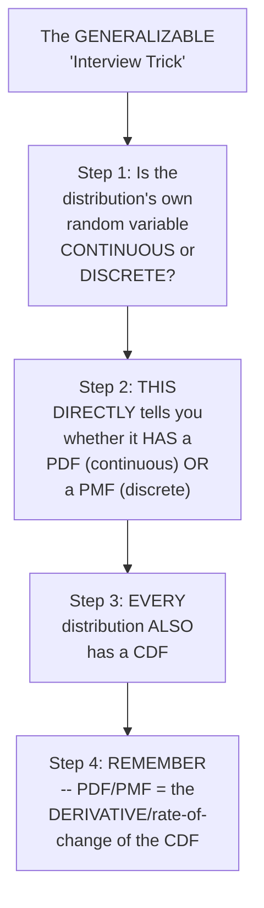

#### 🔍 Internal Working — A Genuine, Direct, Honest Clarification on Formula Memorization

> 💡 **Given directly:** *"You don't need to hire [memorize] the formula, you need to understand about the data."*

#### ⚠ Common Mistakes

* Assuming EACH, DIFFERENT distribution (NORMAL, Bernoulli, LOG-normal, exponential, POISSON, binomial) REQUIRES a GENUINELY, ENTIRELY separate, MEMORIZED mental MODEL — explicitly, directly, LIVE-demonstrated as FALSE: the EXACT SAME, underlying LOGIC (continuous→PDF; DISCRETE→PMF; EVERY distribution→a CDF) GENUINELY, DIRECTLY applies TO all of THEM.
* Assuming SUCCEEDING in a DISTRIBUTION-related interview QUESTION requires MEMORIZING every, SPECIFIC formula — explicitly, directly, HONESTLY clarified: "YOU don't need to HIRE [memorize] the FORMULA, you need to UNDERSTAND about the DATA" — CONCEPTUAL understanding MATTERS far MORE than rote MEMORIZATION.

#### 🎯 Key Takeaways

* THIS video's own, **GENUINELY generalizable "interview TRICK"**: FOR any distribution you ENCOUNTER, FIRST determine WHETHER its OWN random variable is **CONTINUOUS** or **DISCRETE** — this DIRECTLY tells you WHETHER it HAS a PDF OR a PMF — and EVERY distribution ALSO has a CDF.
* A COMPLETE, real, LIVE tour THROUGH multiple, REAL Wikipedia PAGES (Normal, BERNOULLI, log-normal, EXPONENTIAL, Poisson, binomial) directly, CONCRETELY confirmed THIS SAME pattern HOLDS across EVERY, genuinely different DISTRIBUTION type.
* The instructor **directly, HONESTLY emphasizes** that MEMORIZING specific FORMULAS matters FAR less than GENUINELY understanding the UNDERLYING, conceptual FRAMEWORK — "YOU need to UNDERSTAND about the DATA."

---

### 9. Closing: A Confident Framing & What's Next

#### 🪜 Step-by-Step — A Direct, Confident, Closing Framing

> 💡 **Given directly:** *"Once you know this technique, trust me, in [any] interview [about any] distribution, you will be super confident, right — you'll be like a Superman."*

#### 🪜 Step-by-Step — A Direct, Honest Pointer to Future Content

> 💡 **Given directly:** *"The next video will be related to inferential statistics, where I'll give you another trick, where you can probably solve every problem — and you can answer in the interviews."*

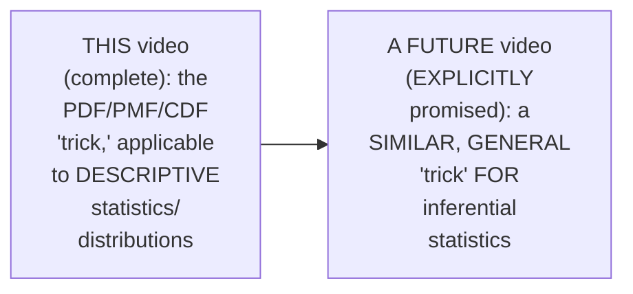

#### ⚠ Common Mistakes

* Assuming THIS video's own COVERAGE represents EVERYTHING genuinely NEEDED for statistics INTERVIEWS — explicitly, directly, HONESTLY clarified: a FUTURE video is EXPLICITLY promised, COVERING a SIMILAR, generalizable "TRICK" for **INFERENTIAL** statistics SPECIFICALLY.

#### 🎯 Key Takeaways

* This video **GENUINELY, COMPLETELY delivers** its OWN, stated GOAL — a SINGLE, GENERALIZABLE framework FOR understanding PDF, PMF, and CDF, ACROSS any DISTRIBUTION.
* The instructor **directly, CONFIDENTLY frames** this UNDERSTANDING as GENUINELY sufficient TO handle "ANY" distribution-RELATED interview QUESTION.
* A **FUTURE video ON inferential STATISTICS** is directly, EXPLICITLY promised — COVERING a SIMILAR, generalizable "TRICK" for THAT complementary AREA of statistics.

---
## 📝 Glossary

| Term | Definition | Why It Matters |
|---|---|---|
| **PDF (Probability Density Function)** | Used for continuous random variables | Its value at a point is NOT a probability itself |
| **PMF (Probability Mass Function)** | Used for discrete random variables | Its value at a point IS a direct probability |
| **CDF (Cumulative Distribution Function)** | Cumulative probability, ranging 0 to 1 | Applies to both continuous and discrete variables |
| **Probability Distribution Function** | A broader, general term | NOT the same as "probability density function" (PDF) |
| **Derivative/Gradient** | The slope of a curve at a specific point | PDF = the derivative of the CDF |
| **Continuous Random Variable** | Can take any value (e.g. age, weight, height) | Uses PDF |
| **Discrete Random Variable** | Whole numbers within a specific range | Uses PMF |

---

## 🔄 Revision Notes — One-Minute Revision

* This is a **standalone, short, interview-focused video** -- NOT part of the 7-day series, but by the same instructor -- explicitly motivated by a REAL question asked during an actual iNeuron hiring process.
* **The foundational distinction**: PDF (continuous variables, e.g. age/weight/height) vs. PMF (discrete variables, e.g. coin toss/dice roll) vs. CDF (cumulative probability, 0 to 1, applies to both). "Probability distribution function" is a broader, general term -- NOT the same as "probability density function" (PDF specifically).
* **The PDF puzzle**: a PDF value (like 0.05, at the mean of a student-weight distribution) is NOT a direct probability ("5% chance of weighing exactly 45kg" is WRONG).
* **The CDF**: an S-shaped curve, ranging 0 to 1, representing cumulative probability (the area under the PDF curve, up to a given point). Live example: CDF at x=45 (the mean) = 0.5; CDF at x=60 = 0.8.
* **THE key insight**: PDF is precisely the DERIVATIVE (slope/gradient) of the CDF, at any given point. Where the CDF's own S-curve is steepest (typically at the mean, for symmetric distributions), the PDF is at its maximum (e.g. 0.05); where the CDF is flatter (e.g. further from the mean, at x=60), the PDF is lower (e.g. 0.03). This directly resolves the earlier puzzle -- 0.05 is a RATE of change, not a probability.
* **PMF, worked examples**: coin toss (P(Head)=P(Tail)=0.5, a Bernoulli distribution); dice roll (each of 6 outcomes, P=1/6, a uniform distribution). The cumulative version sums probabilities as you go: 1/6, 2/6, 3/6, 4/6, 5/6, 6/6.
* **A genuine, practical application**: P(X≤4) for a dice roll = P(X=1)+P(X=2)+P(X=3)+P(X=4) = 4/6 -- directly demonstrating why understanding this relationship matters for solving real questions.
* **The generalizable "interview trick"**: for ANY distribution (Normal, Bernoulli, Log-normal, Exponential, Poisson, Binomial -- all live-toured via Wikipedia), the same logic applies: continuous variable -> has a PDF; discrete variable -> has a PMF; EVERY distribution -> also has a CDF. Memorizing specific formulas matters less than understanding this underlying framework. A genuine, additional Poisson insight: as its Lambda parameter increases, its shape transforms from Pareto-like, to log-normal-like, to eventually normal.
* **Closing**: a confident framing -- understanding this makes you "super confident" for any distribution-related interview question. A future video is explicitly promised, covering a similar, generalizable trick for inferential statistics.

---

## 📋 Cheat Sheet

**The foundational distinction:**
```text
PDF (Probability Density Function)     -- CONTINUOUS variables (age, weight, height)
PMF (Probability Mass Function)        -- DISCRETE variables (coin toss, dice roll)
CDF (Cumulative Distribution Function) -- applies to BOTH; ranges 0 to 1
```

**THE key insight:**
```text
PDF = the DERIVATIVE (slope/gradient) of the CDF, at any given point
-> a PDF value is a RATE of change, NOT a direct probability
```

**PMF worked examples:**
```text
Coin Toss:  P(Head) = 0.5, P(Tail) = 0.5  -> a Bernoulli distribution
Dice Roll:  P(any single outcome) = 1/6    -> a uniform distribution
Cumulative (dice): 1/6, 2/6, 3/6, 4/6, 5/6, 6/6
P(X <= 4) = P(X=1)+P(X=2)+P(X=3)+P(X=4) = 4/6
```

**The generalizable "interview trick":**
```text
For ANY distribution you encounter:
1. Is its random variable CONTINUOUS or DISCRETE?
2. Continuous -> it has a PDF | Discrete -> it has a PMF
3. EVERY distribution also has a CDF
4. Remember: PDF/PMF = the derivative/rate-of-change of the CDF
```

---

## 🔥 Interview Questions & Answers

### 🟢 Beginner

**Q1.**

**Question:** What is the genuine difference between PDF, PMF, and CDF?

**Answer:** PDF is for continuous variables; PMF is for discrete variables; CDF (cumulative probability, 0-1) applies to both.

**Explanation:** Directly, precisely distinguished.

**Why Interviewers Ask This:** The most basic, foundational, and explicitly-confirmed real interview question.

**Possible Follow-up:** "Give an example of a continuous and a discrete random variable."

**Q2.**

**Question:** Is "probability distribution function" the same as "probability density function"?

**Answer:** No -- the former is a broader, general term; the latter (PDF) is one, specific type.

**Explanation:** Directly, precisely clarified.

**Why Interviewers Ask This:** A commonly-confused, genuine terminological distinction.

**Possible Follow-up:** "What is the PDF specifically used for?"

**Q3.**

**Question:** Does a PDF value (like 0.05) represent a direct probability?

**Answer:** No -- it represents a rate of change (the derivative of the CDF), not a probability itself.

**Explanation:** Directly, precisely explained.

**Why Interviewers Ask This:** Tests genuine, deep understanding beyond surface-level definitions.

**Possible Follow-up:** "What IS the precise relationship between PDF and CDF?"

**Q4.**

**Question:** What is the precise, key relationship between PDF and CDF?

**Answer:** PDF is the derivative (slope/gradient) of the CDF, at any given point.

**Explanation:** Directly, explicitly stated -- this video's own central insight.

**Why Interviewers Ask This:** The single most important, generalizable answer this entire video builds toward.

**Possible Follow-up:** "Where does the PDF genuinely reach its maximum value, for a symmetric distribution?"

**Q5.**

**Question:** What shape does a CDF genuinely have?

**Answer:** An S-shape, ranging from 0 to 1.

**Explanation:** Directly, precisely described.

**Why Interviewers Ask This:** Basic, essential CDF visualization knowledge.

**Possible Follow-up:** "What does the CDF's own value at a specific point genuinely represent?"

**Q6.**

**Question:** What is a Bernoulli distribution?

**Answer:** A discrete distribution with two outcomes (e.g., a coin toss: P(Head)=P(Tail)=0.5).

**Explanation:** Directly, precisely explained.

**Why Interviewers Ask This:** Basic, essential discrete-distribution knowledge.

**Possible Follow-up:** "Does a Bernoulli distribution use a PDF or a PMF?"

**Q7.**

**Question:** For a fair, six-sided die, what is P(X≤4)?

**Answer:** 4/6.

**Explanation:** Directly, precisely computed.

**Why Interviewers Ask This:** Tests genuine, practical application of the PMF/CDF relationship.

**Possible Follow-up:** "How would you compute this using individual PMF values?"

**Q8.**

**Question:** According to this video, what is the single most important thing to determine when encountering ANY new distribution?

**Answer:** Whether its random variable is continuous or discrete.

**Explanation:** Directly, explicitly stated -- this video's own generalizable "interview trick."

**Why Interviewers Ask This:** Tests genuine, conceptual (rather than memorized) understanding.

**Possible Follow-up:** "Why does this single determination matter so much?"

**Q9.**

**Question:** Does the instructor recommend memorizing every distribution's own specific formula?

**Answer:** No -- he recommends understanding the underlying data/concept instead.

**Explanation:** Directly, honestly stated.

**Why Interviewers Ask This:** Tests genuine, conceptual learning philosophy.

**Possible Follow-up:** "What does understanding 'the data' genuinely mean, in this context?"

**Q10.**

**Question:** As the Lambda parameter of a Poisson distribution increases, what does its shape genuinely approach?

**Answer:** A normal distribution shape (passing through Pareto-like and log-normal-like shapes along the way).

**Explanation:** Directly, live-confirmed via Wikipedia.

**Why Interviewers Ask This:** Tests genuine, additional distribution-relationship knowledge.

**Possible Follow-up:** "What does this suggest about the general relationship between distribution parameters and shape?"

---

### 🟡 Intermediate

**Q11.**

**Question:** Explain why the instructor deliberately builds up to the "PDF is the derivative of CDF" insight by FIRST posing an unresolved question (what does 0.05 genuinely mean?), rather than stating the derivative relationship immediately.

**Answer:** This is a genuinely deliberate, TENSION-building teaching choice: by FIRST, DIRECTLY posing a GENUINE, unresolved PUZZLE (a PDF value of 0.05, WHICH is clearly NOT "5% probability"), the instructor CREATES a REAL, felt NEED for the SUBSEQUENT explanation — LEARNERS are GENUINELY, ACTIVELY curious ABOUT the answer, RATHER than passively RECEIVING an abstract, UNMOTIVATED formula. This directly, CONCRETELY makes the EVENTUAL "PDF is the DERIVATIVE of CDF" insight FEEL like a GENUINE, satisfying RESOLUTION, RATHER than an ARBITRARY, memorized FACT — a FAR more MEMORABLE, effective TEACHING sequence than STATING the relationship UPFRONT, without FIRST establishing WHY it matters.

**Explanation:** Requires recognizing the deliberate, tension-building value of posing an unresolved question before delivering its resolution.

**Why Interviewers Ask This:** Tests whether a learner recognizes the pedagogical value of motivated, problem-first explanation over immediate, unmotivated formula delivery.

**Possible Follow-up:** "Construct your OWN, similar 'PUZZLE-first' explanation FOR why CDF values are BOUNDED between 0 AND 1."

**Q12.**

**Question:** A learner argues that since PDF is the derivative of CDF, and derivatives can be negative, this means PDF values could genuinely be negative too. Evaluate this claim.

**Answer:** This claim is GENUINELY, MATHEMATICALLY incorrect, though it RAISES a REASONABLE-sounding QUESTION worth ADDRESSING. WHILE derivatives IN GENERAL can INDEED be negative (REPRESENTING a DECREASING function), THIS session's own, ESTABLISHED CDF property (Section 4) DIRECTLY implies WHY PDF CANNOT genuinely be NEGATIVE: the CDF is GENUINELY, STRUCTURALLY a **CUMULATIVE** probability — it can ONLY, GENUINELY increase (OR stay flat) AS x increases, NEVER decrease (SINCE you're ALWAYS adding MORE area, NEVER removing it). A FUNCTION that is GENUINELY, MONOTONICALLY non-decreasing GENUINELY, MATHEMATICALLY has a derivative (SLOPE) that is ALWAYS greater THAN or equal TO zero — NEVER negative. The ACCURATE, more PRECISE conclusion: PDF values are GENUINELY, ALWAYS non-negative, PRECISELY BECAUSE the CDF (ITS own, underlying FUNCTION) is GENUINELY, STRUCTURALLY non-decreasing BY its OWN, cumulative NATURE.

**Explanation:** Tests whether a learner can correctly reason from the CDF's own cumulative, non-decreasing nature to conclude PDF values must be non-negative, rather than assuming derivatives are unconstrained.

**Why Interviewers Ask This:** Distinguishes candidates who can derive a genuine, structural property from first principles from those who apply a general mathematical fact without considering the specific, constraining context.

**Possible Follow-up:** "What GENUINE, real-world INTERPRETATION would a NEGATIVE PDF value have, IF it WERE somehow possible? Explain WHY this INTERPRETATION would be GENUINELY, STRUCTURALLY nonsensical."

**Q13.**

**Question:** Explain, precisely, why the instructor deliberately performs a LIVE tour through multiple, real Wikipedia pages (Normal, Bernoulli, Log-normal, Exponential, Poisson, Binomial), rather than simply asserting that "this same logic applies to every distribution."

**Answer:** This is a genuinely deliberate, EVIDENCE-based teaching choice, DIRECTLY consistent with THIS instructor's own, ESTABLISHED pattern ACROSS his broader SERIES (e.g., the 7-day series' OWN, repeated use OF real, LIVE-computed WORKED examples). By DIRECTLY, LIVE navigating to MULTIPLE, REAL distribution pages and SHOWING the SAME, underlying PATTERN (continuous→PDF; DISCRETE→PMF; EVERY distribution→a CDF) HOLDING true ACROSS SIX, genuinely DIFFERENT distribution TYPES, the instructor TRANSFORMS an ABSTRACT, POTENTIALLY unconvincing CLAIM ("this APPLIES to EVERY distribution") into a CONCRETELY, REPEATEDLY VERIFIED, genuine PATTERN — GIVING learners GENUINE, first-HAND confidence that THIS "trick" WILL, reliably, WORK when THEY encounter a NEW, unfamiliar distribution THEMSELVES, RATHER than SIMPLY trusting an UNVERIFIED assertion.

**Explanation:** Requires recognizing the deliberate, evidence-based value of repeated, live verification across multiple, real examples, rather than a single, abstract assertion.

**Why Interviewers Ask This:** Tests whether a learner recognizes the pedagogical and confidence-building value of repeated, concrete verification over abstract, unverified generalization.

**Possible Follow-up:** "Choose a GENUINE distribution NOT explicitly covered in THIS video (e.g., the UNIFORM distribution FOR continuous VARIABLES, OR the GEOMETRIC distribution), and APPLY this SAME 'trick' to CONFIRM whether it GENUINELY holds."

**Q14.**

**Question:** Using this session's own precise "PDF is the derivative of CDF" reasoning (Section 5), explain a GENUINE, real, PRACTICAL way a data scientist could estimate a continuous variable's own PDF value at a specific point, GIVEN only access to a large, empirical dataset (rather than a known, theoretical formula).

**Answer:** A precise, reasoned, PRACTICAL approach, directly extending Section 5's own established MECHANISM: per Section 5's own PRECISE reasoning, PDF is GENUINELY, DIRECTLY the RATE of change OF cumulative probability. GIVEN a LARGE, empirical DATASET (WITHOUT a known, THEORETICAL formula), a data SCIENTIST could GENUINELY, PRACTICALLY: (1) FIRST, empirically ESTIMATE the CDF DIRECTLY from the DATA (e.g., FOR any x-VALUE, computing the PROPORTION of data POINTS that are LESS than or EQUAL to x — a DIRECT, empirical CDF); (2) THEN, GENUINELY estimate the PDF at a SPECIFIC point BY computing the **RATE of CHANGE** of this EMPIRICAL CDF AT that point (e.g., APPROXIMATING the DERIVATIVE by COMPARING the empirical CDF's OWN values AT two, CLOSELY-spaced x-values, and DIVIDING by their DIFFERENCE — a DIRECT, numerical APPROXIMATION of a DERIVATIVE). This directly, PRACTICALLY illustrates HOW Section 5's own, THEORETICAL relationship (PDF = DERIVATIVE of CDF) TRANSLATES into a GENUINE, real, DATA-driven estimation TECHNIQUE — CONNECTING to WELL-known, real METHODS like KERNEL density estimation (BRIEFLY, informally MENTIONED in the EARLIER, 7-day series' OWN Day 1 content).

**Explanation:** Requires extending the theoretical PDF-CDF derivative relationship into a practical, empirical estimation technique for real, data-driven scenarios.

**Why Interviewers Ask This:** A senior-level question testing whether a candidate can translate a theoretical statistical relationship into a practical, real-world data-science technique.

**Possible Follow-up:** "What GENUINE, real STATISTICAL/machine-learning TECHNIQUE (REFERENCED, BRIEFLY, in a DIFFERENT session OF this WORKSPACE) is DIRECTLY, PRACTICALLY built ON this SAME, underlying PRINCIPLE?"

**Q15.**

**Question:** Synthesize this session's complete "PMF cumulative summation" reasoning (Section 6-7) with its own "PDF as CDF's derivative" reasoning (Section 5) to explain WHY the "summing" operation (for discrete PMF-to-CDF) and the "derivative" operation (for continuous PDF-from-CDF) are GENUINELY, MATHEMATICALLY related, RATHER than being two, entirely UNRELATED operations that simply happen TO apply to different variable TYPES.

**Answer:** A precise, synthesized explanation, directly connecting TWO, separately-established sections: per Section 6-7's own PRECISE, established MECHANISM, a DISCRETE distribution's own CDF is GENUINELY, DIRECTLY built by **SUMMING** individual PMF VALUES (e.g., "1/6, THEN 2/6, then 3/6..."). Per Section 5's own PRECISE, established MECHANISM, a CONTINUOUS distribution's own PDF is GENUINELY, DIRECTLY the **DERIVATIVE** of its OWN CDF. SYNTHESIZING these TWO facts directly, PRECISELY reveals a GENUINE, DEEP, mathematical CONNECTION: SUMMATION (FOR discrete VARIABLES) and INTEGRATION (the "REVERSE" operation OF a derivative, FOR continuous variables) are GENUINELY, MATHEMATICALLY analogous OPERATIONS — a DISCRETE SUM is, CONCEPTUALLY, the DISCRETE analog OF a CONTINUOUS integral. This directly, PRECISELY reveals WHY these TWO, seemingly DIFFERENT operations (SUMMING PMF values, VERSUS taking a DERIVATIVE of CDF) are NOT genuinely, ARBITRARILY unrelated — THEY are GENUINELY, STRUCTURALLY connected THROUGH the SAME, deeper, mathematical RELATIONSHIP between SUMMATION/integration and DIFFERENTIATION — JUST applied TO discrete VERSUS continuous DATA, respectively.

**Explanation:** Requires synthesizing the discrete summation mechanism with the continuous derivative mechanism to identify the deeper, mathematical connection (summation/integration vs. differentiation) underlying both.

**Why Interviewers Ask This:** A senior-level, conceptually-deep question testing whether a candidate can identify the shared, mathematical foundation connecting seemingly different discrete and continuous operations.

**Possible Follow-up:** "For a CONTINUOUS distribution, what OPERATION (the CONTINUOUS analog OF discrete SUMMATION) would you GENUINELY use to GO from PDF BACK to CDF (the REVERSE of Section 5's own, established DERIVATIVE relationship)?"

---

### 🔴 Advanced

**Q16.**

**Question:** Design a complete, reasoned explanation (using ONLY this session's own established concepts) for how you would answer a hypothetical, more advanced interview follow-up: "Given a distribution's own PDF formula, how would you compute the probability that a continuous random variable falls WITHIN a specific range (e.g., between 40 and 50 kg, for the student-weight example)?"

**Answer:** A reasonable, complete explanation, directly applying this session's OWN, exact established CONCEPTS:

```text
1. RECALL (per Section 4's own established mechanism) that the CDF's
   own value, AT any point x, GENUINELY represents the cumulative
   probability -- the AREA under the PDF curve, from the START, UP
   TO x.

2. THEREFORE, to find the probability that the variable falls WITHIN
   a range (e.g., between 40 and 50 kg), COMPUTE:
   P(40 <= X <= 50) = CDF(50) - CDF(40)

3. This DIRECTLY, GENUINELY works BECAUSE CDF(50) represents the
   TOTAL area up TO 50, and CDF(40) represents the TOTAL area UP to
   40 -- SUBTRACTING the SMALLER area FROM the LARGER one GENUINELY,
   PRECISELY isolates JUST the area BETWEEN 40 and 50.

4. ALTERNATIVELY (per Section 5's own established, REVERSE
   relationship), this SAME result COULD, in PRINCIPLE, be obtained
   by INTEGRATING the PDF FUNCTION directly, FROM x=40 to x=50 --
   SINCE integration is the MATHEMATICAL "REVERSE" of the derivative
   relationship (Section 5) CONNECTING PDF and CDF.
```

This complete EXPLANATION directly, precisely APPLIES this session's OWN, established CDF-as-cumulative-AREA concept (Section 4) TO a GENUINELY realistic, MORE advanced interview FOLLOW-UP question.

**Explanation:** Requires extending the CDF's own cumulative-area property to derive the range-probability formula, a natural, advanced follow-up to this session's own core content.

**Why Interviewers Ask This:** A realistic, senior-level question testing whether a candidate can extend the core PDF/CDF relationship to solve a genuinely more complex, but directly related, probability question.

**Possible Follow-up:** "For the STUDENT-weight example (mean=45kg), IF CDF(50)=0.9 and CDF(40)=0.3, what is P(40 <= X <= 50)?"

**Q17.**

**Question:** Critically evaluate: "Since this video confirms that memorizing specific distribution formulas matters less than understanding the underlying continuous/discrete framework, this means a data scientist genuinely never needs to know any distribution's own, specific formula." Is this an accurate, complete characterization?

**Answer:** Not accurate — this OVERSTATES a GENUINE, sound PEDAGOGICAL emphasis into an UNCONDITIONAL, "NEVER need FORMULAS" claim NEITHER this video's own CONTENT, nor sound PRACTICAL reasoning, fully SUPPORTS. Section 8's own PRECISE, DIRECT statement is CAREFULLY, SPECIFICALLY worded: "YOU don't need to HIRE [memorize] the FORMULA, you need to UNDERSTAND about the DATA" — this is a STATEMENT about PRIORITY and DEEPER understanding, NOT a CLAIM that formulas are GENUINELY, ENTIRELY unnecessary. In REAL, practical DATA-science work, a data SCIENTIST GENUINELY, DIRECTLY needs to USE specific FORMULAS (e.g., WHEN implementing a distribution IN code, OR when PERFORMING an ACTUAL, real calculation) — the CONCEPTUAL framework (CONTINUOUS→PDF, DISCRETE→PMF) HELPS you KNOW *WHICH KIND* of formula to EXPECT and *HOW to INTERPRET* it, but does NOT genuinely, PRACTICALLY eliminate the NEED to EVER reference OR use a SPECIFIC formula. The ACCURATE, more PRECISE conclusion: CONCEPTUAL understanding GENUINELY, DIRECTLY takes PRIORITY over ROTE memorization — but SPECIFIC formulas REMAIN genuinely, PRACTICALLY necessary FOR actual, real-WORLD implementation and CALCULATION.

**Explanation:** Tests whether a learner recognizes that a stated priority (understanding over memorization) doesn't mean the de-prioritized element (specific formulas) becomes entirely unnecessary.

**Why Interviewers Ask This:** Distinguishes candidates who understand the genuine, practical balance between conceptual understanding and formula knowledge from those who over-generalize a pedagogical emphasis into an absolute claim.

**Possible Follow-up:** "Describe a GENUINE, real, practical SCENARIO where a data SCIENTIST would GENUINELY, DIRECTLY need to REFERENCE a SPECIFIC distribution's own FORMULA, DESPITE having a STRONG, conceptual understanding of the CONTINUOUS/discrete framework."

**Q18.**

**Question:** Synthesize this session's complete "Poisson distribution, Lambda-driven shape transformation" reasoning (Section 8) with its own "PDF/CDF, continuous vs. discrete" reasoning (Section 2) to construct a reasoned explanation of a GENUINE, subtle nuance: Poisson distribution is GENUINELY, TECHNICALLY a discrete distribution (using a PMF), YET this session's own content directly discusses it "becoming" normal-shaped as Lambda increases — explain how this is GENUINELY consistent, rather than contradictory.

**Answer:** A precise, synthesized explanation, directly connecting TWO, separately-established sections: per Section 2's own PRECISE, established FRAMEWORK, DISCRETE distributions GENUINELY use a **PMF**, NOT a PDF — and PER Section 8's own PRECISE, live-CONFIRMED Wikipedia observation, Poisson IS, GENUINELY, TECHNICALLY confirmed as USING "PROBABILITY mass function, WITH some Lambda VALUE" — CONFIRMING it REMAINS, STRUCTURALLY, a DISCRETE distribution, REGARDLESS of its LAMBDA value. SYNTHESIZING these TWO facts directly, PRECISELY reveals the GENUINE, subtle RESOLUTION: WHEN Section 8's own content SAYS the Poisson distribution's own SHAPE "becomes" NORMAL as LAMBDA increases, this GENUINELY, PRECISELY refers ONLY to its VISUAL, GRAPHICAL resemblance (the OVERALL, outward SHAPE of the DISTRIBUTION's own bars/POINTS increasingly RESEMBLING a SMOOTH, Gaussian bell CURVE) — it does NOT genuinely, STRUCTURALLY mean the Poisson distribution ITSELF stops BEING discrete, or GENUINELY converts INTO a truly CONTINUOUS, PDF-based distribution. This is a GENUINE, real STATISTICAL phenomenon (RELATED to the CENTRAL Limit Theorem's own, BROADER principle, per the EARLIER, 7-day series' OWN Day 7 content) — DISCRETE distributions, UNDER certain CONDITIONS (like a LARGE Lambda), can GENUINELY, VISUALLY APPROXIMATE a continuous, NORMAL shape, WITHOUT genuinely, STRUCTURALLY ceasing to BE discrete distributions THEMSELVES.

**Explanation:** Requires synthesizing the continuous/discrete PMF/PDF framework with the Poisson distribution's own Lambda-driven visual transformation to resolve an apparent, but genuinely reconcilable, tension.

**Why Interviewers Ask This:** A capstone-level question testing whether a candidate can distinguish between a distribution's own structural classification (discrete, using PMF) and its visual, approximate resemblance to a different distribution shape under certain parameter conditions.

**Possible Follow-up:** "Connect THIS SAME phenomenon (a DISCRETE distribution VISUALLY approximating a NORMAL shape) BACK to the CENTRAL Limit Theorem's own, established PRINCIPLE (FROM the earlier, 7-day series' own Day 7 content) -- explain the GENUINE, underlying SIMILARITY between these TWO, related STATISTICAL phenomena."

---

## 🧪 Scenario-Based Interview Questions

> **Scenario 1:** A colleague, analyzing a new dataset, reports finding a PDF value of 1.5 at a specific point, and is confused because this seems to imply a "150% probability," which they know is impossible. Using this session's concepts, explain the resolution.

**Structured Answer:**
1. **Initial investigation:** Recognize this as directly connected to Section 5's own precise "PDF is NOT a direct probability" reasoning — a PDF value GREATER than 1 is GENUINELY, MATHEMATICALLY possible, and does NOT indicate an error.
2. **Relevant principle:** Per Section 5's own established REASONING, PDF is GENUINELY the RATE of change (DERIVATIVE) of the CDF — NOT a probability ITSELF. UNLIKE probabilities (BOUNDED between 0 and 1), a RATE of change CAN, genuinely, EXCEED 1 (e.g., IF the CDF is CHANGING VERY rapidly at THAT specific point).
3. **Possible causes:** A PDF value of 1.5 LIKELY, GENUINELY indicates a REGION where the DISTRIBUTION is GENUINELY, DIRECTLY concentrated (a STEEP CDF slope) — NOT a CALCULATION error.
4. **Debugging/evaluation approach:** Directly CONFIRM that the OVERALL, TOTAL area UNDER the ENTIRE PDF curve (INTEGRATED across ALL possible VALUES) STILL, GENUINELY equals 1 (per the FUNDAMENTAL property OF any valid PDF) — INDIVIDUAL PDF VALUES can genuinely EXCEED 1, as LONG as the TOTAL area REMAINS 1.
5. **Resolution:** REASSURE the colleague THIS is GENUINELY, MATHEMATICALLY valid — EXPLAIN the PDF-as-DERIVATIVE relationship (per Section 5's own established REASONING), CLARIFYING that PDF values are RATES, not PROBABILITIES, and are NOT genuinely BOUNDED by 0-1 the SAME way PROBABILITIES (INCLUDING CDF values) genuinely ARE.
6. **Prevention:** Establish a standing team PRACTICE of DIRECTLY, EXPLICITLY distinguishing PDF values (RATES, potentially >1) FROM probability/CDF values (ALWAYS BETWEEN 0 and 1) IN team documentation and DISCUSSION, DIRECTLY preventing THIS exact, common SOURCE of confusion.

> **Scenario 2 (Advanced):** Your team is building a machine learning feature based on a continuous variable, and needs to determine "what percentage of the data falls below a certain threshold value." A colleague suggests directly using the PDF function for this calculation. Using this session's own concepts, construct a complete, reasoned response.

**Structured Answer:**
1. **Initial investigation:** Recognize this as directly connected to Section 4's own precise "CDF represents cumulative, BELOW-a-point probability" reasoning — the COLLEAGUE's own SUGGESTED approach (USING the PDF directly) is NOT genuinely, DIRECTLY the CORRECT tool FOR this SPECIFIC question.
2. **Relevant principle:** Per Section 4's own established MECHANISM, the QUESTION "what PERCENTAGE falls BELOW a threshold" is PRECISELY, DIRECTLY what the **CDF** ANSWERS — the CDF's own VALUE, at ANY given point, GENUINELY IS that CUMULATIVE percentage.
3. **Possible confusion:** The COLLEAGUE is LIKELY, GENUINELY conflating PDF (a RATE/density, per Section 5's own established REASONING) WITH CDF (a DIRECT, cumulative PROBABILITY, per Section 4).
4. **Debugging/evaluation approach:** Directly CONFIRM whether the TEAM has ACCESS to the distribution's OWN, direct CDF function (OR its EMPIRICAL equivalent, per Advanced Q14's own established, PRACTICAL estimation TECHNIQUE).
5. **Resolution:** RECOMMEND directly USING the **CDF**, NOT the PDF, FOR this SPECIFIC question — the CDF's OWN value, AT the THRESHOLD, GENUINELY, DIRECTLY gives the ANSWER — NO further CALCULATION (LIKE integration) is GENUINELY needed.
6. **Prevention:** Establish a standing team PRACTICE of EXPLICITLY connecting EACH, SPECIFIC business QUESTION ("what PERCENTAGE falls BELOW X?") to the CORRECT, underlying STATISTICAL tool (CDF, in THIS case) — DIRECTLY applying THIS session's own established PDF/CDF distinction TO real, practical DECISION-making.

---

## 🛠 Hands-on Exercises

### 🟢 Easy

1. Write out, from memory, the precise distinction between PDF, PMF, and CDF.
2. Explain, in your own words, why a PDF value is NOT a direct probability.
3. Compute P(X≤3) for a fair, six-sided die, showing your work.

### 🟡 Medium

4. Reproduce this session's own exact student-weight example, sketching both the PDF (bell curve) and CDF (S-curve), labeling the key points (45kg -> CDF=0.5; 60kg -> CDF=0.8).
5. Write a short explanation (150-200 words) of the "PDF is the derivative of CDF" relationship, in your own words, using your own example.
6. Apply this session's own "generalizable trick" (continuous/discrete determination) to a distribution NOT explicitly covered in this video (e.g., the uniform distribution).

### 🔴 Advanced

7. Complete the full, reasoned explanation proposed in Advanced Interview Q16, for computing a range-based probability using CDF subtraction.
8. Implement the debugging scenario proposed in Scenario 1 -- construct a genuine, real example where a PDF value exceeds 1, confirming this is mathematically valid.
9. Research and implement empirical CDF/PDF estimation in Python (e.g., using a real dataset), directly applying Advanced Q14's own established, practical estimation technique.

---

## 🏗 Practice Assignment

### Build: "Complete PDF/PMF/CDF Mastery: The Generalizable Interview Framework"

**Objective:** Directly internalize this video's own, complete, generalizable framework, ready for real, practical interview application.

**Requirements:**
- Write out, from memory, the complete PDF/PMF/CDF distinction, and the key "PDF is the derivative of CDF" insight.
- Reproduce this session's own exact worked examples (student weights, coin toss, dice roll), by hand.
- Apply this session's own generalizable "trick" to at least 3 distributions NOT explicitly covered in this video.
- Solve at least 2, original P(X≤n)-style problems, for a discrete distribution of your own choosing.
- A written reflection (150-200 words) on how this video's own "generalizable trick" genuinely changes how you'd approach an unfamiliar distribution in a real interview.

**Architecture (suggested):**

```text
pdf_pmf_cdf_assignment/
├── foundational_distinction_summary.md      # your written PDF/PMF/CDF distinction
├── worked_examples_reproduction.md             # your reproduced student-weight/coin/dice examples
├── new_distributions_analysis.md                  # your application to 3 new distributions
├── practice_problems.md                              # your original P(X<=n) problems
└── REFLECTION.md                                        # your written reflection
```

**Expected Functionality:**
- Your worked examples should genuinely, precisely match this session's own established results.

**Challenges:**
- Correctly explaining, in your own words, why PDF is not a direct probability.
- Correctly applying the generalizable "trick" to a genuinely unfamiliar distribution.

**Bonus Improvements:**
- Research and implement PDF/PMF/CDF visualization in Python (e.g., using scipy.stats and matplotlib), for a distribution of your own choosing.
- Watch the instructor's own, promised future video on inferential statistics, and connect its own "trick" back to this video's own framework.

---

## 📚 Additional Resources

- **The 7-day "Statistics for Data Science" series** (in this same workspace, by the same instructor) -- covers many of the same distributions (Normal, Bernoulli, binomial, Pareto, log-normal) in greater depth, and directly complements this video's own, focused PDF/PMF/CDF framework.
- **Wikipedia's own distribution pages** (referenced directly, live, throughout this video) -- Normal, Bernoulli, Log-normal, Exponential, Poisson, and Binomial distributions.
- **The instructor's own, previously-referenced video on derivatives** (referenced directly) -- the direct mathematical prerequisite for understanding "PDF as the derivative of CDF."
- **A future, promised video on inferential statistics** (referenced directly) -- covering a similar, generalizable "trick" for that complementary area.

---

## 📌 Final Revision Sheet

### ⭐ Core Concepts
- **PDF**: continuous variables; its value is a rate of change, NOT a direct probability.
- **PMF**: discrete variables; its value IS a direct probability.
- **CDF**: cumulative probability (0-1), applies to both; an S-shaped curve.
- **THE key insight**: PDF = the derivative of CDF, at any given point.
- **The generalizable trick**: continuous -> PDF; discrete -> PMF; every distribution -> a CDF too.

### ⭐ Important Definitions
- **Probability Distribution Function (the broader term), Derivative/Gradient** (see Glossary for full definitions).

### ⭐ Important Commands/Code
```text
(This video is entirely conceptual; no code was demonstrated.)
```

### ⭐ Architecture/Process
- The complete "interview trick" workflow: identify continuous vs. discrete -> determine PDF or PMF -> remember every distribution also has a CDF -> remember PDF/PMF relates to CDF via derivative/summation.

### ⭐ Best Practices
- Never interpret a PDF value as a direct probability.
- Always determine continuous vs. discrete FIRST, when encountering a new distribution.
- Use the CDF directly (not the PDF) to answer "what percentage falls below X" questions.
- Prioritize conceptual understanding over rote formula memorization.

### ⭐ Common Mistakes
- Confusing "probability distribution function" with "probability density function."
- Interpreting a PDF value as a direct probability (it's a rate of change).
- Assuming PDF values must be bounded between 0 and 1 (they are not; only their INTEGRAL must equal 1).
- Assuming each new distribution requires an entirely new, separate mental model.

### ⭐ Interview Points
- Be ready to precisely define PDF, PMF, and CDF, and know when each applies.
- Be ready to state and explain the "PDF is the derivative of CDF" relationship.
- Be ready to compute cumulative, PMF-based probabilities (like P(X≤n)) by hand.
- Be ready to apply the generalizable "continuous/discrete" trick to any new, unfamiliar distribution.

### ⭐ Things to Remember
- This is a **standalone, focused, interview-preparation video** — directly motivated by a real, actual hiring-process question.
- **"PDF is the derivative of CDF"** (Section 5) is this video's own single most important, memorable, and frequently-tested insight.
- The **generalizable "trick"** (Section 8) — continuous→PDF, discrete→PMF, every distribution→a CDF — is confirmed to work across every distribution type, live-verified through six, real examples.

---

## 🔗 Source

- [Understanding PDF, PMF & CDF](https://youtu.be/6Z8SdN52GuU?si=UKBYARL6bovhcL03)