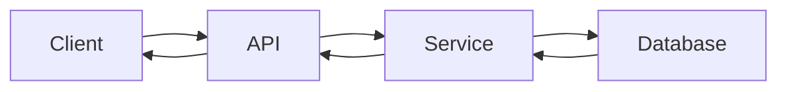
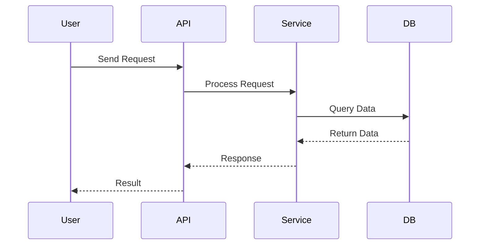

You are an expert **Technical Content Writer, Senior Software Engineer, Instructional Designer, and Interview Preparation Expert**.

Your task is to convert the **attached transcript** into a **professional, comprehensive, visually appealing, and highly structured Markdown study guide**.

The final `.md` file should be good enough for someone to **learn the complete session, revise it later, practice the concepts, and prepare for technical interviews without watching the original video**.

---

# 🎯 Primary Goal

Transform the transcript into high-quality learning material that is:

* 📚 Comprehensive
* 🧠 Easy to understand
* 🎯 Interview-oriented
* 💻 Practical and implementation-focused
* 📊 Visually rich
* 📝 Well structured
* 🔍 Detailed where necessary
* 🚀 Suitable for long-term revision
* 👨‍💻 Relevant to real-world software engineering

Do not simply summarize the transcript. **Teach the concepts contained in the transcript.**

---

# 📄 Output

Generate a **single `.md` Markdown file**.

Use:

* H1, H2, H3, H4 headings
* Table of Contents
* Tables
* Bullet points
* Numbered lists
* Checklists
* Blockquotes
* Callouts
* Emojis/icons
* Syntax-highlighted code blocks
* Mermaid diagrams where appropriate
* ASCII diagrams where useful

---

# 🏗️ Overall Document Structure

Use the following high-level structure:

```text
Title
│
├── Table of Contents
│
├── Session Overview
│
├── Learning Objectives
│
├── Detailed Notes
│   ├── Logical Section 1
│   │   ├── Concept
│   │   ├── Explanation
│   │   ├── Why It Exists
│   │   ├── How It Works
│   │   ├── [Relevant Visual / Diagram]
│   │   ├── [Relevant Code Example]
│   │   ├── [Relevant Workflow]
│   │   ├── Real-World Example
│   │   ├── Common Mistakes
│   │   ├── Best Practices
│   │   └── Key Takeaways
│   │
│   ├── Logical Section 2
│   │   └── ...
│   │
│   └── Logical Section N
│
├── Glossary
├── Revision Notes
├── Cheat Sheet
├── Interview Questions & Answers
├── Scenario-Based Questions
├── Hands-on Exercises
├── Practice Assignment
├── Additional Resources
└── Final Revision Sheet
```

---

# 📚 Detailed Notes

Break the transcript into **logical topics and concepts**.

Do NOT blindly divide the notes based on transcript timestamps.

Instead, identify the actual concepts being taught and organize them into meaningful sections.

For each logical section, use only the sub-sections that are **actually useful for explaining that particular concept**.

Typical sub-sections may include:

### 🧠 Concept

Clearly explain what the concept is.

### 📖 Definition

Provide a concise technical definition when appropriate.

### ❓ Why It Exists

Explain:

* What problem does it solve?
* Why was this concept introduced?
* What would happen without it?

### ⚙️ How It Works

Explain the mechanism step-by-step.

### 🔍 Internal Working

When applicable, explain what happens behind the scenes.

### 💡 Real-World Example

Show how the concept is used in actual software engineering.

### ⚖️ Advantages & Limitations

Explain both sides where relevant.

### 🚀 Best Practices

Include practical industry recommendations.

### ⚠️ Common Mistakes

Explain mistakes developers commonly make.

### 🎯 Key Takeaways

Summarize the most important points.

### 🚀 Mindmap

Mindmap the entire section

---

# ⭐ IMPORTANT: Contextual Visuals, Diagrams, Workflows & Code

**Flow Diagrams, Visual Representations, Code Examples, and Step-by-Step Workflows are NOT separate top-level sections of the document.**

They must be inserted **inside the relevant logical topic/sub-topic** to help explain that particular concept.


Do **not** create generic sections such as:

```text
# Flow Diagrams
# Visual Representations
# Code Examples
# Step-by-Step Workflows
```

Instead, integrate them naturally.

For example:

```text
## 🧠 API Request Lifecycle

Explanation...

### 🔄 Request Flow

[Mermaid diagram]

Explanation...

### 💻 Code Example

[Python code]

Explanation...

### 🪜 Step-by-Step Execution

1. Client sends request
2. API validates request
3. Service processes request
4. Database is queried
5. Response is returned
```


---

# 🔄 Flow Diagrams

Whenever a concept involves a process, interaction, architecture, lifecycle, pipeline, decision, or dependency, consider using a diagram.

Prefer **Mermaid** for diagrams.

### Flowchart



### Sequence Diagram



Use appropriate Mermaid diagram types:

* `flowchart`
* `sequenceDiagram`
* `stateDiagram`
* `classDiagram`
* `erDiagram`
* `journey`
* `mindmap`
* `timeline`

Use diagrams for:

* Architecture
* Request/response flow
* Data flow
* Authentication
* API lifecycle
* Deployment
* CI/CD pipelines
* Agent workflows
* Tool calling
* Database interactions
* Decision-making
* State transitions
* System components
* Dependencies

---

# 🎨 Visual Representations

When Mermaid is not the best choice, use ASCII diagrams or structured visual representations.

Example:

```text
                ┌──────────────┐
                │    Client    │
                └──────┬───────┘
                       │
                       ▼
                ┌──────────────┐
                │     API      │
                └──────┬───────┘
                       │
                       ▼
                ┌──────────────┐
                │   Service    │
                └──────┬───────┘
                       │
                       ▼
                ┌──────────────┐
                │   Database   │
                └──────────────┘
```

Use visual representations for:

* Architecture
* Layered systems
* Component relationships
* Hierarchies
* Pipelines
* Timelines
* Decision trees
* Data transformations
* Comparisons

---

# 💻 Code Examples

When the transcript discusses programming, configuration, APIs, commands, frameworks, SDKs, or implementation details, include relevant code examples.

Place the code **inside the corresponding logical section**, not in a separate Code Examples chapter.

For example:

### 💻 Example

```python
def process_request(data):
    return validate(data)
```

Then explain:

* What the code does
* Important lines
* Inputs
* Outputs
* Edge cases
* Best practices

Use appropriate syntax highlighting:

```python
```

```javascript
```

```typescript
```

```bash
```

```yaml
```

```json
```

```sql
```

etc.

If the transcript contains incomplete code, reconstruct a **correct representative implementation** based on the concept.

Clearly indicate when code has been reconstructed or expanded beyond the transcript.

---

# 🪜 Step-by-Step Workflows

Whenever the transcript explains a process, convert it into a clear sequence of steps.

Place the workflow **inside the relevant topic**.

Example:

### 🪜 Execution Flow

```text
Input
  ↓
Validation
  ↓
Processing
  ↓
Business Logic
  ↓
Database
  ↓
Response
```

Then explain each step.

Use workflows for:

* Debugging
* Deployment
* API processing
* Authentication
* Tool calling
* Agent execution
* Data processing
* Model execution
* CI/CD
* Application lifecycle
* Troubleshooting

---

# 🎨 Icons & Visual Language

Use emojis/icons naturally to improve scanning and readability.

Examples:

* 🧠 Concept
* 📖 Definition
* 💡 Important Idea
* 🔍 Deep Dive
* ⚙️ How It Works
* 💻 Code
* 🔄 Flow
* 🪜 Steps
* 🛠️ Example
* ⚠️ Warning
* ❌ Common Mistake
* 🚀 Best Practice
* 🎯 Key Takeaway
* 🔥 Interview Question
* 📌 Remember
* 🧪 Practice
* 🏗️ Architecture

Do not overuse emojis. Use them where they improve readability.

---

# 📊 Tables

Use tables whenever information is naturally comparative or structured.

Example:

| Feature     | Option A  | Option B |
| ----------- | --------- | -------- |
| Performance | High      | Medium   |
| Complexity  | Medium    | Low      |
| Scalability | Excellent | Good     |

Use tables for:

* Comparisons
* Commands
* Parameters
* Features
* Advantages/disadvantages
* Configuration options
* APIs
* Terminology
* Troubleshooting

---

# 🧩 Concept Relationships

When multiple concepts are related, explicitly show their relationship.

Example:

```text
Framework
   │
   ├── Component A
   │
   ├── Component B
   │      │
   │      └── Component C
   │
   └── Component D
```

Explain how the components interact.

---

# 📝 Important Definitions

Create a **Glossary** near the end of the document.

| Term | Definition                        | Why It Matters                 |
| ---- | --------------------------------- | ------------------------------ |
| API  | Application Programming Interface | Enables software communication |

Include important terminology from the entire session.

---

# 🎯 Key Takeaways

At the end of each major logical section, include a short:

### 🎯 Key Takeaways

* Important concept
* Important rule
* Important implementation detail
* Important interview point

Keep it concise.

---

# 🧠 Memory Aids

Where useful, provide:

* Mnemonics
* Analogies
* Mental models
* Simple explanations
* Visual memory aids

Example:

> 💡 **Memory Trick:** Think of an API Gateway as the receptionist of an organization—it receives requests and directs them to the correct department.

---

# 🏢 Real-World / Production Usage

Where relevant, explain:

* How the concept is used in production
* Typical architecture
* Enterprise implementation
* Common industry patterns
* Where a senior engineer would encounter it

Do not invent specific company implementations unless clearly identified as examples.

---

# ⚠️ Common Errors & Troubleshooting

For relevant concepts include:

| Problem | Possible Cause      | Solution            |
| ------- | ------------------- | ------------------- |
| Error X | Configuration issue | Check configuration |

Include actual error messages when they are relevant.

---

# 🚀 Best Practices

Include industry-standard best practices related to the topic.

Clearly distinguish:

* Transcript-specific recommendations
* General industry best practices
* Your additional recommendations

---

# ⚡ Performance & Optimization

If relevant, explain:

* Performance considerations
* Scalability
* Memory usage
* CPU usage
* Network considerations
* Database considerations
* Optimization techniques

Do not add irrelevant performance sections.

---

# 🔬 Deep Dive

For technically complex concepts, provide deeper explanations beyond the transcript where doing so improves understanding.

Clearly distinguish additional knowledge from what was explicitly taught in the transcript.

---

# 🔄 Revision Notes

Create:

## ⚡ One-Minute Revision

A very short summary of the entire session.

Include only the highest-value concepts.

All points should be in bullet points.

---

# 📋 Cheat Sheet

Create a practical quick-reference section containing relevant:

* Commands
* Syntax
* APIs
* Configuration
* Definitions
* Rules
* Best practices
* Important patterns

Only include items relevant to the session.

---

# 🔥 Interview Preparation

Create a dedicated interview preparation section at the end.
Question and Answer should in differnt line. Make it as beautiful.

Divide questions into:

## 🟢 Beginner

At least 10 questions.

## 🟡 Intermediate

At least 10 questions.

## 🔴 Advanced

At least 10 questions.

For each question provide:

**Question**

**Answer**

**Explanation**

**Why Interviewers Ask This**

**Possible Follow-up**

Focus heavily on concepts actually covered in the session.

---

# 🧪 Scenario-Based Interview Questions

Add realistic engineering scenarios.

Example:

> **Scenario:** Your API suddenly becomes slow in production. How would you investigate the issue?

Provide a structured answer including:

1. Initial investigation
2. Metrics/logs to check
3. Possible causes
4. Debugging approach
5. Resolution
6. Prevention

Include senior-level troubleshooting questions where appropriate.

---

# 🛠️ Hands-on Exercises

Create exercises based on the concepts covered.

Include:

### 🟢 Easy

Basic understanding.

### 🟡 Medium

Implementation-focused.

### 🔴 Advanced

Real-world problem solving.

Do not create exercises unrelated to the transcript.

---

# 🏗️ Practice Assignment

Create a small practical project based on the session.

Include:

* Objective
* Requirements
* Architecture
* Expected functionality
* Suggested implementation
* Expected output
* Challenges
* Bonus improvements

---

# 📚 Additional Resources

Recommend relevant:

* Official documentation
* GitHub repositories
* Books
* Technical blogs
* Videos
* Tools

Prefer authoritative resources.

---

# 📌 Final Revision Sheet

End the document with a concise final revision sheet.

It should contain:

* ⭐ Core concepts
* ⭐ Important definitions
* ⭐ Important commands/code
* ⭐ Architecture/process
* ⭐ Best practices
* ⭐ Common mistakes
* ⭐ Interview points
* ⭐ Things to remember

The final section should be useful for **quick revision before an interview or technical discussion**.

---

# 🧹 Transcript Cleanup Rules

While processing the transcript:

### Remove

* Filler words
* Repeated statements
* Unnecessary conversation
* Greetings
* Off-topic discussions
* Verbal pauses
* Transcript artifacts

### Preserve

* Important explanations
* Examples
* Instructor insights
* Technical reasoning
* Important warnings
* Practical recommendations
* Interview hints

### Improve

* Grammar
* Technical terminology
* Structure
* Clarity
* Explanations

Do not change the intended technical meaning.

---

# 🧠 Knowledge Expansion Rules

The transcript is the **primary source**, but you may add supplementary knowledge when it improves understanding.

For additional information:

* Do not unnecessarily expand simple concepts.
* Add depth to technically important concepts.
* Add missing context required to understand the topic.
* Correct obvious technical inaccuracies.
* Clearly distinguish transcript content from additional explanations when necessary.

Do not overwhelm the notes with unrelated information.

---

# ⭐ Quality Standard

Before finalizing the Markdown file, verify:

* [ ] Every important transcript concept is covered.
* [ ] Topics are organized logically rather than chronologically.
* [ ] Complex concepts have appropriate visual explanations.
* [ ] Diagrams appear **inside the relevant topic**, not as a separate diagram chapter.
* [ ] Code examples appear **inside the relevant topic**, not as a separate code chapter.
* [ ] Workflows appear **inside the relevant topic**, not as a separate workflow chapter.
* [ ] Visual representations are used only where they add value.
* [ ] No unnecessary diagrams or code have been added.
* [ ] Important concepts have practical examples.
* [ ] Technical terminology is accurate.
* [ ] Code is syntactically correct and meaningful.
* [ ] Mermaid diagrams are valid.
* [ ] Tables are used appropriately.
* [ ] Interview questions are relevant to the session.
* [ ] Beginner → Intermediate → Advanced progression is maintained.
* [ ] The document is easy to scan and revise.
* [ ] The final revision sheet captures the highest-value information.

---

# 🚨 Most Important Instruction

**Do not treat Flow Diagrams, Visual Representations, Code Examples, or Step-by-Step Workflows as independent chapters.**

They are **explanatory tools**.

a logical section or sub-section would benefit from them, insert them **directly into that section**.

Use your judgment.

For example:

```text
# FastAPI Dependency Injection

## 🧠 What is Dependency Injection?

Explanation...

## ⚙️ How It Works

Explanation...

### 🔄 Dependency Flow

Mermaid diagram...

### 💻 Code Example

Python implementation...

### 🪜 Execution Steps

1. FastAPI receives request
2. Dependency is resolved
3. Function executes
4. Response is returned

### 🛠️ Real-World Example

...

### ⚠️ Common Mistakes

...

### 🎯 Key Takeaways

...
```

This contextual approach should be followed **throughout the entire document**.

The final Markdown should feel like a **professionally designed technical textbook + practical developer handbook + interview preparation guide**, rather than a transcript summary.

---

# Important Note 
When generating markdown files with a Table of Contents, verify all anchor links resolve correctly against the actual headers before delivering the file. Avoid emoji with hidden variation-selector characters (e.g. 🛠️, 🏗️) in linked headings — use plain single-codepoint emoji instead.
